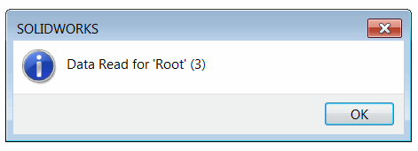
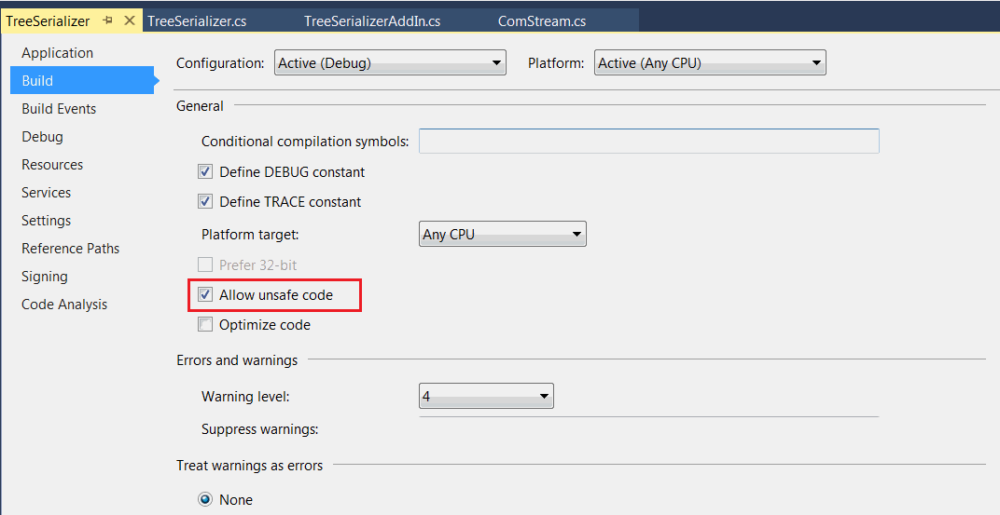

 Example of usage of 3rd Party Storage (stream) to serialize and deserialize tree structure using SOLIDWORKS API and XmlSerializers within the model document
image: read-data-result.png
labels: [serialization,third party store]
---
This example demonstrates how to use 3rd Party Storage in SOLIDWORKS API to read and write custom structure directly within the model.

Example SOLIDWORKS add-in is built using the [SwEx.AddIn](/docs/codestack/labs/solidworks/swex/add-in/) framework but it could work with any other methods of creating the add-ins.

Add-in adds two buttons in the menu and toolbar and provides two handlers correspondingly: 

* SaveTree - asynchronous method to store the data in the stream. This method bumps the revision of the structure after each save.
* LoadTree - loads the data from the stream and displays the name of the root element and the version

{ width=250 }

## Usage Instructions

* Open any model
* Click "Save Data" button. First version of the structure is saved with the model
* You can close the model and SOLIDWORKS
* Reopen the model and click "Load Data". Information about saved structure is displayed in the message box
* Click "Save Data" button again. Data version is updated

It is required to set the 'Allow unsafe code' option in the Visual Studio Project settings:

{ width=450 }

**TreeSerializerAddIn.cs**

~~~ cs
using CodeStack.SwEx.AddIn;
using CodeStack.SwEx.AddIn.Attributes;
using SolidWorks.Interop.sldworks;
using SolidWorks.Interop.swconst;
using System;
using System.Runtime.InteropServices;
using System.Threading.Tasks;

namespace TreeSerializer
{
    [ComVisible(true), Guid("6B8E1B39-5898-46F0-B8DE-753066A2326F")]
    [AutoRegister("Tree Serializer", "Sample Demonstrating use of 3rd party store")]
    public partial class TreeSerializer : SwAddInEx
    {
        private const string STREAM_NAME = "CodeStackSampleStream";

        [CodeStack.SwEx.Common.Attributes.Title("Tree Serializer")]
        public enum Commands_e
        {
            SaveToCurrentDoc,
            LoadFromCurrentDoc
        }

        public override bool OnConnect()
        {
            AddCommandGroup<Commands_e>(OnButtonClick);
            return true;
        }

        private async void OnButtonClick(Commands_e cmd)
        {
            switch (cmd)
            {
                case Commands_e.SaveToCurrentDoc:
                    await SaveTree();
                    break;

                case Commands_e.LoadFromCurrentDoc:
                    LoadTree();
                    break;
            }
        }

        private async Task SaveTree()
        {
            try
            {
                ElementsTree tree = null;

                try
                {
                    tree = ReadDataFromDocument(App.IActiveDoc2);
                    tree.Version = tree.Version + 1;
                }
                catch (ThirdPartyStreamNotFoundException)
                {
                    //create new tree only if stream was never created, show an error otherwise
                    tree = new ElementsTree(1,
                        new Element(1, "Root",
                            new Element(2, "Level1-A",
                                new Element(4, "Level2")),
                            new Element(5, "Level1-B")));
                }

                await SaveDataToDocument(App.IActiveDoc2, tree);
                App.SendMsgToUser2("Data saved",
                    (int)swMessageBoxIcon_e.swMbInformation,
                    (int)swMessageBoxBtn_e.swMbOk);
            }
            catch (Exception ex)
            {
                App.SendMsgToUser2(ex.Message,
                    (int)swMessageBoxIcon_e.swMbStop,
                    (int)swMessageBoxBtn_e.swMbOk);
            }
        }

        private void LoadTree()
        {
            try
            {
                var readTree = ReadDataFromDocument(App.IActiveDoc2);
                App.SendMsgToUser2($"Data Read for '{readTree.Root.Name}' ({readTree.Version})",
                    (int)swMessageBoxIcon_e.swMbInformation,
                    (int)swMessageBoxBtn_e.swMbOk);
            }
            catch (Exception ex)
            {
                App.SendMsgToUser2(ex.Message,
                    (int)swMessageBoxIcon_e.swMbStop,
                    (int)swMessageBoxBtn_e.swMbOk);
            }
        }
    }
}

~~~

Structure used in this example represents the simple hierarchical data

**ElementsTree.cs**

~~~ cs
using System;
using System.Collections.Generic;
using System.Linq;
using System.Text;
using System.Threading.Tasks;

namespace TreeSerializer
{
    public class ElementsTree
    {
        public int Version { get; set; }
        public Element Root { get; set; }

        public ElementsTree()
        {
        }

        public ElementsTree(int version, Element root)
        {
            Version = version;
            Root = root;
        }
    }

    public class Element
    {
        public int Id { get; set; }
        public string Name { get; set; }
        public Element[] Children { get; set; }

        public Element()
        {
        }

        public Element(int id, string name, params Element[] children)
        {
            Id = id;
            Name = name;
            Children = children;
        }
    }
}

~~~

For simplicity [IStream](https://docs.microsoft.com/en-us/windows/desktop/api/objidl/nn-objidl-istream) com stream is wrapped into the [System.IO.Stream](https://docs.microsoft.com/en-us/dotnet/api/system.io.stream?view=netframework-4.7.2) type.

**ComStream.cs**

~~~ cs
using System;
using System.IO;
using System.Runtime.InteropServices.ComTypes;

namespace ThirdPartyStorage
{
    public class ComStream : Stream
    {
        private readonly IStream m_ComStream;
        private readonly bool m_Commit;

        private bool m_IsWritable;

        public override bool CanRead
        {
            get
            {
                return true;
            }
        }

        public override bool CanSeek
        {
            get
            {
                return true;
            }
        }

        public override bool CanWrite
        {
            get
            {
                return m_IsWritable;
            }
        }

        public override long Length
        {
            get
            {
                const int STATSFLAG_NONAME = 1;

                STATSTG statstg;

                m_ComStream.Stat(out statstg, STATSFLAG_NONAME);

                return statstg.cbSize;
            }
        }

        public override long Position
        {
            get
            {
                return Seek(0, SeekOrigin.Current);
            }
            set
            {
                Seek(value, SeekOrigin.Begin);
            }
        }

        public ComStream(IStream comStream, bool writable, bool commit = true)
        {
            if (comStream == null)
            {
                throw new ArgumentNullException(nameof(comStream));
            }
            
            m_ComStream = comStream;
            m_Commit = commit;
            m_IsWritable = writable;
        }

        public override void Flush()
        {
            if (m_Commit)
            {
                const int STGC_DEFAULT = 0;

                m_ComStream.Commit(STGC_DEFAULT);
            }
        }

        public unsafe override int Read(byte[] buffer, int offset, int count)
        {
            if (offset != 0)
            {
                throw new NotSupportedException("Offset is not supported");
            }

            int bytesRead;

            var address = new IntPtr(&bytesRead);

            m_ComStream.Read(buffer, count, address);

            return bytesRead;
        }

        public unsafe override long Seek(long offset, SeekOrigin origin)
        {
            long position = 0;

            var address = new IntPtr(&position);

            m_ComStream.Seek(offset, (int)origin, address);

            return position;
        }

        public override void SetLength(long value)
        {
            m_ComStream.SetSize(value);
        }
        
        public override void Write(byte[] buffer, int offset, int count)
        {
            if (offset != 0)
            {
                throw new NotSupportedException("Offset is not supported");
            }

            m_ComStream.Write(buffer, count, IntPtr.Zero);
        }

        protected override void Dispose(bool disposing)
        {
            try
            {
                if (disposing)
                {
                    m_IsWritable = false;
                }
            }
            finally
            {
                base.Dispose(disposing);
            }
        }

        ~ComStream()
        {
            Dispose(false);
        }
    }
}

~~~

Serialization and deserialization routine utilizing the [XmlSerializer](https://docs.microsoft.com/en-us/dotnet/api/system.xml.serialization.xmlserializer?view=netframework-4.7.2) class, but any other serialization methods could be used.

**TreeSerializer.cs**

~~~ cs
using SolidWorks.Interop.sldworks;
using SolidWorks.Interop.swconst;
using System;
using System.Collections.Generic;
using System.Linq;
using System.Runtime.InteropServices.ComTypes;
using System.Text;
using System.Threading.Tasks;
using System.Xml.Serialization;
using ThirdPartyStorage;

namespace TreeSerializer
{
    public partial class TreeSerializer
    {
        public class ThirdPartyStreamNotFoundException : Exception
        {
        }

        private async Task SaveDataToDocument(IModelDoc2 model, ElementsTree data)
        {
            int err = -1;
            int warn = -1;

            model.SetSaveFlag();

            const int S_OK = 0;

            bool? result = null; ;

            var onSaveToStorageNotifyFunc = new Func<int>(() =>
            {
                try
                {
                    StoreData(model, data, STREAM_NAME);
                    result = true;
                }
                catch
                {
                    result = false;
                }
                return S_OK;
            });

            var partSaveToStorageNotify = new DPartDocEvents_SaveToStorageNotifyEventHandler(onSaveToStorageNotifyFunc);
            var assmSaveToStorageNotify = new DAssemblyDocEvents_SaveToStorageNotifyEventHandler(onSaveToStorageNotifyFunc);
            var drwSaveToStorageNotify = new DDrawingDocEvents_SaveToStorageNotifyEventHandler(onSaveToStorageNotifyFunc);

            #region Attach Event Handlers

            switch ((swDocumentTypes_e)model.GetType())
            {
                case swDocumentTypes_e.swDocPART:
                    (model as PartDoc).SaveToStorageNotify += partSaveToStorageNotify;
                    break;

                case swDocumentTypes_e.swDocASSEMBLY:
                    (model as AssemblyDoc).SaveToStorageNotify += assmSaveToStorageNotify;
                    break;

                case swDocumentTypes_e.swDocDRAWING:
                    (model as DrawingDoc).SaveToStorageNotify += drwSaveToStorageNotify;
                    break;
            }

            #endregion

            if (!model.Save3((int)swSaveAsOptions_e.swSaveAsOptions_Silent, ref err, ref warn))
            {
                throw new InvalidOperationException($"Failed to save the model: {(swFileSaveError_e)err}");
            }

            await Task.Run(() =>
            {
                while (!result.HasValue)
                {
                    System.Threading.Thread.Sleep(10);
                }
            });

            #region Detach Event Handlers

            switch ((swDocumentTypes_e)model.GetType())
            {
                case swDocumentTypes_e.swDocPART:
                    (model as PartDoc).SaveToStorageNotify -= partSaveToStorageNotify;
                    break;

                case swDocumentTypes_e.swDocASSEMBLY:
                    (model as AssemblyDoc).SaveToStorageNotify -= assmSaveToStorageNotify;
                    break;

                case swDocumentTypes_e.swDocDRAWING:
                    (model as DrawingDoc).SaveToStorageNotify -= drwSaveToStorageNotify;
                    break;
            }

            #endregion

            if (!result.Value)
            {
                throw new Exception("Failed to store the data");
            }
        }

        private ElementsTree ReadDataFromDocument(IModelDoc2 model)
        {
            return ReadData<ElementsTree>(model, STREAM_NAME);
        }

        private void StoreData<T>(IModelDoc2 model, T data, string streamName)
        {
            try
            {
                var stream = model.IGet3rdPartyStorage(streamName, true) as IStream;

                using (var comStr = new ComStream(stream, true, false))
                {
                    comStr.Seek(0, System.IO.SeekOrigin.Begin);
                    var ser = new XmlSerializer(typeof(T));
                    ser.Serialize(comStr, data);
                }
            }
            catch
            {
                throw;
            }
            finally
            {
                model.IRelease3rdPartyStorage(streamName);
            }
        }

        private T ReadData<T>(IModelDoc2 model, string streamName)
        {
            try
            {
                var stream = model.IGet3rdPartyStorage(streamName, false) as IStream;

                if (stream != null)
                {
                    using (var comStr = new ComStream(stream, false))
                    {
                        comStr.Seek(0, System.IO.SeekOrigin.Begin);
                        var ser = new XmlSerializer(typeof(T));
                        return (T)ser.Deserialize(comStr);
                    }
                }
                else
                {
                    throw new ThirdPartyStreamNotFoundException();
                }
            }
            catch
            {
                throw;
            }
            finally
            {
                model.IRelease3rdPartyStorage(streamName);
            }
        }
    }
}

~~~

