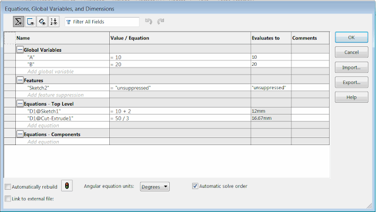
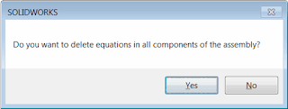

该宏可以使用SOLIDWORKS API从活动模型（零件或装配）中删除所有方程（或仅删除损坏的方程）。

{ width=640 }

如果活动模型是装配体，则该宏可以选择从装配体的每个组件中删除所有方程。将显示以下消息。单击**是**以从所有组件的所有级别中删除方程，单击**否**以仅处理顶层装配体的方程。

{ width=320 height=120 }

将*DELETE_BROKEN_ONLY*选项设置为*True*，以仅删除损坏（悬空）的方程。

**重要提示：使用此宏时请自行承担风险。此宏会修改您的数据（删除所有方程），请在运行此宏之前备份您的文件**

~~~ vb
Const DELETE_BROKEN_ONLY As Boolean = False '如果此标志为True，则仅删除损坏的方程，否则删除所有方程

Dim swApp As SldWorks.SldWorks
Dim swModel As SldWorks.ModelDoc2
Dim swEqMgr As SldWorks.EquationMgr

Sub main()

    Set swApp = Application.SldWorks
    
try_:
    On Error GoTo catch_
    
    Set swModel = swApp.ActiveDoc
    
    Dim hasDeleted As Boolean
    
    DeleteEquationsFromModel swModel, hasDeleted
    
    If swModel.GetType = swDocumentTypes_e.swDocASSEMBLY Then
        
        If swApp.SendMsgToUser2("是否要删除装配体的所有组件中的方程？", swMessageBoxIcon_e.swMbQuestion, swMessageBoxBtn_e.swMbYesNo) = swMessageBoxResult_e.swMbHitYes Then
            
            Dim swAssy As SldWorks.AssemblyDoc
            Set swAssy = swModel
            
            '需要将组件加载到内存中以处理其方程
            swAssy.ResolveAllLightWeightComponents True
            
            Dim vComps As Variant
            vComps = swAssy.GetComponents(False)
            
            Dim i As Integer
            
            For i = 0 To UBound(vComps)
                
                Dim swComp As SldWorks.Component2
                Set swComp = vComps(i)
                
                Dim swCompModel As SldWorks.ModelDoc2
                
                Set swCompModel = swComp.GetModelDoc2
                
                If Not swCompModel Is Nothing Then
                    
                    Dim hasCompEqDeleted As Boolean
                    DeleteEquationsFromModel swCompModel, hasCompEqDeleted
                    
                    If hasCompEqDeleted Then
                        hasDeleted = True
                    End If
                    
                End If
                
            Next
            
        End If
        
    End If
    
    If hasDeleted Then
        swModel.ForceRebuild3 False
    End If
    
    GoTo finally_
    
catch_:
    swApp.SendMsgToUser2 Err.Description, swMessageBoxIcon_e.swMbStop, swMessageBoxBtn_e.swMbOk
finally_:
    
End Sub

Sub DeleteEquationsFromModel(model As SldWorks.ModelDoc2, ByRef hasDeleted As Boolean)
    
    Set swEqMgr = model.GetEquationMgr()
    
    Dim i As Integer
    
    hasDeleted = False
    
    '以相反的方向迭代，因为删除前一个方程后，方程索引会发生变化
    For i = swEqMgr.GetCount - 1 To 0 Step -1
        
        If Not DELETE_BROKEN_ONLY Or IsEquationBroken(swEqMgr, i) Then
            swEqMgr.Delete i
            hasDeleted = True
        End If
    Next
    
    If hasDeleted Then
        '删除方程不会使模型变为脏模型
        model.SetSaveFlag
    End If
    
End Sub

Function IsEquationBroken(eqMgr As SldWorks.EquationMgr, index As Integer) As Boolean
    
    Const STATUS_BROKEN As Integer = -1
    
    Dim val As String
    val = eqMgr.Value(index) '求值以获取状态
    
    IsEquationBroken = (eqMgr.Status = STATUS_BROKEN)
    
End Function

~~~