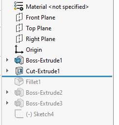

这个VBA宏删除回滚栏下的所有特征。

~~~ vb
Dim swApp As SldWorks.SldWorks

Sub main()

try_:
    
    On Error GoTo catch_
    
    Set swApp = Application.SldWorks
    
    Dim swModel As SldWorks.ModelDoc2
    
    Set swModel = swApp.ActiveDoc
    
    Dim vRolledBackFeats As Variant
    
    vRolledBackFeats = GetRolledBackFeatures(swModel)
    
    If False = swModel.FeatureManager.EditRollback(swMoveRollbackBarTo_e.swMoveRollbackBarToEnd, "") Then
        Err.Raise vbError, "", "无法向前回滚"
    End If
    
    If swModel.Extension.MultiSelect2(vRolledBackFeats, False, Nothing) <> UBound(vRolledBackFeats) + 1 Then
        Err.Raise vbError, "", "无法选择特征"
    End If
    
    If False = swModel.Extension.DeleteSelection2(swDeleteSelectionOptions_e.swDelete_Absorbed) Then
        Err.Raise vbError, "", "无法删除特征"
    End If
    
    GoTo finally_
    
catch_:
    swApp.SendMsgToUser2 Err.Description, swMessageBoxIcon_e.swMbStop, swMessageBoxBtn_e.swMbOk
finally_:
        
End Sub

Function GetRolledBackFeatures(model As SldWorks.ModelDoc2) As Variant
    
    Dim isInit As Boolean
    Dim swFeats() As SldWorks.Feature
        
    Dim swFeat As SldWorks.Feature
    Set swFeat = model.FirstFeature
    
    While Not swFeat Is Nothing
        
        If False <> swFeat.IsRolledBack() Then
            
            If Not isInit Then
                isInit = True
                ReDim swFeats(0)
            Else
                ReDim Preserve swFeats(UBound(swFeats) + 1)
            End If
            
            Set swFeats(UBound(swFeats)) = swFeat
            
        End If
        
        Set swFeat = swFeat.GetNextFeature
    Wend
        
    If isInit Then
        GetRolledBackFeatures = swFeats
        
    Else
        GetRolledBackFeatures = Empty
    End If
    
End Function
~~~