

### 安装VSI扩展

从[Visual Studio Marketplace](https://marketplace.visualstudio.com/items?itemName=VisualStudioClient.MicrosoftVisualStudio2017InstallerProjects)下载Microsoft Visual Studio Installer Projects扩展。找到与您的Visual Studio版本匹配的版本。

> 建议在安装此扩展时关闭当前的Visual Studio会话。

### 创建安装程序项目

在解决方案中添加新的安装程序项目，可以在“其他项目类型->Visual Studio Installer”部分找到。

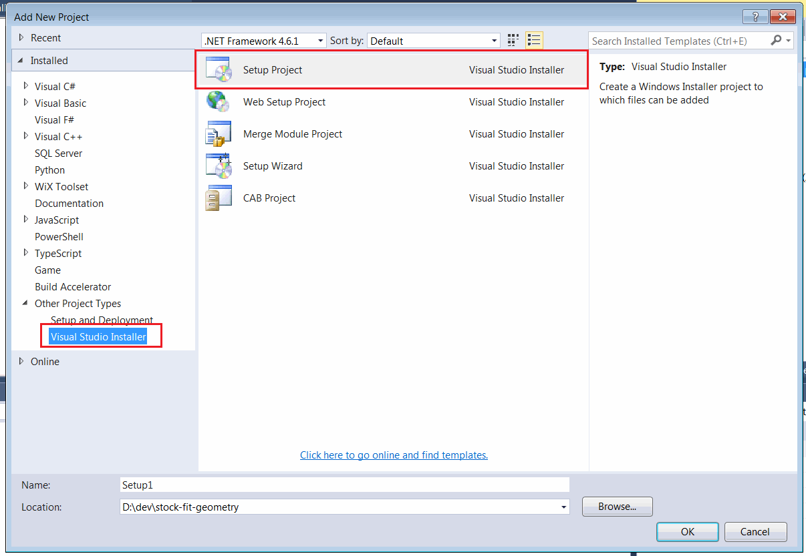{ width=450 }

通过选择解决方案树中的安装程序项目并在属性页中更改属性来配置安装程序的属性。

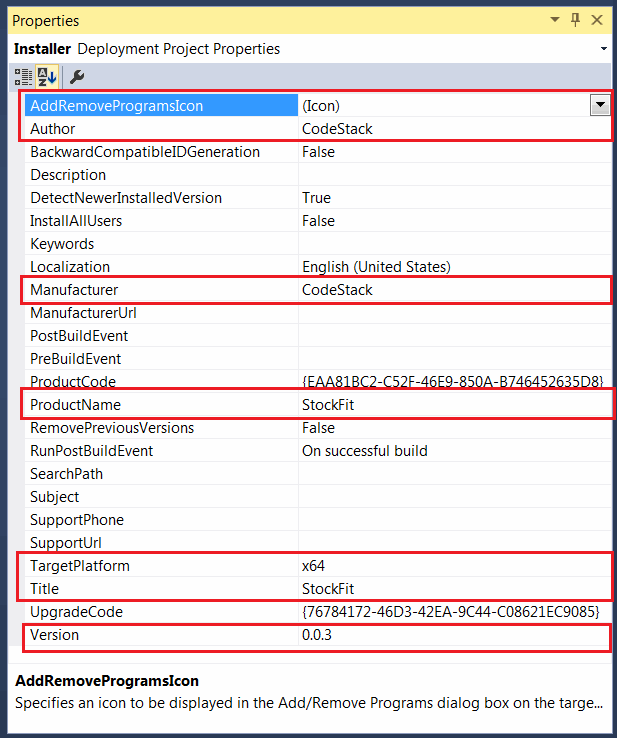{ width=350 }

> 确保选择正确的平台版本。默认选项x86应更改为x64以支持64位版本的SOLIDWORKS。

### 添加安装文件和COM注册

单击项目节点的右键，并从上下文菜单中选择“添加->项目输出...”命令。

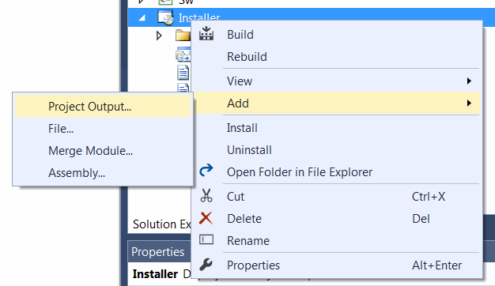{ width=300 }

在下拉菜单中选择插件的主项目，并选择“主输出”选项。

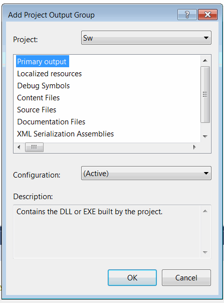{ width=250 }

这将允许将dll及其所有依赖的dll和文件添加到安装程序中。

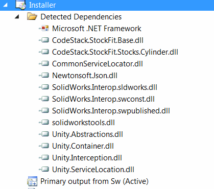{ width=250 }

这也将在dll中注册COM对象。

### 自定义安装程序视图

可以通过安装程序视图对安装程序进行自定义，并添加新的组件。

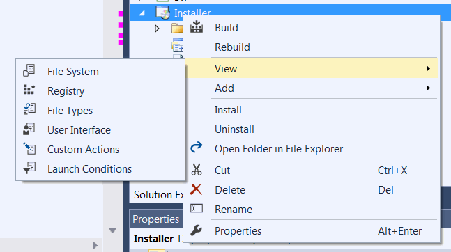{ width=300 }

### 添加注册表项

需要将注册表值添加到“SolidWorks”注册表部分，以使SOLIDWORKS识别插件。

打开“注册表视图”

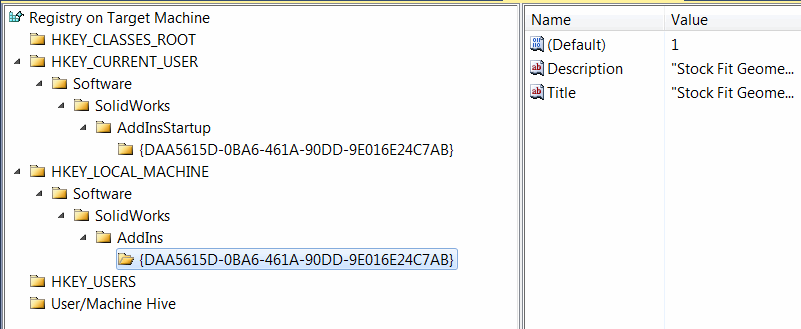{ width=350 }

添加以下内容：
> HKEY_LOCAL_MACHINE\Software\SolidWorks\Addins\[{ADDIN GUID}]

并在此键中添加以下字段：

(default)（DWORD值）等于1。将字段名称留空以将其设置为默认值（不要显式输入（default））

Title（字符串值）- 值是插件的标题

Description（字符串值）- 值是插件的描述

为了在启动时加载插件，添加以下键

> HKEY_CURRENT_USER\Software\SolidWorks\AddinsStartup\[{ADDIN GUID}]

添加默认的DWORD字段，值为1

### 添加资源文件

通过右键单击插件项目并选择“添加->文件”菜单命令将资源文件添加到安装程序。资源文件可用于向安装程序添加图标、横幅图像、最终用户许可协议（EULA）等。

#### 自定义用户界面

打开“用户界面”视图。此视图包含安装过程中显示的所有页面的列表和顺序。

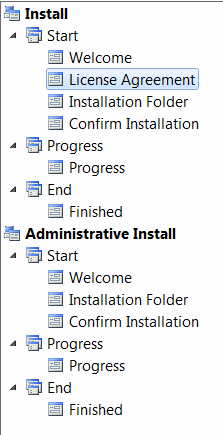{ width=150 }

可以自定义、添加、删除和重新排序页面。

选择所有页面并设置横幅图像。横幅图像显示在安装程序的顶部，是一个500x70像素大小的位图（bmp）或png文件。

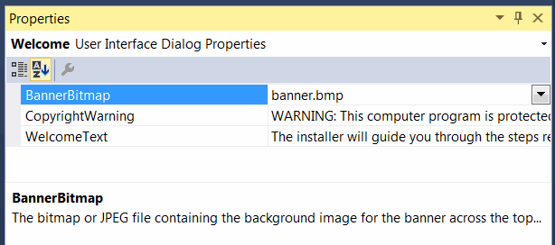{ width=300 }

通过浏览在上一步中添加的位图资源来更改横幅属性。

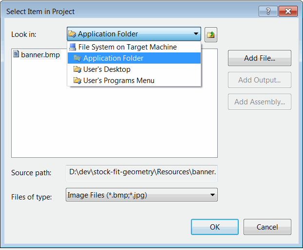{ width=300 }

可以向安装程序添加更多页面，例如最终用户许可协议（EULA）或注册页面。

### 安装插件

当项目编译完成后，将在输出目录中生成msi包。可以将此包重新分发给用户以安装您的产品。

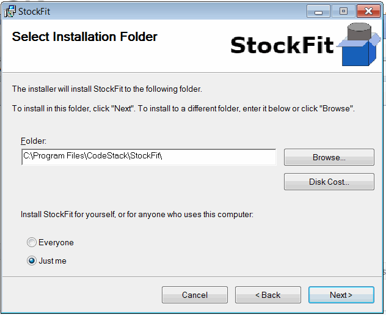{ width=300 }

安装完成后，产品图标将出现在控制面板的“程序和功能”页面中。可以在此页面上修复或卸载产品。

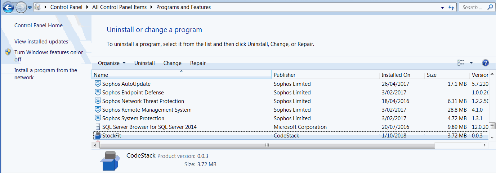{ width=650 }

### 发布更新

当需要产品更新并需要重新分发新的安装程序时，需要更新安装程序的版本。

可能会显示以下消息。

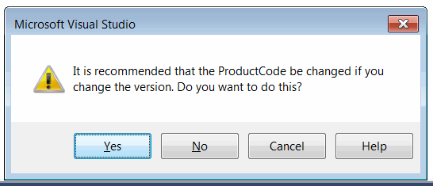{ width=300 }

每个新版本都需要更改“产品代码”，而“升级代码”应保持不变。这将允许用户升级而无需卸载先前版本的插件（如果已安装）。

> 必须更改所有更改的项目的程序集版本，否则安装程序将不会在目标机器上更新dll。

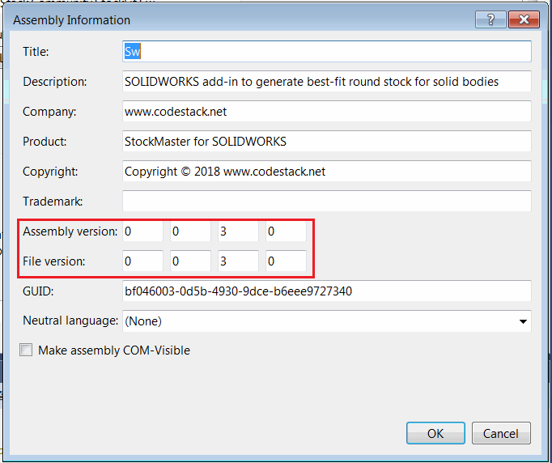{ width=300 }