

## 下载并安装WiX框架

从[WiX Toolset](https://wixtoolset.org/)网站下载WiX安装程序

> 建议下载最新稳定版本

运行安装过程

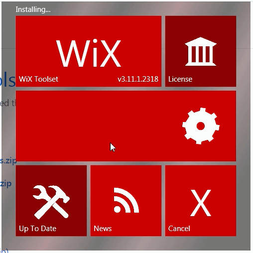{ width=250 }

安装完成后，点击按钮安装Visual Studio扩展

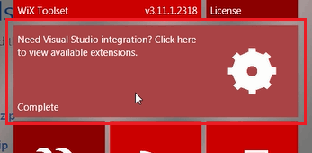{ width=250 }

> 或者可以直接从[发布页面](https://wixtoolset.org/releases/)或[Visual Studio Marketplace](https://marketplace.visualstudio.com/items?itemName=RobMensching.WiXToolset)下载扩展

## 添加安装程序项目

安装WiX框架和Visual Studio扩展后，可以直接从Visual Studio创建和编译安装程序项目。

添加新项目，选择*WiX Toolset*类别下的*Setup Project for WiX vX*

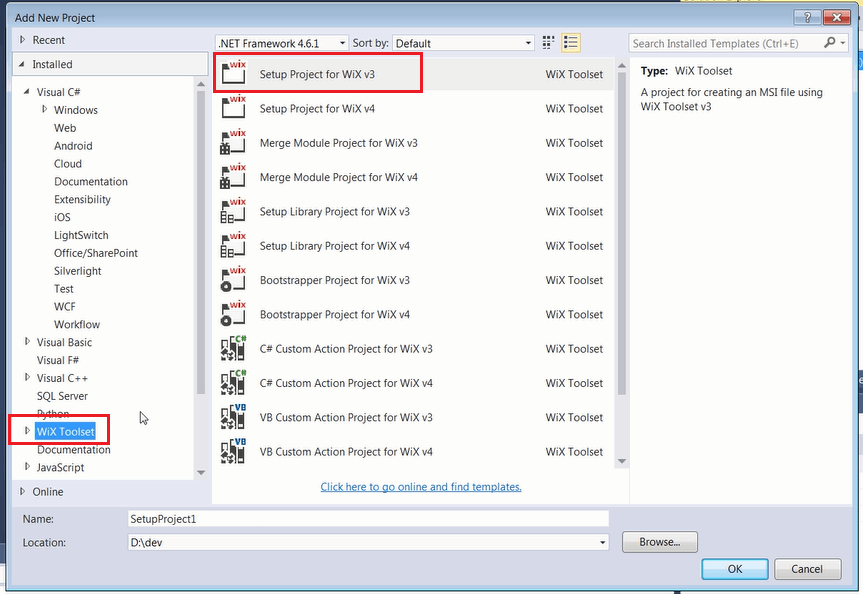{ width=350 }

Visual Studio将生成默认项目。

## 配置项目

按照以下步骤配置项目

### 添加扩展引用

通过单击上下文菜单中的*Add Reference...*命令，添加WiX扩展引用以在安装程序对话框中使用标准页面

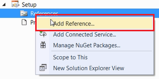

浏览到%wix%\bin目录下的*WixUIExtension.dll*和*WixUtilExtension.dll*文件

### 添加x64配置

默认情况下，WiX项目是为x86部署创建的。大多数SOLIDWORKS版本都是x64的。因此，需要修改WiX项目以支持此环境。

在Visual Studio中卸载设置项目，然后单击*Edit Project*或在任何文本编辑器中打开*.wixproj*文件。如下图所示，修改属性组以支持x64环境：

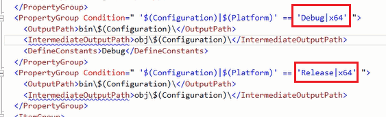

### 将构建文件夹设置为预处理器变量

为了简化将文件链接到安装程序项目的过程，建议在WiX项目中创建一个预处理器变量，该变量等于插件的构建位置

> SourceOutDir=..\Build

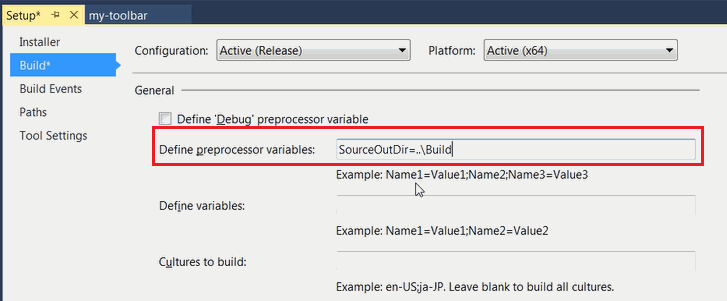{ width=350 }

> 允许并建议使用相对路径指向构建位置

## 配置产品

*Product.wxs*是包含安装程序包配置的文件

### 添加默认对话框

要添加最小对话框（例如欢迎页面、安装文件夹和进度），需要在*Package*节点中添加以下行

~~~ xml
<UIRef Id="WixUI_InstallDir" />
<UIRef Id="WixUI_Common" />
<Property Id="WIXUI_INSTALLDIR" Value="INSTALLFOLDER" />
~~~

### 添加归属信息

可以自定义对话框以包含图标和横幅图像

横幅是安装程序的标题栏中显示的图像。这应该是一个大小为493x58像素的.bmp文件。

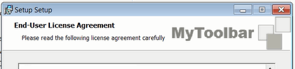

对话框背景是安装程序的背景中显示的图像。这应该是一个大小为493x312像素的.bmp文件。

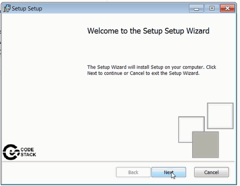{ width=350 }

可以将图标添加为.ico文件，并将其分配给*控制面板*中的*程序和功能*组中的产品。

需要在*Package*节点中添加以下行以添加对归属文件的引用：

~~~ xml
<Icon Id="MainIconId" SourceFile="Resources\icon.ico"/>
<Property Id="ARPPRODUCTICON" Value="MainIconId" />
<WixVariable Id="WixUIBannerBmp" Value="Resources\banner.bmp" />
<WixVariable Id="WixUIDialogBmp" Value="Resources\dialog.bmp" />
~~~

### 添加最终用户许可协议（EULA）

可以通过在*Package*节点中添加以下行将EULA页面添加到安装程序中。在用户同意EULA条款和条件之前，将不会安装软件包。EULA必须以富文本格式（*.rtf）提供。

~~~ xml
<WixVariable Id="WixUILicenseRtf" Value="Resources\eula.rtf" />
~~~

### 添加插件注册表组件

将注册表组件添加到**ComponentGroup**节点中，以添加插件的注册表键

~~~ xml
<Component Id="Reg" Guid="{NEW GUID}">
    <RegistryValue Root="HKCU" Key="Software\SolidWorks\AddInsStartup\{ADDIN GUID}" Value="1" Type="integer" Action="write" />
    <RegistryValue Root="HKLM" Key="Software\SolidWorks\Addins\{ADDIN GUID}" Value="0" Type="integer" Action="write" />
    <RegistryValue Root="HKLM" Key="Software\SolidWorks\Addins\{ADDIN GUID}" Name="Description" Value="AddIn description" Type="string" Action="write" />
    <RegistryValue Root="HKLM" Key="Software\SolidWorks\Addins\{ADDIN GUID}" Name="Title" Value="AddIn Title" Type="string" Action="write" />
</Component>
~~~

### 添加文件

#### 添加SOLIDWORKS互操作组

通过将以下组件添加到**ComponentGroup**节点中，将SOLIDWORKS互操作添加到安装程序中

~~~ xml
<Component Id="interops" Guid="{NEW GUID}">
    <File Id='SolidWorks.Interop.sldworks.dllID' Name='SolidWorks.Interop.sldworks.dll' Source ='$(var.SourceOutDir)\SolidWorks.Interop.sldworks.dll'/>
    <File Id='SolidWorks.Interop.swconst.dllID' Name='SolidWorks.Interop.swconst.dll' Source ='$(var.SourceOutDir)\SolidWorks.Interop.swconst.dll'/>
    <File Id='SolidWorks.Interop.swpublished.dllID' Name='SolidWorks.Interop.swpublished.dll' Source ='$(var.SourceOutDir)\SolidWorks.Interop.swpublished.dll'/>
    <File Id='SolidWorksTools.dllID' Name='SolidWorksTools.dll' Source ='$(var.SourceOutDir)\SolidWorksTools.dll'/>
</Component>
~~~

> $(var.SourceOutDir)变量将解析为[将构建文件夹设置为预处理器变量](#将构建文件夹设置为预处理器变量)中定义的构建文件夹

#### 添加其他文件到安装程序

如果需要将任何其他数据或dll文件包含到安装程序中，请在**ComponentGroup**节点下添加另一个组件和文件

~~~ xml
<Component Id="files" Guid="{NEW GUID}">
    <File Id='{FileName}ID' Name='{FileName}' Source ='$(var.SourceOutDir)\{FileName}'/>
    ....
</Component>
~~~

#### 自动添加项目文件

或者，可以使用收集工具自动添加文件，因此不需要手动逐个添加每个文件。将以下代码段添加到*.wixproj*文件中

~~~ xml
<Target Name="BeforeBuild">
<HeatDirectory Directory="..\Build" Transforms="DirectoryHeatTransform.xslt" PreprocessorVariable="var.SourceOutDir" OutputFile="Files.wxs" ComponentGroupName="FilesRegGroup" DirectoryRefId="INSTALLFOLDER" AutogenerateGuids="true" ToolPath="$(WixToolPath)" SuppressFragments="true" SuppressRegistry="true" SuppressCom="true" SuppressRootDirectory="true" />
</Target>
~~~

*Transforms*属性允许定义xslt转换，以排除不需要作为安装程序的一部分的任何文件（例如pdb或xml）：

~~~ xslt
<?xml version="1.0" encoding="utf-8"?>
<xsl:stylesheet
    xmlns:xsl="http://www.w3.org/1999/XSL/Transform"
    xmlns:wix="http://schemas.microsoft.com/wix/2006/wi"
    xmlns="http://schemas.microsoft.com/wix/2006/wi"
    version="1.0"
    exclude-result-prefixes="xsl wix">

    <xsl:output method="xml" indent="yes" omit-xml-declaration="yes" />

    <xsl:strip-space elements="*" />

    <xsl:key
        name="AddInToRemove"
        match="wix:Component[ wix:File/@Source = '$(var.SourceOutDir)\CodeStack.Sw.MyToolbar.dll']"
        use="@Id" />

    <xsl:key
        name="TlbToRemove"
        match="wix:Component[ substring( wix:File/@Source, string-length( wix:File/@Source ) - 3 ) = '.tlb' ]"
        use="@Id" />

    <xsl:key
        name="XmlToRemove"
        match="wix:Component[ substring( wix:File/@Source, string-length( wix:File/@Source ) - 3 ) = '.xml' ]"
        use="@Id" />

    <xsl:key
        name="PdbToRemove"
        match="wix:Component[ substring( wix:File/@Source, string-length( wix:File/@Source ) - 3 ) = '.pdb' ]"
        use="@Id" />

    <xsl:template match="@*|node()">
        <xsl:copy>
            <xsl:apply-templates select="@*|node()" />
        </xsl:copy>
    </xsl:template>

    <xsl:template match="*[ self::wix:Component or self::wix:ComponentRef ][ key( 'AddInToRemove', @Id ) ]" />
    <xsl:template match="*[ self::wix:Component or self::wix:ComponentRef ][ key( 'TlbToRemove', @Id ) ]" />
    <xsl:template match="*[ self::wix:Component or self::wix:ComponentRef ][ key( 'XmlToRemove', @Id ) ]" />
    <xsl:template match="*[ self::wix:Component or self::wix:ComponentRef ][ key( 'PdbToRemove', @Id ) ]" />
</xsl:stylesheet>
~~~

## 注册COM组件

> 如果需要部署独立应用程序且不需要注册COM组件，则可以跳过此步骤。

SOLIDWORKS插件必须注册为COM组件。建议使用[Harvest工具（heat）](https://wixtoolset.org/documentation/manual/v3/overview/heat.html)而不是使用[regasm](https://docs.microsoft.com/en-us/dotnet/framework/tools/regasm-exe-assembly-registration-tool)自定义操作来部署COM组件

可以使用Harvest工具的两种方法

### 方法A：后期构建操作

将以下行添加到需要注册COM组件的项目的后期构建事件中

~~~ cs
"%WIX%\bin\heat.exe" file "$(TargetPath)" -ag -srd -cg "AddInComRegGroup" -var var.SourceOutDir -dr INSTALLFOLDER -o "..\Setup\AddInReg.wxs"
~~~

### 方法B：BeforeBuild目标

直接将以下代码段添加到*.wixproj*文件中

~~~ xml
<Target Name="BeforeBuild">
    <HeatFile File="..\Build\CodeStack.Sw.MyToolbar.dll" PreprocessorVariable="var.SourceOutDir" OutputFile="..\Setup\AddInReg.wxs" ComponentGroupName="AddInComRegGroup" DirectoryRefId="INSTALLFOLDER" AutogenerateGuids="true" ToolPath="$(WixToolPath)" SuppressFragments="false" SuppressRegistry="false" SuppressCom="false" SuppressRootDirectory="true" />
</Target>
~~~

此操作将创建一个*AddInReg.wxs*文件，其中包含*AddInComRegGroup*组件文件，其中包含在目标计算机上注册COM组件所需的所有信息。

> 建议将此文件直接生成到安装程序项目文件夹中

将此文件添加到WiX项目中，以便进行编译。

将对组件的引用添加到**Feature**节点中

~~~ xml
<ComponentGroupRef Id="AddInComRegGroup"/>
~~~

将**Product**节点的**Manufacturer**属性设置为必填属性。

## 其他参数

修改**MediaTemplate**节点如下

### 生成单个.msi安装程序包

~~~ xml
<MediaTemplate EmbedCab="yes"/>
~~~

这将允许生成单个*.msi文件进行安装。

### 设置默认安装文件夹

将默认安装位置修改为链接到程序文件的x64版本的*ProgramFiles64Folder*。可选择为公司名称指定目录：

~~~ xml
<Directory Id="TARGETDIR" Name="SourceDir">
    <Directory Id="ProgramFiles64Folder">
        <Directory Id="CodeStackDirId" Name="CodeStack">
            <Directory Id="INSTALLFOLDER" Name="MyAddIn" />
        </Directory>
    </Directory>
</Directory>
~~~

> 以上将生成默认安装位置为%programfiles%\CodeStack\MyAddIn

### 在构建安装程序时自动构建插件项目

默认情况下，安装程序项目不依赖于解决方案中的其他项目。建议添加依赖关系，以便在编译安装程序项目之前，先编译所有项目，以确保最新的二进制文件已添加到.msi包中。

选择安装程序项目，然后单击*Project Dependencies...*

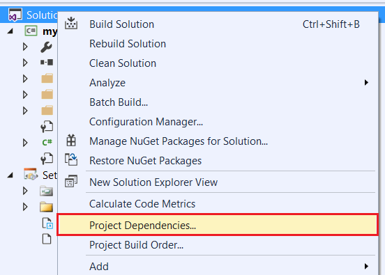{ width=250 }

确保在下拉菜单中选择安装程序项目，并将插件项目作为*depends on*引用进行勾选

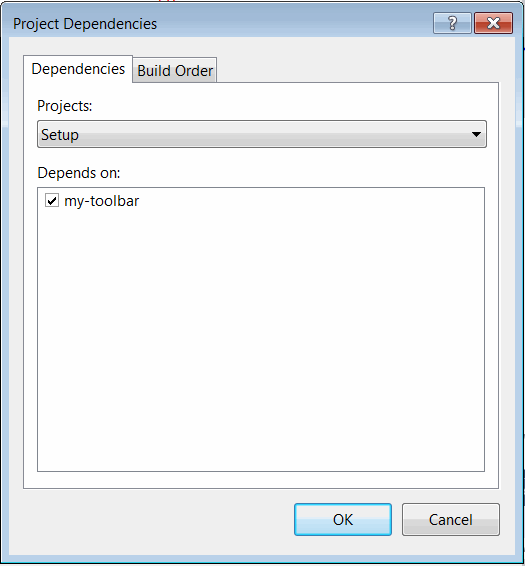{ width=250 }

编译安装程序项目。这将在输出文件夹中生成一个.msi包。

安装后，插件将添加到控制面板中的“程序和功能”中。可以从此页面修复安装或卸载插件。

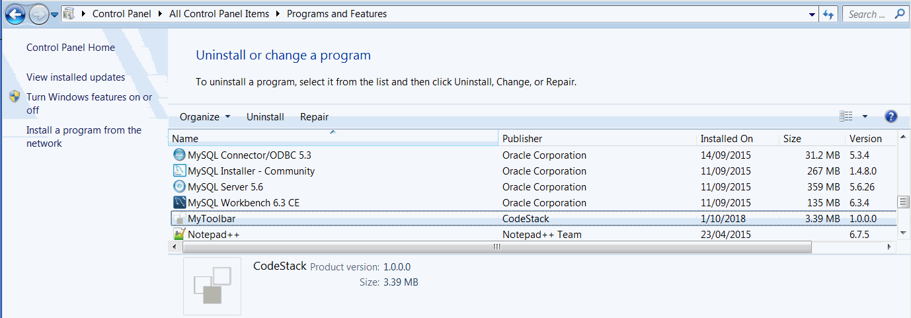{ width=350 }

## 发布新版本的产品

当准备好新版本的二进制文件时，需要更改**Product**节点的**Version**属性。并且可以升级先前版本的现有安装，而无需卸载先前版本。

> 建议将安装程序的版本与插件dll的程序集版本保持同步。

## Product.wxs文件的模板示例

~~~ wxs
<?xml version="1.0" encoding="UTF-8"?>
<Wix xmlns="http://schemas.microsoft.com/wix/2006/wi">
    <Product Id="*" Name="[Product Name" Language="1033" Version="1.0.0.0" Manufacturer="[Company Name]" UpgradeCode="NEW GUID">
        <Package InstallerVersion="200" Compressed="yes" InstallScope="perMachine" />

        <MajorUpgrade DowngradeErrorMessage="A newer version of [Product Name] is already installed." />
        <MediaTemplate EmbedCab="yes"/>

        <UIRef Id="WixUI_InstallDir" />
        <UIRef Id="WixUI_Common" />
        <Property Id="WIXUI_INSTALLDIR" Value="INSTALLFOLDER" />
        <Icon Id="MainIconId" SourceFile="Resources\icon.ico"/>
        <Property Id="ARPPRODUCTICON" Value="MainIconId" />
        <WixVariable Id="WixUIBannerBmp" Value="Resources\banner.bmp" />
        <WixVariable Id="WixUIDialogBmp" Value="Resources\dialog.bmp" />
        <WixVariable Id="WixUILicenseRtf" Value="Resources\eula.rtf" />
        
        <Feature Id="ProductFeature" Title="Setup" Level="1">
            <ComponentGroupRef Id="ProductComponents" />
            <ComponentGroupRef Id="AddInComRegGroup"/>
        </Feature>
    </Product>

    <Fragment>
        <Directory Id="TARGETDIR" Name="SourceDir">
            <Directory Id="ProgramFiles64Folder">
                <Directory Id="CodeStackDirId" Name="[Company Name]">
                    <Directory Id="INSTALLFOLDER" Name="[Product Name]" />
                </Directory>
            </Directory>
        </Directory>
    </Fragment>

    <Fragment>
        <ComponentGroup Id="ProductComponents" Directory="INSTALLFOLDER">
            <Component Id="Reg" Guid="{NEW GUID}">
                <RegistryValue Root="HKCU" Key="Software\SolidWorks\AddInsStartup\{ADDIN GUID}" Value="1" Type="integer" Action="write" />
                <RegistryValue Root="HKLM" Key="Software\SolidWorks\Addins\{ADDIN GUID}" Value="0" Type="integer" Action="write" />
                <RegistryValue Root="HKLM" Key="Software\SolidWorks\Addins\{ADDIN GUID}" Name="Description" Value="AddIn description" Type="string" Action="write" />
                <RegistryValue Root="HKLM" Key="Software\SolidWorks\Addins\{ADDIN GUID}" Name="Title" Value="AddIn title" Type="string" Action="write" />
            </Component>
            <Component Id="interops" Guid="{NEW GUID}">
                <File Id='SolidWorks.Interop.sldworks.dllID' Name='SolidWorks.Interop.sldworks.dll' Source ='$(var.SourceOutDir)\SolidWorks.Interop.sldworks.dll'/>
                <File Id='SolidWorks.Interop.swconst.dllID' Name='SolidWorks.Interop.swconst.dll' Source ='$(var.SourceOutDir)\SolidWorks.Interop.swconst.dll'/>
                <File Id='SolidWorks.Interop.swpublished.dllID' Name='SolidWorks.Interop.swpublished.dll' Source ='$(var.SourceOutDir)\SolidWorks.Interop.swpublished.dll'/>
                <File Id='SolidWorksTools.dllID' Name='SolidWorksTools.dll' Source ='$(var.SourceOutDir)\SolidWorksTools.dll'/>
            </Component>
            <Component Id="files" Guid="{NEW GUID}">
                <File Id='File1.dllID' Name='File1.dll' Source ='$(var.SourceOutDir)\File1.dll'/>
            </Component>
        </ComponentGroup>
    </Fragment>
</Wix>

~~~

## 示例项目

* [Sketch++](https://github.com/codestackdev/sketch-plus-plus/tree/master/Installer)
* [MyToolbar](https://github.com/codestackdev/my-toolbar/tree/master/Installer)
* [Geometry++](https://github.com/codestackdev/geometry-plus-plus/tree/master/Installer)