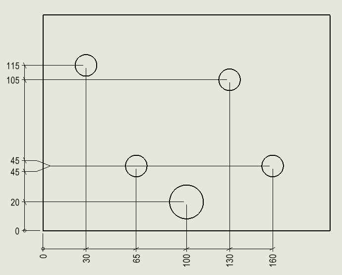

这个SOLIDWORKS VBA宏可以自动化添加所选图纸视图中所有孔的水平坐标尺寸。

* 宏将通过查找视图中的左下顶点来确定坐标尺寸的原点
* 宏将查找视图中的所有孔（仅包括内部孔，不考虑圆角）
* 宏将为孔添加水平和垂直尺寸
* 尺寸将相对于图纸视图进行定位

~~~ vb
Dim swApp As SldWorks.SldWorks
Dim swMathUtils As SldWorks.MathUtility

Sub main()

    Set swApp = Application.SldWorks
        
    Set swMathUtils = swApp.GetMathUtility
        
    Dim swModel As SldWorks.ModelDoc2
    
    Set swModel = swApp.ActiveDoc
    
    Dim swView As SldWorks.view

    Set swView = swModel.SelectionManager.GetSelectedObject6(1, -1)
    
    If swView Is Nothing Then
        Err.Raise vbError, "", "请选择视图"
    End If
    
    Dim swOrigVertex As SldWorks.vertex
    Set swOrigVertex = FindOriginVertex(swView)
    
    Dim vHoles As Variant
    vHoles = FindHoles(swView)
    
    If IsEmpty(vHoles) Then
        Err.Raise vbError, "", "未找到孔"
    End If
    
    Dim vOutline As Variant
    vOutline = swView.GetOutline
    
    Dim offset As Double
    offset = (vOutline(2) - vOutline(1)) * 0.1
    
    AddOrdinateDimensions swModel, swOrigVertex, vHoles, swAddOrdinateDims_e.swHorizontalOrdinate, 0, vOutline(1) - offset
    AddOrdinateDimensions swModel, swOrigVertex, vHoles, swAddOrdinateDims_e.swVerticalOrdinate, vOutline(0) - offset, 0

End Sub

Sub AddOrdinateDimensions(model As SldWorks.ModelDoc2, origVertex As SldWorks.vertex, holes As Variant, dimType As swAddOrdinateDims_e, x As Double, y As Double)
    
    Dim swSels() As SldWorks.Entity
    ReDim swSels(1 + UBound(holes))
    
    Set swSels(0) = origVertex
    
    Dim i As Integer
    
    For i = 0 To UBound(holes)
        Set swSels(i + 1) = holes(i)
    Next
    
    If model.Extension.MultiSelect2(swSels, False, Nothing) = UBound(swSels) + 1 Then
        Dim res As Long
        res = model.Extension.AddOrdinateDimension(dimType, x, y, 0)
        
        model.SetPickMode
        
        If res <> swCreateOrdDimError_e.swCreateOrdDimErr_Success Then
            Err.Raise vbError, "", "添加坐标尺寸失败"
        End If
    Else
        Err.Raise vbError, "", "选择实体失败"
    End If
    
End Sub

Function FindOriginVertex(view As SldWorks.view) As SldWorks.vertex
    
    Dim vComps As Variant
    
    vComps = view.GetVisibleComponents
    
    Dim swViewTransform As SldWorks.MathTransform
    Set swViewTransform = view.ModelToViewTransform
    
    Dim swOriginVertex As SldWorks.vertex
    
    If Not IsEmpty(vComps) Then
    
        Dim i As Integer
        
        For i = 0 To UBound(vComps)
        
            Dim swComp As SldWorks.Component2
                
            Set swComp = vComps(i)
            
            Dim vVisEnts As Variant
            vVisEnts = view.GetVisibleEntities2(swComp, swViewEntityType_e.swViewEntityType_Vertex)
            
            Dim j As Integer
            
            For j = 0 To UBound(vVisEnts)
                Dim swVertex As SldWorks.vertex
                Set swVertex = vVisEnts(j)
                                
                If swOriginVertex Is Nothing Then
                    Set swOriginVertex = swVertex
                Else
                    Dim vCurOrigCoord As Variant
                    vCurOrigCoord = GetVertexCoordinate(swOriginVertex, swViewTransform)
                    
                    Dim vCoord As Variant
                    vCoord = GetVertexCoordinate(swVertex, swViewTransform)

                    If vCoord(0) < vCurOrigCoord(0) And vCoord(1) < vCurOrigCoord(1) Then
                        Set swOriginVertex = swVertex
                    End If
                    
                End If
                
            Next
            
        Next
        
    End If
    
    If swOriginVertex Is Nothing Then
        Err.Raise vbError, "", "未找到原点顶点"
    End If
    
    Set FindOriginVertex = swOriginVertex
    
End Function

Function GetVertexCoordinate(vertex As SldWorks.vertex, transform As SldWorks.MathTransform) As Variant
        
    Dim vCoordPt As Variant
    vCoordPt = vertex.GetPoint()
    
    Dim swMathPt As SldWorks.MathPoint
    Set swMathPt = swMathUtils.CreatePoint(vCoordPt)
    
    Set swMathPt = swMathPt.MultiplyTransform(transform)
    
    GetVertexCoordinate = swMathPt.ArrayData
    
End Function

Function FindHoles(view As SldWorks.view) As Variant
    
    Dim vComps As Variant
    
    vComps = view.GetVisibleComponents
       
    Dim swHoles() As SldWorks.Edge
    
    If Not IsEmpty(vComps) Then
    
        Dim i As Integer
        
        For i = 0 To UBound(vComps)
        
            Dim swComp As SldWorks.Component2
                
            Set swComp = vComps(i)
            
            Dim vVisEnts As Variant
            vVisEnts = view.GetVisibleEntities2(swComp, swViewEntityType_e.swViewEntityType_Edge)
            
            Dim j As Integer
            
            For j = 0 To UBound(vVisEnts)
                
                Dim swEdge As SldWorks.Edge
                Set swEdge = vVisEnts(j)
                
                Dim swCurve As SldWorks.Curve
                Set swCurve = swEdge.GetCurve
                
                If False <> swCurve.IsCircle() Then
                    
                    Dim isClosed As Boolean
                    swCurve.GetEndParams -1, -1, isClosed, -1
                    
                    If False <> isClosed Then
                    
                        If (Not swHoles) = -1 Then
                            ReDim swHoles(0)
                        Else
                            ReDim Preserve swHoles(UBound(swHoles) + 1)
                        End If
                        
                        Set swHoles(UBound(swHoles)) = swEdge
        
                    End If
                    
                End If
                
            Next
            
        Next
        
    End If
    
    If (Not swHoles) = -1 Then
        FindHoles = Empty
    Else
        FindHoles = swHoles
    End If

End Function
~~~