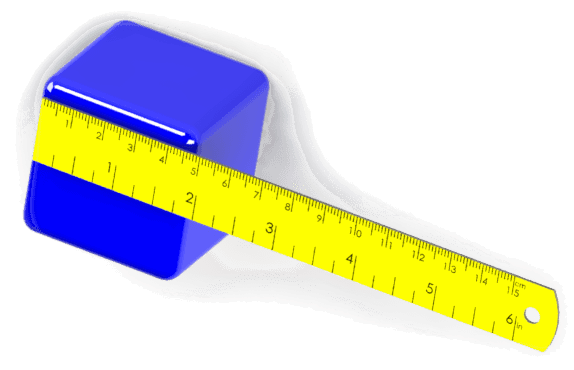

 通过SOLIDWORKS API自动化模型尺寸的文章和代码示例集合
sidebar_position: 7
image: solidworks-dimensions-api.png
---
{ width=300 }

可以通过[SOLIDWORKS API的IModelDocExtension::AddDimension](https://help.solidworks.com/2022/english/api/sldworksapi/solidworks.interop.sldworks~solidworks.interop.sldworks.imodeldocextension~adddimension.html)方法将尺寸添加到所选的草图段上。

每个尺寸都有一个唯一的名称，可以由用户分配。可以通过[IModelDoc2::Parameter](https://help.solidworks.com/2022/english/api/sldworksapi/solidworks.interop.sldworks~solidworks.interop.sldworks.imodeldoc2~parameter.html)方法按名称检索尺寸对象。

请参考[IDimension](https://help.solidworks.com/2022/english/api/sldworksapi/SolidWorks.Interop.sldworks~SolidWorks.Interop.sldworks.IDimension.html) SOLIDWORKS API接口，了解尺寸自动化的可用方法列表。