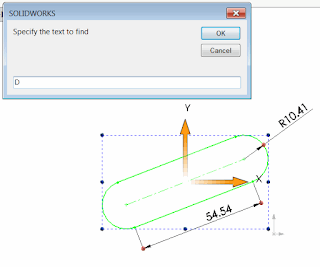

该宏使用SOLIDWORKS API在所选特征的尺寸名称中查找和替换文本（类似于文本编辑器中的查找和替换功能）：

{ width=320 }

1. 打开SOLIDWORKS装配或零件。
2. 选择要查找尺寸的特征。
3. 运行宏。
4. 指定要查找的文本和要替换的文本。只包括短尺寸名称。
   例如，Sketch1中的尺寸D1将具有短名称*D1*和完整名称*D1@Sketch1*。在查找字段中指定*D*，在替换字段中指定*B*，将导致尺寸重命名为*B1@Sketch1*。

```vb
Dim swApp As SldWorks.SldWorks
Dim swModel As SldWorks.ModelDoc2
Dim swSelMgr As SldWorks.SelectionMgr

Sub main()

    Set swApp = Application.SldWorks
    
    Set swModel = swApp.ActiveDoc
    
    Set swSelMgr = swModel.SelectionManager
    
    If Not swModel Is Nothing Then
    
        Dim fromText As String
        Dim toText As String
        
        fromText = InputBox("Specify the text to find")
        toText = InputBox("Specify the text to replace")
    
        Dim i As Integer
        Dim isFeatSelected As Boolean
        isFeatSelected = False
        
        For i = 1 To swSelMgr.GetSelectedObjectCount2(-1)
            
            Dim swFeat As SldWorks.Feature
                
            Set swFeat = swSelMgr.GetSelectedObject6(i, -1)
                
            If Not swFeat Is Nothing Then
                
                isFeatSelected = True
                
                Dim swDispDim As SldWorks.DisplayDimension
                Set swDispDim = swFeat.GetFirstDisplayDimension
                
                While Not swDispDim Is Nothing
                    
                    Dim swDim As SldWorks.Dimension
                    Set swDim = swDispDim.GetDimension2(0)
                    
                    swDim.Name = Replace(swDim.Name, fromText, toText)
                    
                    Set swDispDim = swFeat.GetNextDisplayDimension(swDispDim)
                    
                Wend
                
            End If
            
        Next
        
        If Not isFeatSelected Then
            MsgBox "Please select feature(s) you want to rename dimensions in"
        End If
        
    Else
        MsgBox "Please open the model"
    End If
    
End Sub
```

