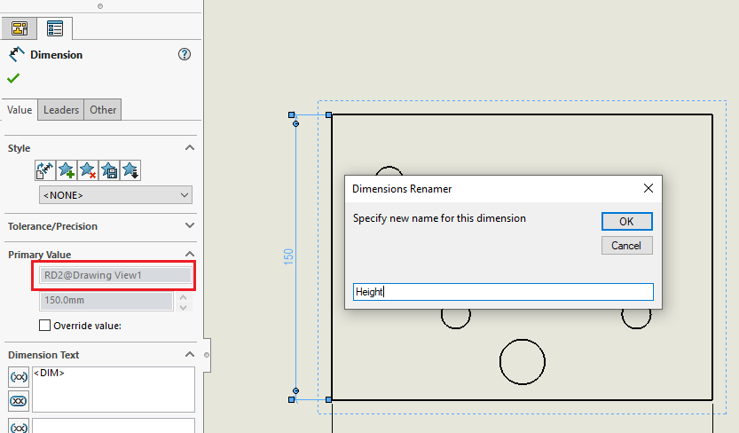

---
标题：重命名尺寸
描述：VBA宏，用于在SOLIDWORKS绘图视图中为尺寸分配自定义名称，否则无法在用户界面中重命名
图片：read-only-dimension-name.png
---

SOLIDWORKS允许在3D文档（零件和装配体）中分配自定义尺寸名称。

然而，绘图视图中的尺寸名称是只读的，无法更改。

在某些情况下，为绘图视图中的尺寸分配自定义名称可能会很有益。例如，当尺寸是[检验报告](/docs/codestack/solidworks-api/document/drawing/export-dimensions/)的一部分或者是DriveWorks等绘图自动化软件的一部分时。

这个VBA宏允许为绘图视图中的尺寸分配自定义名称。

选择要更改名称的尺寸，然后运行宏。

在弹出的对话框中指定新名称。

{width=600}

指定名称后，尺寸名称将设置为新值。

> 还可以以\<尺寸名称\>@\<特征名称\>的格式分配尺寸的完整名称（例如MyDimension@MyView）。在这种情况下，宏还将重命名父视图。这对于无法重命名的视图（例如剖视图）非常有益。

~~~ vb
Dim swApp As SldWorks.SldWorks

Sub main()

    Set swApp = Application.SldWorks
    
    Dim swModel As SldWorks.ModelDoc2
    
    Set swModel = swApp.ActiveDoc
    
    If swModel Is Nothing Then
        Err.Raise vbError, "", "请选择绘图尺寸"
    End If

    Dim swDispDim As SldWorks.DisplayDimension
    
    Set swDispDim = swModel.SelectionManager.GetSelectedObject6(1, -1)
    
    If swDispDim Is Nothing Then
        Err.Raise vbError, "", "请选择尺寸"
    End If
    
    Dim swDim As SldWorks.dimension
    Set swDim = swDispDim.GetDimension2(0)
    
    Dim newName As String
    newName = InputBox("为此尺寸指定新名称", "尺寸重命名器", swDim.Name)
    
    If newName <> "" Then
        
        If InStr(newName, "@") <> 0 Then
            
            Dim vNameParts As Variant
            vNameParts = Split(newName, "@")
            newName = vNameParts(0)
            
            Dim featName As String
            featName = vNameParts(1)
            
            RenameFeature swModel, swDim, featName
            
        End If
        
        swDim.Name = newName
    End If
    
End Sub

Sub RenameFeature(model As SldWorks.ModelDoc2, dimension As SldWorks.dimension, newFeatName As String)
    
    Dim vDimNameParts As Variant
    vDimNameParts = Split(dimension.FullName, "@")
    
    Dim featName As String
    featName = vDimNameParts(1)
    
    Dim swFeat As SldWorks.Feature
    Set swFeat = model.FeatureByName(featName)
    
    If swFeat Is Nothing Then
        Err.Raise vbError, "", "无法按名称找到特征：" & featName
    End If
    
    swFeat.Name = newFeatName
    
End Sub
~~~