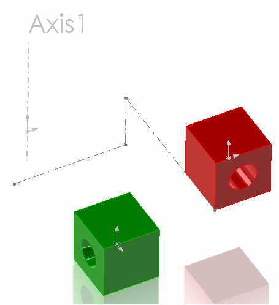

{ width=250 }

This example demonstrates how to load the transformation matrix for the components from the CSV file and apply it as a presentation transform using SOLIDWORKS API

* Download and open the [Example SOLIDWORKS Files](presentation-transform-example.zip)
* Download [CSV File](transforms.csv) and save to disc
* Modify the path to the CSV file in the macro constant
* Run the macro. Macro stops the execution and the components are transformed as shown below

{ width=250 }

Red component is translated in XYZ space and green component is rotated 90 degrees around global Y axis (Axis 1).

Please note that the components are moved regardless the fact that both of them are fully defined in space (by mates or fix constraint). And the mates are still preserved. The reason is that the presentation transform was applied instead of the permanent one. This allows to only move the components for visual purposes without changing the geometry.

Continue the macro with F5 or Play button to remove the presentation transformation. Use [IComponent2::Transform2](https://help.solidworks.com/2012/english/api/sldworksapi/SolidWorks.Interop.sldworks~SolidWorks.Interop.sldworks.IComponent2~Transform2.html) SOLIDWORKS API property instead of [IComponent2::PresentationTransform](https://help.solidworks.com/2012/english/api/sldworksapi/solidworks.interop.sldworks~solidworks.interop.sldworks.icomponent2~presentationtransform.html) to apply the permanent transform if needed (in this case it is required to remove any mates which will not fit this transformation).

~~~ vb
Const INPUT_FILE_PATH = "D:\transforms.csv"

Dim swApp As SldWorks.SldWorks
Dim swAssy As SldWorks.AssemblyDoc

Sub main()

    On Error GoTo Error

    Set swApp = Application.SldWorks
    
    Set swAssy = swApp.ActiveDoc
    
    Dim vTable As Variant
    vTable = ReadCsvFile(INPUT_FILE_PATH, True)
    
    swAssy.EnablePresentation = True
    PreviewComponentsPosition vTable
    
Error:
    Stop
    swAssy.EnablePresentation = False
        
End Sub

Function ReadCsvFile(filePath As String, firstRowHeader As Boolean) As Variant
    
    'rows x columns
    Dim vTable() As Variant
    
    On Error GoTo Error
    
    Dim fileName As String
    Dim tableRow As String
    Dim fileNo As Integer

    fileNo = FreeFile
    
    Open filePath For Input As #fileNo
    
    Dim isFirstRow As Boolean
    Dim isTableInit As Boolean
    
    isFirstRow = True
    isTableInit = False
    
    Do While Not EOF(fileNo)
        
        Line Input #fileNo, tableRow
            
        If Not isFirstRow Or Not firstRowHeader Then
            
            Dim vCells As Variant
            vCells = Split(tableRow, ",")
            
            Dim lastRowIndex As Integer
            
            If Not isTableInit Then
                lastRowIndex = 0
                isTableInit = True
                ReDim Preserve vTable(lastRowIndex)
            Else
                lastRowIndex = UBound(vTable, 1) + 1
                ReDim Preserve vTable(lastRowIndex)
            End If
            
            vTable(lastRowIndex) = vCells
            
        End If
        
        If isFirstRow Then
            isFirstRow = False
        End If
    
    Loop
    
    Close #fileNo
    
    ReadCsvFile = vTable
    
    Exit Function
    
Error:

    ReadCsvFile = Empty
    
End Function

Sub PreviewComponentsPosition(table As Variant)
    
    Dim i As Integer
    
    For i = 0 To UBound(table)
    
        Dim swComp As SldWorks.Component2
        
        Dim compName As String
        compName = table(i)(0)
        
        Set swComp = GetComponent(compName)
        
        If Not swComp Is Nothing Then
            swComp.RemovePresentationTransform
            swComp.PresentationTransform = CreateTransform(table(i))
        Else
            Debug.Print compName & " is not found"
        End If
        
    Next
    
    Dim swModelView As SldWorks.ModelView
    Set swModelView = swAssy.ActiveView
    swModelView.GraphicsRedraw Nothing
    
End Sub

Function CreateTransform(tableRow As Variant) As SldWorks.MathTransform
    
    Dim swMathUtils As SldWorks.MathUtility
    Set swMathUtils = swApp.GetMathUtility
    
    Dim dMatrix(15) As Double
    
    dMatrix(0) = CDbl(tableRow(1)): dMatrix(1) = CDbl(tableRow(2)): dMatrix(2) = CDbl(tableRow(3)): dMatrix(3) = CDbl(tableRow(5))
    dMatrix(4) = CDbl(tableRow(6)): dMatrix(5) = CDbl(tableRow(7)): dMatrix(6) = CDbl(tableRow(9)): dMatrix(7) = CDbl(tableRow(10))
    dMatrix(8) = CDbl(tableRow(11)): dMatrix(9) = CDbl(tableRow(13)): dMatrix(10) = CDbl(tableRow(14)): dMatrix(11) = CDbl(tableRow(15))
    dMatrix(12) = CDbl(tableRow(16)): dMatrix(13) = CDbl(tableRow(4)): dMatrix(14) = CDbl(tableRow(8)): dMatrix(15) = CDbl(tableRow(12))
    
    Dim swXform As SldWorks.MathTransform
    Set swXform = swMathUtils.CreateTransform(dMatrix)

    Set CreateTransform = swXform
    
End Function

Function GetComponent(compPath As String) As Component2
    
    Dim swComp As SldWorks.Component2
    
    Dim compNames As Variant
    compNames = Split(compPath, "\")
    
    Dim i As Integer
    Set swComp = swAssy.ConfigurationManager.ActiveConfiguration.GetRootComponent()
    
    For i = 0 To UBound(compNames)
        If Not swComp Is Nothing Then
            
            Dim vChildComps As Variant
            Dim j As Integer
            
            vChildComps = swComp.GetChildren
            
            Dim isCompFound As Boolean
            isCompFound = False
            
            If Not IsEmpty(vChildComps) Then
                
                Dim shortCompName As String
                
                For j = 0 To UBound(vChildComps)
                    
                    Dim swChildComp As SldWorks.Component2
                    Set swChildComp = vChildComps(j)
                    
                    Dim vShortNames As Variant
                    vShortNames = Split(swChildComp.Name2, "/")
                    shortCompName = vShortNames(UBound(vShortNames))
                    
                    If LCase(shortCompName) = LCase(compNames(i)) Then
                        Set swComp = swChildComp
                        isCompFound = True
                    End If
                Next
            End If
            
            If Not isCompFound Then
                Set swComp = Nothing
            End If
            
        End If
    Next
    
    Set GetComponent = swComp
    
End Function

~~~

