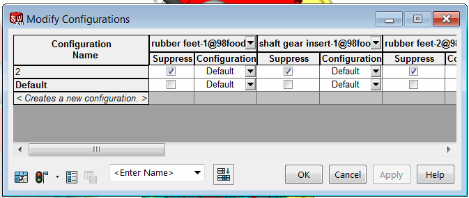

 Example demonstrates how to modify parameters of multiple components in the specified configurations (e.g. suppression state) using SOLIDWORKS API
image: modify-configurations.png
labels: [parameters, design table, components, configuration]
---
{ width=350 }

This example demonstrates how to use parameters (similar to design table parameters) to suppress all components in every configuration except of the active one using SOLIDWORKS API. It is not required to activate configuration or select any components to use the macro.

Multiple components can be modified in a batch mode to improve performance.

~~~ vb
Dim swApp As SldWorks.SldWorks

Sub main()

    Set swApp = Application.SldWorks
    
    Dim swAssy As SldWorks.AssemblyDoc
    
    Set swAssy = swApp.ActiveDoc
    
    If Not swAssy Is Nothing Then
        
        Dim vConfNames As Variant
        vConfNames = GetOtherConfigurations(swAssy)
        
        If Not IsEmpty(vConfNames) Then
        
            Dim vComps As Variant
            vComps = swAssy.GetComponents(True)
            
            Dim i As Integer
            
            Dim paramNames() As String
            Dim paramValues() As String
            
            ReDim paramNames(UBound(vComps))
            ReDim paramValues(UBound(vComps))
            
            For i = 0 To UBound(vComps)
                    
                Dim swComp As SldWorks.Component2
                Set swComp = vComps(i)
                
                Dim instId As Integer
                Dim compName As String
                compName = swComp.Name2
                instId = CInt(Right(compName, Len(compName) - InStrRev(compName, "-")))
                compName = Left(compName, InStrRev(compName, "-") - 1)
                
                paramNames(i) = "$STATE@" & compName & "<" & instId & ">"
                paramValues(i) = "S"
                                
            Next
            
            For i = 0 To UBound(vConfNames)
                
                Dim swConfMgr As SldWorks.ConfigurationManager
                Set swConfMgr = swAssy.ConfigurationManager
                
                If False = swConfMgr.SetConfigurationParams(CStr(vConfNames(i)), (paramNames), (paramValues)) Then
                    MsgBox "Failed to set configuration parameters for " & CStr(vConfNames(i))
                End If
                
            Next
            
        Else
            MsgBox "There is no other configurations in the assembly"
        End If
    
    Else
        MsgBox "Please open assembly"
    End If
    
End Sub

Function GetOtherConfigurations(model As SldWorks.ModelDoc2) As Variant
    
    Dim vAllConfs As Variant
    vAllConfs = model.GetConfigurationNames()
    
    If UBound(vAllConfs) > 0 Then
        
        Dim confs() As String
        ReDim confs(UBound(vAllConfs) - 1)
        
        Dim curIndex As Integer
        curIndex = 0
        
        Dim activeConf As String
        activeConf = model.ConfigurationManager.ActiveConfiguration.Name
        
        Dim i As Integer
        
        For i = 0 To UBound(vAllConfs)
            If LCase(vAllConfs(i)) <> LCase(activeConf) Then
                confs(curIndex) = vAllConfs(i)
                curIndex = curIndex + 1
            End If
        Next
        
        GetOtherConfigurations = confs
        
    Else
        GetOtherConfigurations = Empty
    End If
    
End Function
~~~

