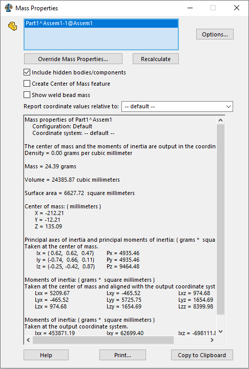

这个宏演示了两种方法来计算所选组件的重心（COG），与装配坐标系相关。

宏将计算所选组件的重心。

## 转换坐标

[IModelDocExtension::GetMassProperties2](https://help.solidworks.com/2017/english/api/sldworksapi/SolidWorks.Interop.sldworks~SolidWorks.Interop.sldworks.IModelDocExtension~GetMassProperties2.html) API允许在模型中计算质量属性数据。

当在组件的模型级别上计算时，需要使用变换将坐标转换为装配空间，以获得所需的结果。

~~~ vb
Dim swApp As SldWorks.SldWorks

Sub main()

    Set swApp = Application.SldWorks
    
    Dim swModel As SldWorks.ModelDoc2
    Dim swSelMgr As SldWorks.SelectionMgr
    
    Set swModel = swApp.ActiveDoc
    Set swSelMgr = swModel.SelectionManager
    
    Dim swComp As SldWorks.Component2
    
    Set swComp = swSelMgr.GetSelectedObjectsComponent3(1, -1)
    
    Dim swCompModel As SldWorks.ModelDoc2
    Set swCompModel = swComp.GetModelDoc2
    
    Const ACCURACY_DEFAULT As Integer = 1
    Dim status As swMassPropertiesStatus_e
    
    Dim vMassPrps As Variant
    vMassPrps = swCompModel.Extension.GetMassProperties2(ACCURACY_DEFAULT, status, False)
    
    Dim dCog(2) As Double
    
    dCog(0) = vMassPrps(0): dCog(1) = vMassPrps(1): dCog(2) = vMassPrps(2)
    
    Dim swMathUtils As SldWorks.MathUtility
    
    Set swMathUtils = swApp.GetMathUtility
    
    Dim swMathPt As SldWorks.MathPoint
    Set swMathPt = swMathUtils.CreatePoint(dCog)
    
    Set swMathPt = swMathPt.MultiplyTransform(swComp.Transform2)
    
    Dim vCog As Variant
    vCog = swMathPt.ArrayData
    
    Debug.Print "COG: " & vCog(0) & "; " & vCog(1) & "; " & vCog(2)
    
End Sub
~~~

## 使用IMassProperty接口

[IMassProperty](https://help.solidworks.com/2017/English/api/sldworksapi/SOLIDWORKS.Interop.sldworks~SOLIDWORKS.Interop.sldworks.IMassProperty.html)接口模拟了SOLIDWORKS中质量属性功能的功能。

{ width=400 }

与UI等效项类似，可以为计算范围分配体（包括组件体）。

与前一方法相比，这种方法的主要优点之一是可以计算轻量级组件的重心。

~~~ vb
Dim swApp As SldWorks.SldWorks

Sub main()

    Set swApp = Application.SldWorks
    
    Dim swModel As SldWorks.ModelDoc2
    Dim swSelMgr As SldWorks.SelectionMgr
    
    Set swModel = swApp.ActiveDoc
    Set swSelMgr = swModel.SelectionManager
    
    Dim swComp As SldWorks.Component2
    
    Set swComp = swSelMgr.GetSelectedObjectsComponent3(1, -1)
    
    Dim swMassPrps As SldWorks.MassProperty
    Set swMassPrps = swModel.Extension.CreateMassProperty()
    
    Dim vCompBodies As Variant
    vCompBodies = swComp.GetBodies3(swBodyType_e.swSolidBody, Empty)
    
    If False <> swMassPrps.AddBodies(vCompBodies) Then
    
        Dim vCog As Variant
        vCog = swMassPrps.CenterOfMass
        
        Debug.Print "COG: " & vCog(0) & "; " & vCog(1) & "; " & vCog(2)
    
    Else
        Err.Raise vbError, "", "Failed to add bodies for calculation"
    End If
    
End Sub
~~~