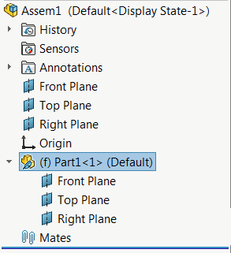

 Example demonstrates how to get the pointer to IModelDoc2 from the component (even if it is in the suppressed or lightweight state)
image: lightweight-component.png
labels: [assembly, component, example, lightweight, modeldoc, memory, solidworks api]
---

[IComponent2::GetModelDoc2](https://help.solidworks.com/2012/english/api/sldworksapi/SolidWorks.Interop.sldworks~SolidWorks.Interop.sldworks.IComponent2~GetModelDoc2.html) SOLIDWORKS API method returns the pointer to [IModelDoc2](https://help.solidworks.com/2012/english/api/sldworksapi/SolidWorks.Interop.sldworks~SolidWorks.Interop.sldworks.IModelDoc2.html) interface.

It is required to use this interface to retrieve the model specific information (such as custom properties, feature tree, annotations etc.).

The model document is not available for the components loaded lightweight or suppressed (i.e. the pointer is *NULL*).

The following example demonstrates how to get the pointer to IModelDoc2 from the component (even if it is in the suppressed or lightweight state) using SOLIDWORKS API. The result is achieved by loading the component directly into memory without the need of resolving the component or opening the file in its own window.

~~~ vb
Dim swApp As SldWorks.SldWorks
Dim swAssy As SldWorks.AssemblyDoc

Sub main()

    On Error Resume Next
    
    Set swApp = Application.SldWorks
    
    Set swAssy = swApp.ActiveDoc
    
    If Not swAssy Is Nothing Then
        
        Dim swComp As SldWorks.Component2
        Set swComp = swAssy.SelectionManager.GetSelectedObject6(1, -1)
        
        If Not swComp Is Nothing Then
        
            Dim swRefModel As SldWorks.ModelDoc2
            Set swRefModel = GetModelDocFromComponent(swComp)
            
            Debug.Print swRefModel.GetTitle
            
        Else
            MsgBox "Please select the component"
        End If
        
    Else
        MsgBox "Please open assembly"
    End If
    
End Sub

Function GetModelDocFromComponent(comp As SldWorks.Component2) As SldWorks.ModelDoc2
    
    Dim swRefModel As SldWorks.ModelDoc2
    Set swRefModel = comp.GetModelDoc2
    
    If swRefModel Is Nothing Then 'component is lightweight or suppressed
        
        Dim path As String
        path = comp.GetPathName
        
        Dim docType As swDocumentTypes_e
        
        docType = GetDocumentTypeFromPath(path)
        
        On Error GoTo End_
        
        swApp.DocumentVisible False, docType
        
        Dim errs As Long
        Dim wrns As Long
        Set swRefModel = swApp.OpenDoc6(path, docType, swOpenDocOptions_e.swOpenDocOptions_Silent, "", errs, wrns)
        
End_: 'restore the flag otherwise all files will be opened invisible
    swApp.DocumentVisible True, docType
        
    End If
    
    Set GetModelDocFromComponent = swRefModel

End Function

Function GetDocumentTypeFromPath(path As String) As swDocumentTypes_e
    
    Dim ext As String
    ext = Right(path, Len(path) - InStrRev(path, "."))
    
    Select Case UCase(ext)
        
        Case "SLDPRT"
            GetDocumentTypeFromPath = swDocPART
            Exit Function
            
        Case "SLDASM"
            GetDocumentTypeFromPath = swDocASSEMBLY
            Exit Function
            
        Case "SLDDRW"
            GetDocumentTypeFromPath = swDocDRAWING
            Exit Function
            
    End Select
    
End Function
~~~

