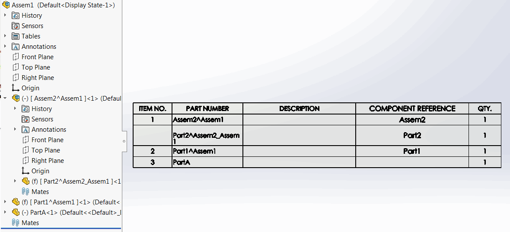

 VBA macro to copy component name to the component reference using SOLIDWORKS with an ability to filter virtual components only
image: component-reference.png
labels: [name,virtual,component reference]
group: Assembly
---
{ width=350 }

This VBA macro allows to copy the name of the components in the active assembly to the component's reference using SOLIDWORKS API.

Macro has an option to only process virtual components by settings the *VIRTUAL_ONLY* option to *True*.

~~~ vb
Const VIRTUAL_ONLY As Boolean = True
~~~

This macro can be useful if component names are used to store the project attributes (e.g. Part Number) as component name cannot be added to the Bill Of Materials while Component Reference can be.

{ width=350 }

~~~ vb
Const VIRTUAL_ONLY As Boolean = False

Dim swApp As SldWorks.SldWorks

Sub main()
    
    Set swApp = Application.SldWorks
    
    Dim swModel As SldWorks.ModelDoc2
    Dim swSelMgr As SldWorks.SelectionMgr

    Set swModel = swApp.ActiveDoc
    
    If Not swModel Is Nothing Then
    
        If swModel.GetType() = swDocumentTypes_e.swDocASSEMBLY Then
        
            Dim swAssy As SldWorks.AssemblyDoc
            Set swAssy = swModel
            
            Dim vComps As Variant
            vComps = swAssy.GetComponents(False)
            
            Dim i As Integer
            
            For i = 0 To UBound(vComps)
                
                Dim swComp As SldWorks.Component2
                Set swComp = vComps(i)
                
                If swComp.IsVirtual Or Not VIRTUAL_ONLY Then
                
                    Dim compName As String
                    
                    compName = swComp.Name2
                    
                    If Not swComp.GetParent() Is Nothing Then
                        'if not root remove the sub-assemblies name
                        compName = Right(compName, Len(compName) - InStrRev(compName, "/"))
                    End If
                    
                    If swComp.IsVirtual() Then
                        'if virtual remove the context assembly name
                        compName = Left(compName, InStr(compName, "^") - 1)
                    Else
                        'remove the index name
                        compName = Left(compName, InStrRev(compName, "-") - 1)
                    End If
                    
                    swComp.ComponentReference = compName
                
                End If
                
            Next

        Else
            MsgBox "Active document is not an assembly"
        End If
    
    Else
        MsgBox "Please open assembly document"
    End If
    
End Sub
~~~

