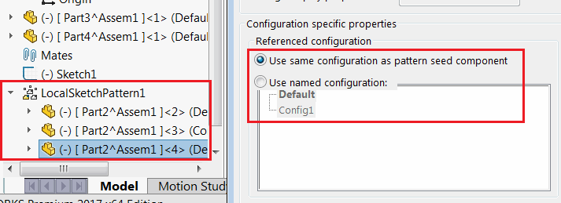

 Example demonstrates how to change the configuration specific properties (use same configuration as pattern seed component or use named configuration) of the component in the pattern using SOLIDWORKS API
image: component-config-specific-properties.png
labels: [assembly, spattern, configuration, seed]
---

This macro example demonstrates how to change the following configuration specific properties using SOLIDWORKS API.

* Use same configuration as pattern seed component
* Use named configuration

[IAssemblyDoc::CompConfigProperties5](https://help.solidworks.com/2018/english/api/sldworksapi/solidworks.interop.sldworks~solidworks.interop.sldworks.iassemblydoc~compconfigproperties5.html) SOLIDWORKS API is used to modify the multiple properties at a time for the selected component.

In the instance component of the pattern (e.g. Sketch Driven Pattern)

~~~ vb
Enum SeedCompConfigOpts_e
    UseSameConfigAsPatternSeed
    UseNamedConfiguration
End Enum

Dim swApp As SldWorks.SldWorks
Dim swAssy As SldWorks.AssemblyDoc

Sub main()

    Set swApp = Application.SldWorks
    
    Set swAssy = swApp.ActiveDoc
    
    Dim swComp As SldWorks.Component2
    
    Set swComp = swAssy.SelectionManager.GetSelectedObject6(1, -1)
    
    If Not swComp Is Nothing Then
        
        'Set use named to 'Config1'
        SetConfigSpecProps swComp, SeedCompConfigOpts_e.UseNamedConfiguration, "Config1"
        
        Stop
        
        'Set use same configuration as pattern seed component
        SetConfigSpecProps swComp, SeedCompConfigOpts_e.UseSameConfigAsPatternSeed
    
    Else
        MsgBox "Please select component"
    End If
    
End Sub

Sub SetConfigSpecProps(comp As SldWorks.Component2, opts As SeedCompConfigOpts_e, Optional namedConf As String = "")
    
    comp.Select4 False, Nothing, False
    
    Dim suppOpts As Long
    Dim solveOpts As Long
    Dim isVisible As Boolean
    Dim exlFromBom As Boolean
    Dim isEnv As Boolean
    Dim useNamedConf As Boolean
    Dim refConfName As String
    
    suppOpts = comp.GetSuppression()
    solveOpts = comp.Solving
    
    If solveOpts = -1 Then
        'Note: for part components this will be -1 but the CompConfigProperties5 failse if -1 is passed
        solveOpts = swComponentSolvingOption_e.swComponentRigidSolving
    End If
    
    isVisible = comp.Visible
    exlFromBom = comp.ExcludeFromBOM
    isEnv = comp.isEnvelope
        
    Select Case opts
        Case SeedCompConfigOpts_e.UseSameConfigAsPatternSeed
            useNamedConf = False
        Case SeedCompConfigOpts_e.UseNamedConfiguration
            useNamedConf = True
            refConfName = namedConf
    End Select
    
    swAssy.CompConfigProperties5 suppOpts, solveOpts, isVisible, useNamedConf, refConfName, exlFromBom, isEnv
    
End Sub
~~~

