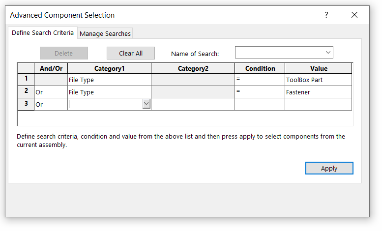
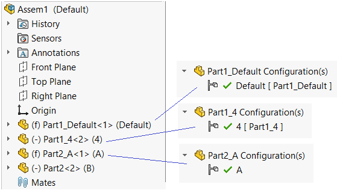
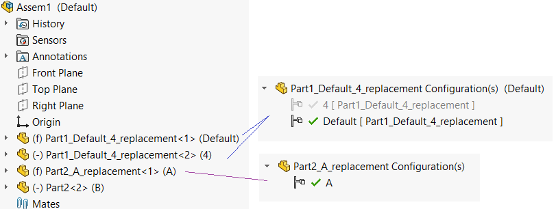

 VBA macro to create copies of all selected components in the assembly and purge configurations in each of them
image: purged-components-result1.png
labels: [component, replace, purge]
group: Assembly
---
In some cases it might be required to remove (purge) all unused configurations from the components in the assembly. It is in particular useful for the fastener or toolbox components as file can contains thousands of configurations but only few are used in the assembly.

This macro allows to create a copy of all selected components, purge their configurations and replace them in the assembly.

> It is strongly recommended to backup your assembly before using this macro

You can either select components manually or use [advanced component selection tool](https://help.solidworks.com/2016/English/SolidWorks/sldworks/c_Advanced_Component_Selection_SWassy.htm) to select components based on the criteria (e.g. or fasteners or toolbars):

For additional criteria use the [extended advanced selection macro](/docs/codestack/solidworks-api/document/assembly/components/advanced-selection/).

## Notes

* Macro will only work with permanent components. Error will be generated for virtual components
* Macro will only work with part based (*.sldprt) components
* Macro will only work wil fully loaded components, suppressed or lightweight components are not supported
* Macro doesn't save the document after processing. Use *Save All* to save all modifications
* Macro will copy all replacement part at the same location as source part
* Component can be selected in the Feature Manager tree or from the graphics view (it is possible to select any entity of the component as well, such as face or edge)
* Design table will be removed if exists
* Macro will not replace existing files and *File already exist* wil be generated if target file already created. Remove all of these files manually. If macro failed, some of the files may be loaded into the memory despite they are not used in the assembly. Use *Close All* command to release those files
* Mates will be reattached

## Options

### Replacement Name

Specify the name of the replacement file by changing the *REPLACEMENT_NAME* constant. Use fre text with the \[title\] and \[conf\] placeholders which will be replaced with title of the source file and the component's referenced configuration respectively. If the *GROUP_BY_CONFIGURATIONS* option is set to True, the \[conf\] placeholder will be replaced by the join of all configuration names separated by _ symbol.

### Grouping Configurations

*GROUP_BY_CONFIGURATIONS* option allows to specify if the components referencing the same document in different configuration should be replaced by single component or new single configuration part should be created for each component irrespectively.

### Examples

There are 2 files with multiple configuration

* Part1.sldprt contains 4 configurations: Default, 2, 3 and 4
* Part2.sldprt contains 6 configurations driven by the design table: Default, A, B, C, D, E
* Part1 is placed into the assembly 2 times in configurations Default and 4
* Part2 is placed into the assembly 2 times in configurations A and B

User selects first 3 components and runs the macro. The following results will be produced depending on the specified settings

### Option 1

~~~ vb
Const GROUP_BY_CONFIGURATIONS As Boolean = False
Const REPLACEMENT_NAME As String = "[title]_[conf]"
~~~

As the result 3 new files will be generated with a single configuration: Part1_Default.sldprt, Part1_4.sldprt, Part2_A.sldprt (design table is removed) and all selected component will be replaced. The 4th component will not be changed as it was not selected initially.

### Option 2

~~~ vb
Const GROUP_BY_CONFIGURATIONS As Boolean = True
Const REPLACEMENT_NAME As String = "[title]_[conf]_replacement"
~~~

As the result 2 new files will be generated: Part1_Default_4_replacement.sldprt (with 2 configurations), Part2_A_replacement.sldprt (design table is removed) and all selected component will be replaced. The 4th component will not be changed as it was not selected initially.

~~~ vb
Const GROUP_BY_CONFIGURATIONS As Boolean = False
Const REPLACEMENT_NAME As String = "[title]_[conf]"

Dim swApp As SldWorks.SldWorks

Sub main()

    Set swApp = Application.SldWorks
    
try:
    On Error GoTo catch
    
    Dim swAssy As SldWorks.AssemblyDoc
    
    Set swAssy = swApp.ActiveDoc
    
    If Not swAssy Is Nothing Then
        
        Dim vComps As Variant
        vComps = GetReplacementComponents(swAssy)
        
        Dim swCompGroups As Object
        Set swCompGroups = GroupByModel(vComps)
        
        Dim replacementsMap As Object

        Set replacementsMap = CreateReplacementModels(swCompGroups)
        
        ReplaceComponents swAssy, vComps, replacementsMap
        
    Else
        Err.Raise vbError, "", "Open assembly document"
    End If
    
    GoTo finally
    
catch:
    swApp.SendMsgToUser2 Err.Description, swMessageBoxIcon_e.swMbStop, swMessageBoxBtn_e.swMbOk
finally:
    
End Sub

Sub ReplaceComponents(assy As SldWorks.AssemblyDoc, comps As Variant, replacementMap As Object)
    
    Dim i As Integer
    
    For i = 0 To UBound(comps)
        
        Dim swComp As SldWorks.Component2
        Set swComp = comps(i)
        
        Dim srcKey As String
        
        srcKey = swComp.GetModelDoc2().GetPathName
        
        If Not GROUP_BY_CONFIGURATIONS Then
            srcKey = srcKey & "::" & swComp.ReferencedConfiguration
        End If
        
        If False <> swComp.Select4(False, Nothing, False) Then
            Dim fileName As String
            fileName = replacementMap.item(srcKey)
            
            If False = assy.ReplaceComponents2(fileName, swComp.ReferencedConfiguration, False, swReplaceComponentsConfiguration_e.swReplaceComponentsConfiguration_MatchName, True) Then
                Err.Raise vbError, "", "Failed to replace the component " & swComp.Name2
            End If
            
        Else
            Err.Raise vbError, "", ""
        End If
        
    Next
    
End Sub

Function CreateReplacementModels(modelsMap As Object) As Object
    
    Const PLACEHOLDER_TITLE As String = "[title]"
    Const PLACEHOLDER_CONF As String = "[conf]"

    Dim replacementsMap As Object
    Set replacementsMap = CreateObject("Scripting.Dictionary")
    
    Dim i As Integer
    
    Dim vModels As Variant
    vModels = modelsMap.keys
    
    For i = 0 To UBound(vModels)
        
        Dim swModel As SldWorks.ModelDoc2
        Set swModel = vModels(i)
        
        Dim refConfs As Collection
        Set refConfs = modelsMap.item(swModel)
        
        Dim path As String
        Dim dir As String
        Dim title As String
        
        path = swModel.GetPathName
        title = Mid(path, InStrRev(path, "\") + 1, InStrRev(path, ".") - InStrRev(path, "\") - 1)
        dir = Left(path, InStrRev(path, "\"))
        
        Dim newTitle As String
        Dim newPath As String
        Dim j As Integer
        
        If GROUP_BY_CONFIGURATIONS Then
            
            Dim confs As String
            confs = ""
            For j = 1 To refConfs.Count
                confs = confs & refConfs(j) & IIf(j <> refConfs.Count, "_", "")
            Next
            
            newTitle = Replace(REPLACEMENT_NAME, PLACEHOLDER_TITLE, title)
            newTitle = Replace(newTitle, PLACEHOLDER_CONF, confs)
            newPath = dir & newTitle & ".sldprt"
            
            CreateFileCopy path, newPath
            
            RemoveConfigurations newPath, refConfs
            replacementsMap.Add path, newPath
        Else
            For j = 1 To refConfs.Count
                
                newTitle = Replace(REPLACEMENT_NAME, PLACEHOLDER_TITLE, title)
                newTitle = Replace(newTitle, PLACEHOLDER_CONF, refConfs(j))
                newPath = dir & newTitle & ".sldprt"
                
                CreateFileCopy path, newPath
                
                Dim keepConf As Collection
                Set keepConf = New Collection
                keepConf.Add refConfs(j)
                
                RemoveConfigurations newPath, keepConf
                replacementsMap.Add path & "::" & refConfs(j), newPath
            Next
        End If
        
    Next
    
    Set CreateReplacementModels = replacementsMap
    
End Function

Sub CreateFileCopy(srcFile As String, destFile As String)
    
    Dim fso As Object
    Set fso = CreateObject("Scripting.FileSystemObject")

    fso.CopyFile srcFile, destFile, False
    
End Sub

Sub RemoveConfigurations(filePath As String, confsToKeep As Collection)
    
try:
    On Error GoTo catch
    
    Dim swModel As SldWorks.ModelDoc2
    
    Dim swDocSpec As SldWorks.DocumentSpecification
    Set swDocSpec = swApp.GetOpenDocSpec(filePath)
    
    swApp.DocumentVisible False, swDocumentTypes_e.swDocPART
    Set swModel = swApp.OpenDoc7(swDocSpec)
    swApp.DocumentVisible True, swDocumentTypes_e.swDocPART
    
    swModel.ShowConfiguration2 confsToKeep(1)
    
    Dim vConfNames As Variant
    
    vConfNames = swModel.GetConfigurationNames
    
    Dim i As Integer
    
    For i = 0 To UBound(vConfNames)
        
        Dim confName As String
        confName = CStr(vConfNames(i))
        
        If Not CollectionContains(confsToKeep, confName) Then
            swModel.DeleteConfiguration2 confName
        End If
        
    Next
    
    If False <> swModel.Extension.HasDesignTable() Then
        swModel.DeleteDesignTable
    End If
    
    GoTo finally
    
catch:
    swApp.DocumentVisible True, swDocumentTypes_e.swDocPART
    Err.Raise Err.Number, Err.Source, Err.Description
finally:
    
End Sub

Function GroupByModel(comps As Variant) As Object
    
    Dim modelsMap As Object
    Set modelsMap = CreateObject("Scripting.Dictionary")
    
    Dim refConfNames As Collection
    
    Dim i As Integer
    
    For i = 0 To UBound(comps)
        
        Dim swComp As SldWorks.Component2
        Set swComp = comps(i)
        
        Dim swCompModel As SldWorks.ModelDoc2
        Set swCompModel = swComp.GetModelDoc2
        
        If Not modelsMap.exists(swCompModel) Then
            Set refConfNames = New Collection
            refConfNames.Add swComp.ReferencedConfiguration
            modelsMap.Add swCompModel, refConfNames
        Else
            Set refConfNames = modelsMap.item(swCompModel)
            
            If Not CollectionContains(refConfNames, swComp.ReferencedConfiguration) Then
                refConfNames.Add swComp.ReferencedConfiguration
            End If
        End If
    Next
    
    Set GroupByModel = modelsMap
    
End Function

Function GetReplacementComponents(model As SldWorks.ModelDoc2) As Variant
    
    Dim swComps() As SldWorks.Component2
    Dim isInit As Boolean
    
    Dim i As Integer
    
    Dim swSelMgr As SldWorks.SelectionMgr
    Set swSelMgr = model.SelectionManager
    
    For i = 1 To swSelMgr.GetSelectedObjectCount2(-1)
        
        Dim swComp As SldWorks.Component2
        Set swComp = swSelMgr.GetSelectedObjectsComponent4(i, -1)
        
        If False = swComp.IsVirtual Then
        
            Dim swCompModel As SldWorks.ModelDoc2
            Set swCompModel = swComp.GetModelDoc2
            
            If swCompModel Is Nothing Then
                Err.Raise vbError, "", "Failed to get document from the component: " & swComp.Name2 & ". Make sure component is fully resolved and not suppressed"
            End If
            
            If Not TypeOf swCompModel Is SldWorks.PartDoc Then
                Err.Raise vbError, "", "Only part components are supported"
            End If
            
            If isInit Then
                If Not Contains(swComps, swComp) Then
                    ReDim Preserve swComps(UBound(swComps) + 1)
                    Set swComps(UBound(swComps)) = swComp
                End If
            Else
                ReDim swComps(0)
                Set swComps(0) = swComp
                isInit = True
            End If
            
        Else
            Err.Raise vbError, "", "Virtual components are not supported"
        End If
        
    Next
    
    If isInit Then
        GetReplacementComponents = swComps
    Else
        GetReplacementComponents = Empty
    End If
    
End Function

Function Contains(arr As Variant, item As Object) As Boolean
    
    Dim i As Integer
    
    For i = 0 To UBound(arr)
        If arr(i) Is item Then
            Contains = True
            Exit Function
        End If
    Next
    
    Contains = False
    
End Function

Function CollectionContains(coll As Collection, item As String) As Boolean
    
    Dim i As Integer
    
    For i = 1 To coll.Count
        If LCase(coll.item(i)) = LCase(item) Then
            CollectionContains = True
            Exit Function
        End If
    Next
    
    CollectionContains = False
    
End Function
~~~

