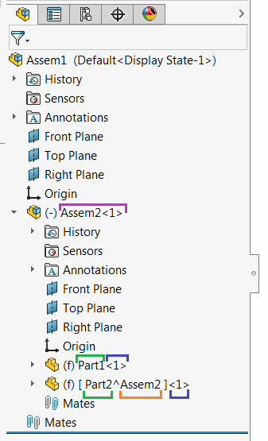

 This code example explains correct ways of changing the name of the component (including virtual component or component in sub-assembly)
image: component-name.png
labels: [assembly, component, name]
---
[IComponent2::Name2](https://help.solidworks.com/2012/english/api/sldworksapi/solidworks.interop.sldworks~solidworks.interop.sldworks.icomponent2~name2.html) SOLIDWORKS API property provides get and set accessors for reading and changing the component name respectively.

This function returns different names structures when setting or getting. That means if it is required to rename component using its original name (i.e. add suffix or prefix) value returned from get-accessor needs to be altered.

When **get** accessor is called full name of the component is returned, while **set** accessor only requires short name.

Full name of the component consists of

* Component Name
* Component Index (specified after **-** symbol in full name)
* Context name for virtual component (specified after **^** symbol in the full name)
* Parent assembly full name (specified before **/** symbol in the full name)

The names of the components in the structure above will be returned as the following (the colors in the picture match the parts in names)

Assem2-1 *Root component*

Assem2-1/Part1-1 *Component in sub-assembly*

Assem2-1/Part2^Assem2-1  *virtual component in sub-assembly*

Example below renames any selected component (root level, component in sub-assembly and virtual) using SOLIDWORKS API by adding the suffix to its name.

~~~ vb
Const SUFFIX As String = "_Renamed"

Dim swApp As SldWorks.SldWorks

Sub main()
    
    Set swApp = Application.SldWorks
    
    Dim swModel As SldWorks.ModelDoc2
    Dim swSelMgr As SldWorks.SelectionMgr

    Set swModel = swApp.ActiveDoc
    
    If Not swModel Is Nothing Then
    
        Set swSelMgr = swModel.SelectionManager
        
        Dim swComp As SldWorks.Component2
        
        Set swComp = swSelMgr.GetSelectedObject6(1, -1)
        
        If Not swComp Is Nothing Then
        
            Dim compName As String
            
            compName = swComp.Name2
            
            If Not swComp.GetParent() Is Nothing Then
                'if not root remove the sub-assemblies name
                compName = Right(compName, Len(compName) - InStrRev(compName, "/"))
            End If
            
            If swComp.IsVirtual() Then
                'if virtual remove the context assembly name
                compName = Left(compName, InStr(compName, "^") - 1)
            Else
                'remove the index name
                compName = Left(compName, InStrRev(compName, "-") - 1)
            End If
            
            Dim newCompName As String
            newCompName = compName & SUFFIX
            
            swComp.Name2 = newCompName
            
        Else
            MsgBox "Please select component to rename"
        End If
    
    Else
        MsgBox "Please open assembly document"
    End If
    
End Sub
~~~

