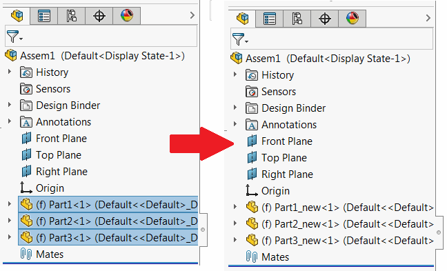

 Macro demonstrates how to replace selected components in the batch preserving original selections using SOLIDWORKS API
image: replace_components.png
labels: [component, replace, selection]
group: Assembly
---
{ width=350 }

This macro allows to replace the selected components in the tree with the components from the nominated folder (optionally with additional suffix in name) using SOLIDWORKS API.

This could be useful when managing similar types of projects where some files were copied, updated and renamed and need to be replaced in the original assembly.

This macro is using the [API only selections](/docs/codestack/solidworks-api/document/selection/api-only-selection/) which allows to keep the original selected components and avoiding the need to use the temp collection variables to satisfy the requirement of [IAssemblyDoc::ReplaceComponents2](https://help.solidworks.com/2017/english/api/sldworksapi/solidworks.interop.sldworks~solidworks.interop.sldworks.iassemblydoc~replacecomponents2.html) SOLIDWORKS API method where each component needs to be selected for replacement.

* Modify the input parameters. Set the directory where the replacement parts are located via *REPLACEMENT_DIR* and optional *SUFFIX* for file name.

~~~ vb
Const REPLACEMENT_DIR As String = "D:\Assembly\Replacement"
Const SUFFIX As String = "_new"
~~~

* Select components
* Run macro. All components are replaced

~~~ vb
Const REPLACEMENT_DIR As String = "D:\Assembly\Replacement"
Const SUFFIX As String = "_new"

Dim swApp As SldWorks.SldWorks

Sub main()

    Set swApp = Application.SldWorks
    
    Dim swModel As SldWorks.ModelDoc2
    
    Set swModel = swApp.ActiveDoc
    
    If Not swModel Is Nothing Then
        
        Dim swAssy As SldWorks.AssemblyDoc
        Set swAssy = swModel
        
        Dim swSelMgr As SldWorks.SelectionMgr
        Set swSelMgr = swModel.SelectionManager
        
        Dim i As Integer
        
        For i = 1 To swSelMgr.GetSelectedObjectCount2(-1)
            
            If swSelMgr.GetSelectedObjectType3(i, -1) = swSelectType_e.swSelCOMPONENTS Then
                
                Dim swComp As SldWorks.Component2
                Set swComp = swSelMgr.GetSelectedObject6(i, -1)
                
                Debug.Print swSelMgr.SuspendSelectionList
                
                swSelMgr.AddSelectionListObject swComp, Nothing
                
                swAssy.ReplaceComponents2 GetReplacementPath(swComp), swComp.ReferencedConfiguration, False, swReplaceComponentsConfiguration_e.swReplaceComponentsConfiguration_MatchName, True
                    
                swSelMgr.ResumeSelectionList
                
            End If
        Next
        
    Else
        MsgBox ("Please open assembly document")
    End If
    
End Sub

Function GetReplacementPath(comp As SldWorks.Component2)
    
    Dim replFilePath As String
    
    Dim compPath As String
    compPath = comp.GetPathName()
                
    Dim dir As String
    dir = REPLACEMENT_DIR
    
    If Right(dir, 1) <> "\" Then
        dir = dir & "\"
    End If
    
    Dim fileName As String
    fileName = Right(compPath, Len(compPath) - InStrRev(compPath, "\"))
    
    If SUFFIX <> "" Then
        
        Dim ext As String
        
        ext = Right(fileName, Len(".SLDXXX"))
        
        fileName = Left(fileName, Len(fileName) - Len(ext)) & SUFFIX & ext
        
    End If
    
    replFilePath = dir & fileName
                
    GetReplacementPath = replFilePath
    
End Function
~~~

