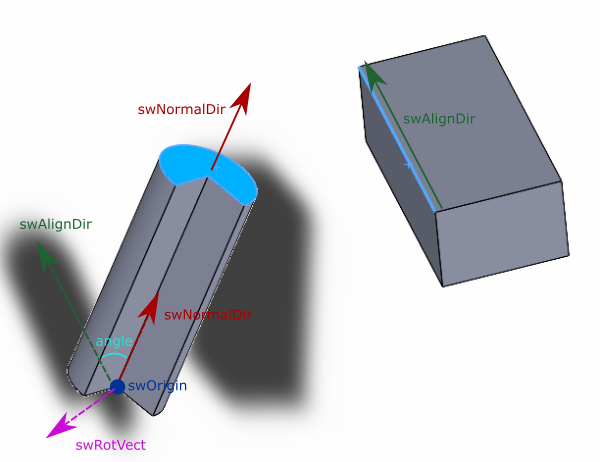

 VBA example demonstrates hwo to calculate the rotation transformation to align the normal of the component's face with edge direction around the component's origin
image: rotation-transform.png
labels: [transform,rotation,align]
---
This VBA example demonstrates how to use the [IMathUtility::CreateTransformRotateAxis](https://help.solidworks.com/2017/English/api/sldworksapi/SOLIDWORKS.Interop.sldworks~SOLIDWORKS.Interop.sldworks.IMathUtility~CreateTransformRotateAxis.html) SOLIDWORKS API to rotate the component and align the normal of its face with the direction from the linear edge.

As a precondition select the planar face on the first component in the assembly and linear edge on the second component in the assembly. First component must not be fixed and do not have any mates. As the result first component rotated in a way that its normal is collinear with the direction of the edge. Component is rotated around the origin.

## Explanation

In order to transform the component in the expected way it is required to calculate its transform. For that it is required to find the origin of rotation, rotation vector and an angle.

At first we create vectors of the face normal and edge direction. It is required to apply the transformation of the components to represent vectors in the same coordinate system. The angle between those vectors is a required angle of transformation.

In order to find the vector of rotation it is required to find the vector perpendicular to both normal and direction. This can be achieved by finding the cross product.

Finally point of rotation is an origin of the component transformed to the assembly coordinate system.

~~~ vb
Dim swApp As SldWorks.SldWorks

Sub main()

    Set swApp = Application.SldWorks
    
    Dim swModel As SldWorks.ModelDoc2
    
    Set swModel = swApp.ActiveDoc
    
    Dim swSelMgr As SldWorks.SelectionMgr
    
    Set swSelMgr = swModel.SelectionManager
    
    Dim swFace As SldWorks.Face2
    Dim swEdge As SldWorks.Edge
    
    Set swFace = swSelMgr.GetSelectedObject6(1, -1)
    
    Dim swComp As SldWorks.Component2
    Set swComp = swFace.GetComponent()
    Dim swCompTransform As SldWorks.MathTransform
    Set swCompTransform = swComp.Transform2
    
    Set swEdge = swSelMgr.GetSelectedObject6(2, -1)
    
    Dim swMathUtils As SldWorks.MathUtility
    Set swMathUtils = swApp.GetMathUtility
    
    Dim swNormalDir As SldWorks.MathVector
    Set swNormalDir = swMathUtils.CreateVector(swFace.Normal)
    Set swNormalDir = swNormalDir.MultiplyTransform(swCompTransform)
    
    Dim swAlignDir As SldWorks.MathVector
    Dim vLineParams As Variant
    vLineParams = swEdge.GetCurve().lineParams
    Dim dVec(2) As Double
    dVec(0) = vLineParams(3): dVec(1) = vLineParams(4): dVec(2) = vLineParams(5)
    Set swAlignDir = swMathUtils.CreateVector(dVec)
    Set swAlignDir = swAlignDir.MultiplyTransform(swEdge.GetComponent().Transform2)
    
    Dim swOrigin As SldWorks.MathPoint
    Dim dOrigin(2) As Double
    dOrigin(0) = 0: dOrigin(1) = 0: dOrigin(2) = 0
    Set swOrigin = swMathUtils.CreatePoint(dOrigin)
    
    Set swOrigin = swOrigin.MultiplyTransform(swCompTransform)
    
    Dim swRotVect As SldWorks.MathVector
    Set swRotVect = swNormalDir.Cross(swAlignDir)
        
    Dim angle As Double
    angle = GetAngle(swNormalDir, swAlignDir)
    
    Dim swTransform As SldWorks.MathTransform
    Set swTransform = swMathUtils.CreateTransformRotateAxis(swOrigin, swRotVect, angle)
    
    Set swTransform = swCompTransform.Multiply(swTransform)
    
    swComp.Transform2 = swTransform
    
    swModel.GraphicsRedraw2
    
End Sub

Function GetAngle(vec1 As MathVector, vec2 As MathVector) As Double
    
    'cos a= a*b/(|a|*|b|)
    GetAngle = ACos(vec1.Dot(vec2) / (vec1.GetLength() * vec2.GetLength()))
    
End Function

Function ACos(val As Double) As Double
    
    If val = 1 Then
        ACos = 0
    ElseIf val = -1 Then
        ACos = 4 * Atn(1)
    Else
        ACos = Atn(-val / Sqr(-val * val + 1)) + 2 * Atn(1)
    End If
    
End Function
~~~

