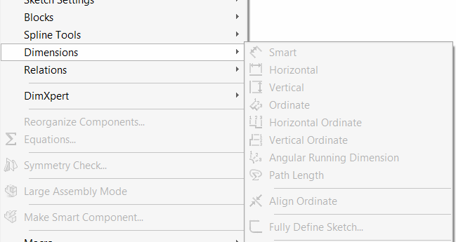

 Example demonstrates how to run a smooth animation of components rotation around axis using the presentation transforms in SOLIDWORKS API
image: component-rotation.gif
labels: [assembly, transform, rotation, animation]
---

This macro demonstrates how to run a smooth animation of components rotation around Y axis of the component using the presentation transforms via [IComponent2::PresentationTransform](https://help.solidworks.com/2012/english/api/sldworksapi/solidworks.interop.sldworks~solidworks.interop.sldworks.icomponent2~presentationtransform.html) SOLIDWORKS API method.

This allows to only move the components for visual purposes without changing the geometry. Component will be moved regardless if it is fully defined in space (by mates or fix constraint). And the mates are still preserved.

* Select any component in the assembly and run the macro
* Component is rotated around its Y axis
* To stop the animation clear the selection (deselect all objects)
* To modify the speed of the rotation change the optional *speed* parameter of *RunRotationAnimation* method

~~~ vb
If Not swComp Is Nothing Then
    RunRotationAnimation swModel, swComp, 2 'speed x2
Else
    MsgBox "Please select component"
End If
~~~

### Note

In order to enable presentation mode it is required to set the [IAssemblyDoc::EnablePresentation](https://help.solidworks.com/2012/english/api/sldworksapi/SOLIDWORKS.Interop.sldworks~SOLIDWORKS.Interop.sldworks.IAssemblyDoc~EnablePresentation.html) proeprty to True.

It is required to set this property to False after the animation is finished otherwise all SOLIDWORKS menues will be locked:

{ width=300 }

~~~ vb
Const PI As Double = 3.14159265359

Dim swApp As SldWorks.SldWorks

Sub main()

    Set swApp = Application.SldWorks
    
    Dim swModel As SldWorks.ModelDoc2
    
    Set swModel = swApp.ActiveDoc
    
    If Not swModel Is Nothing Then
    
        Dim swSelMgr As SldWorks.SelectionMgr
        
        Set swSelMgr = swModel.SelectionManager
        
        Dim swComp As SldWorks.Component2
        Set swComp = swSelMgr.GetSelectedObjectsComponent4(1, -1)
        
        If Not swComp Is Nothing Then
            RunRotationAnimation swModel, swComp
        Else
            MsgBox "Please select component"
        End If
        
    Else
        MsgBox "Please open assembly"
    End If
    
End Sub

Sub RunRotationAnimation(assy As SldWorks.AssemblyDoc, comp As SldWorks.Component2, Optional speed As Double = 1)
    
    Dim swSelMgr As SldWorks.SelectionMgr
        
    Set swSelMgr = assy.SelectionManager
        
    Dim rotStep As Double
    rotStep = PI * 2 / 360 * speed
    
    Dim curAng As Double
    
    Dim swModelView As SldWorks.ModelView
    Set swModelView = assy.ActiveView
            
    assy.EnablePresentation = True
    
    While swSelMgr.GetSelectedObjectCount2(-1) <> 0
        For curAng = 0 To PI * 2 Step rotStep
            Dim animStep As MathTransform
            Set animStep = GetTransform(comp, curAng)
            comp.PresentationTransform = animStep
            swModelView.GraphicsRedraw Nothing
            DoEvents
        Next
    Wend
    
    assy.EnablePresentation = False
    
End Sub

Function GetTransform(comp As SldWorks.Component2, angle As Double) As MathTransform
    
    Dim swMathUtils As SldWorks.MathUtility
    
    Set swMathUtils = swApp.GetMathUtility
    
    Dim swOrigPt As SldWorks.MathPoint
    Dim dPt(2) As Double
    dPt(0) = 0: dPt(1) = 0: dPt(2) = 0
    
    Set swOrigPt = swMathUtils.CreatePoint(dPt)
    
    Set swOrigPt = swOrigPt.MultiplyTransform(comp.Transform2)
    
    Dim swAxisVec As SldWorks.MathVector
    Dim dVec(2) As Double
    dVec(0) = 0: dVec(1) = 1: dVec(2) = 0
    
    Set swAxisVec = swMathUtils.CreateVector(dVec)
    
    Set swAxisVec = swAxisVec.MultiplyTransform(comp.Transform2)
    
    Set GetTransform = swMathUtils.CreateTransformRotateAxis(swOrigPt, swAxisVec, angle)
    
End Function
~~~

