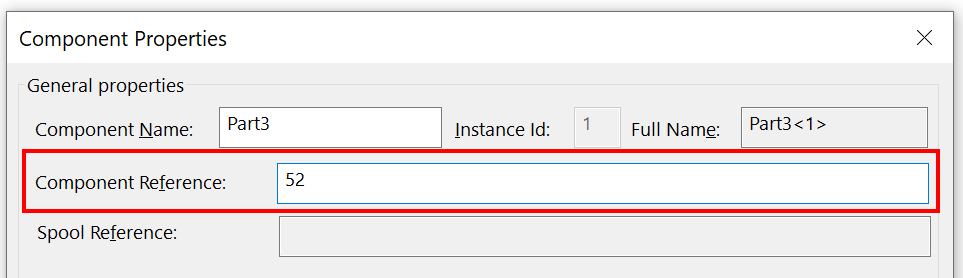

 VBA macro to increment and assign the component reference in sequential order for the selected components based on the seed number
image: component-reference.png
---
{ width=600 }

This VBA macro allows to automatically assign the numeric number to the selected components' references in the SOLIDWORKS assembly

Number is incremented automatically based on the specified seed value

Number is assigned in the order components are selected in the assembly

Component can be selected in the feature manager tree or in the graphics area (any entity of the component can be selected, e.g. face or edge)

Macro can be configured to either specify the input in the popup box (set the value of **INPUT_SEED** variable to **True**) or by providing the seed as the constant (**INPUT_SEED** equals to **False** and **SEED** equals to the seed number)

~~~ vb
Const INPUT_SEED As Boolean = True 'input the seed (start) number in the input box upon running the macro
Const SEED As Integer = 1
~~~

~~~ vb
Enum ScopeType_e
    Selected
    topLevel
    All
End Enum

Const SCOPE As Integer = ScopeType_e.Selected
Const INPUT_SEED As Boolean = False
Const SEED As Integer = 1

Dim swApp As SldWorks.SldWorks

Sub main()

    Set swApp = Application.SldWorks
        
    Dim swModel As SldWorks.ModelDoc2
    Set swModel = swApp.ActiveDoc
    
    Dim swAssm As SldWorks.AssemblyDoc
    Set swAssm = swModel
    
    If Not swModel Is Nothing Then
        
        Dim i As Integer
        Dim swComp As SldWorks.Component2
        Dim nextRef As Integer
        
        If INPUT_SEED Then
            Dim seedStr As String
            seedStr = InputBox("Specify the start seed number")
            If seedStr <> "" Then
                nextRef = CInt(seedStr)
            Else
                End
            End If
        Else
            nextRef = SEED
        End If
        
        If SCOPE = ScopeType_e.Selected Then
        
            Dim swSelMgr As SldWorks.SelectionMgr
        
            Set swSelMgr = swModel.SelectionManager
            
            For i = 1 To swSelMgr.GetSelectedObjectCount2(-1)
            
                Set swComp = swSelMgr.GetSelectedObjectsComponent3(i, -1)
                
                If swComp Is Nothing Then
                    Err.Raise vbError, "", "Object selected at index " & i & " does not belong to component"
                End If
                
                swComp.ComponentReference = nextRef
                
                nextRef = nextRef + 1
                
            Next
        Else
            Dim topLevel As Boolean
            
            If SCOPE = ScopeType_e.topLevel Then
                topLevel = True
            ElseIf SCOPE = ScopeType_e.All Then
                topelvel = False
            Else
                Err.Raise vbError, "", "Not supported scope"
            End If
            
            Dim vComps As Variant
            vComps = swAssm.GetComponents(topLevel)
            
            If Not IsEmpty(vComps) Then
                
                For i = 0 To UBound(vComps)
            
                    Set swComp = vComps(i)
                    
                    swComp.ComponentReference = nextRef
                    
                    nextRef = nextRef + 1
                
                Next
                
            End If
            
        End If
        
    Else
        Err.Raise vbError, "", "Open assembly"
    End If
    
End Sub
~~~

