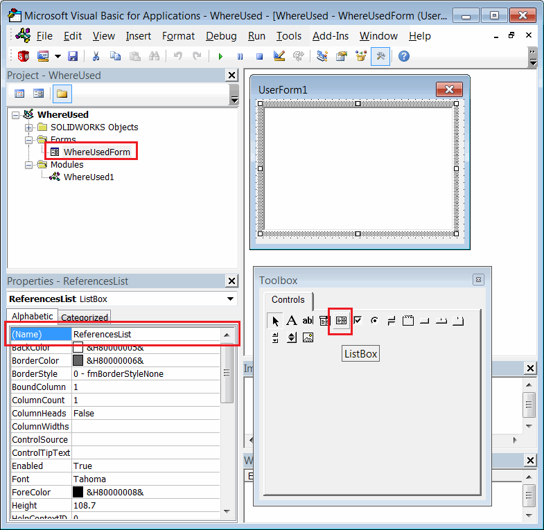

 VBA macro to find the assemblies within active assembly which are using the selected component using SOLIDWORKS API
image: where-used-form.png
labels: [where used,parent,component]
group: Assembly
---
This VBA macro finds all parent components of the selected component instances (Where Used) in the active assembly using SOLIDWORKS API and displays the list for review.

{ width=350 }

All references can be selected in the form and corresponding component will be highlighted in the Feature Manager Tree.

## Configuration

Macro can be configured by changing the constant parameters at the beginning of the macro as shown below:

~~~ vb
Const CONSIDER_CONFIG As Boolean = False 'True to only find the component which have the same referenced configuration, False to find by model path only
Const INCLUDE_SUPPRESSED As Boolean = False 'True to include suppressed components in the search, False to not include
~~~

## Creating Macro

* Create new macro
* Add new [User Form](/docs/codestack/visual-basic/user-forms/)
* Set the name of the form as *WhereUsedForm*
* Drag-n-drop ListBox control onto the form
* Name the ListBox control as *ReferencesList*

{ width=550 }

Place the code into corresponding modules

### Macro

~~~ vb
Const CONSIDER_CONFIG As Boolean = False
Const INCLUDE_SUPPRESSED As Boolean = False

Dim swApp As SldWorks.SldWorks

Sub main()

    Set swApp = Application.SldWorks
    
    Dim swAssy As SldWorks.AssemblyDoc
    
    Set swAssy = swApp.ActiveDoc
    
    If Not swAssy Is Nothing Then
        Dim swSelMgr As SldWorks.SelectionMgr
        Set swSelMgr = swAssy.SelectionManager
        
        Dim swComp As SldWorks.Component2
        Set swComp = swSelMgr.GetSelectedObjectsComponent3(1, -1)
        
        If Not swComp Is Nothing Then
        
            Dim vComps As Variant
            vComps = GetAllComponentInstances(swAssy, swComp, CONSIDER_CONFIG, INCLUDE_SUPPRESSED)
            
            If Not IsEmpty(vComps) Then
                Dim vParents As Variant
                vParents = GetParents(vComps)
                WhereUsedForm.Components = vParents
                Set WhereUsedForm.Assembly = swAssy
                WhereUsedForm.Show vbModeless
            Else
                MsgBox "Failed to find component instances"
            End If
            
        Else
            MsgBox "Please select component"
        End If
    Else
        MsgBox "Please open assembly"
    End If
    
End Sub

Function GetAllComponentInstances(assy As SldWorks.AssemblyDoc, targComp As SldWorks.Component2, considerConfig As Boolean, includeSuppressed As Boolean)
    
    Dim swCompInst() As SldWorks.Component2
    Dim isInit As Boolean
    
    Dim vComps As Variant
    vComps = assy.GetComponents(False)
    
    Dim i As Integer
    
    For i = 0 To UBound(vComps)
        
        Dim swComp As SldWorks.Component2
        Set swComp = vComps(i)
        
        If UCase(swComp.GetPathName()) = UCase(targComp.GetPathName()) Then
            
            If Not considerConfig Or UCase(swComp.ReferencedConfiguration) = UCase(targComp.ReferencedConfiguration) Then
                
                If includeSuppressed Or False = swComp.IsSuppressed() Then
                    
                    If isInit Then
                        ReDim Preserve swCompInst(UBound(swCompInst()) + 1)
                    Else
                        ReDim swCompInst(0)
                        isInit = True
                    End If
                    
                    Set swCompInst(UBound(swCompInst())) = swComp
                    
                End If
                
            End If
        End If
    Next
    
    If isInit Then
        GetAllComponentInstances = swCompInst
    Else
        GetAllComponentInstances = Empty
    End If
    
End Function

Function GetParents(comps As Variant) As Variant
    
    Dim swParents() As SldWorks.Component2
    Dim isInit As Variant
    
    Dim i As Integer
    
    For i = 0 To UBound(comps)
        
        Dim swComp As SldWorks.Component2
        Set swComp = comps(i)
        
        Dim swParentComp As SldWorks.Component2
        
        Set swParentComp = swComp.GetParent
        
        Dim addParent As Boolean
        addParent = True
        
        If Not isInit Then
            isInit = True
            ReDim swParents(0)
        Else
            If Not Contains(swParents, swParentComp) Then
                ReDim Preserve swParents(UBound(swParents) + 1)
            Else
                addParent = False
            End If
        End If
        
        If addParent Then
            Set swParents(UBound(swParents)) = swParentComp
        End If
        
    Next
    
    GetParents = swParents
    
End Function

Function Contains(vArr As Variant, item As Object) As Boolean
    
    Dim i As Integer
    
    For i = 0 To UBound(vArr)
        If vArr(i) Is item Then
            Contains = True
            Exit Function
        End If
    Next
    
    Contains = False
    
End Function
~~~

### WhereUsedForm

~~~ vb
Dim swComps As Variant

Public Assembly As SldWorks.AssemblyDoc

Property Let Components(val As Variant)
    swComps = val
    
    Dim i As Integer
    
    For i = 0 To UBound(swComps)
        
        Dim swComp As SldWorks.Component2
        Set swComp = swComps(i)
        
        Dim name As String
        
        If swComp Is Nothing Then
            name = "<root>"
        Else
            name = swComp.Name2
        End If
        
        ReferencesList.AddItem name
    Next
    
End Property

Private Sub ReferencesList_Change()

    Dim swComp As SldWorks.Component2
    Set swComp = swComps(ReferencesList.ListIndex)
        
    If Not swComp Is Nothing Then
        swComp.Select4 False, Nothing, False
    Else
        Assembly.ClearSelection2 False
    End If
        
End Sub
~~~

