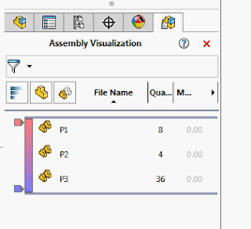

 Example displays the page for Assembly Visualization page
image: sw-assembly-visualization.png
labels: [assembly, example, solidworks api, visualization]
redirect-from:
  - /2018/03/solidworks-api-assembly-display-assm-visual-tool.html
---
This example displays the feature tree page for Assembly Visualization using SOLIDWORKS API.

{ width=320 height=291 }

~~~ vb
Dim swApp As SldWorks.SldWorks

Sub main()

    Set swApp = Application.SldWorks
        
    Dim swAssy As SldWorks.AssemblyDoc
    Set swAssy = TryGetActiveAssembly
    
    If Not swAssy Is Nothing Then
        swApp.RunCommand swCommands_VisualizationTool, ""
    Else
        MsgBox "Please open assembly"
    End If
    
End Sub

Function TryGetActiveAssembly() As SldWorks.AssemblyDoc
    
    Dim swModel As SldWorks.ModelDoc2
    
    Set swModel = swApp.ActiveDoc
    
    If Not swModel Is Nothing Then
        
        If swModel.GetType() = swDocumentTypes_e.swDocASSEMBLY Then
            Set TryGetActiveAssembly = swApp.ActiveDoc
        End If
        
    End If
    
End Function
~~~

