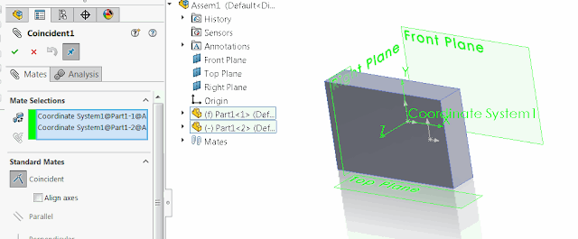

 Macro adds coincident mate between 2 coordinate systems of 2 selected components
image: sw-mate-coincident.png
labels: [assembly, component, coordinate system, example, mate, solidworks api]
redirect-from:
  - /2018/03/solidworks-api-assembly-add-mate-between-coord-sys.html
  - /solidworks-api/document/assembly/add-mate-between-coordinate-systems
---
Adds coincident mate between 2 coordinate systems of 2 selected components using SOLIDWORKS API. The components must contain the coordinate system features named *Coordinate System1*

{ width=640 }

[IAssemblyDoc::AddMate3](https://help.solidworks.com/2018/english/api/sldworksapi/solidworks.interop.sldworks~solidworks.interop.sldworks.iassemblydoc~addmate3.html) SOLIDWORKS API is used to insert mate feature.

~~~ vb
Dim swApp As SldWorks.SldWorks
Dim swAssy As SldWorks.AssemblyDoc
Dim swSelMgr As SldWorks.SelectionMgr

Sub main()

    Set swApp = Application.SldWorks
    
    Set swAssy = swApp.ActiveDoc
        
    If Not swAssy Is Nothing Then
    
        Set swSelMgr = swAssy.SelectionManager
                
        Dim swCs1 As SldWorks.Feature
        Dim swCs2 As SldWorks.Feature
    
        Set swCs1 = GetCoordinateSystemFromSelection(1, "Coordinate System1")
        Set swCs2 = GetCoordinateSystemFromSelection(2, "Coordinate System1")
        
        swCs1.Select2 False, 1
        swCs2.Select2 True, 1
        
        swAssy.AddMate3 swMateType_e.swMateCOINCIDENT, swMateAlign_e.swMateAlignCLOSEST, False, 0, 0, 0, 0, 0, 0, 0, 0, False, 0
        
        swAssy.EditRebuild
    
    Else
        
        MsgBox "Please open assembly"
    
    End If
    
End Sub

Function GetCoordinateSystemFromSelection(index As Integer, name As String) As SldWorks.Feature
    
    Dim swComp As SldWorks.Component2
    Dim swCoordSys As SldWorks.Feature
    
    Set swComp = swSelMgr.GetSelectedObjectsComponent2(index)
    
    If Not swComp Is Nothing Then
    
        Set swCoordSys = swComp.FeatureByName(name)
        
        If swCoordSys Is Nothing Then
            MsgBox "Component " & swComp.Name2 & " doesn't contain the feature " & name
            End
        End If
    
    Else
        
        MsgBox "Please select 2 components"
        End
        
    End If
    
    Set GetCoordinateSystemFromSelection = swCoordSys
    
End Function

~~~

