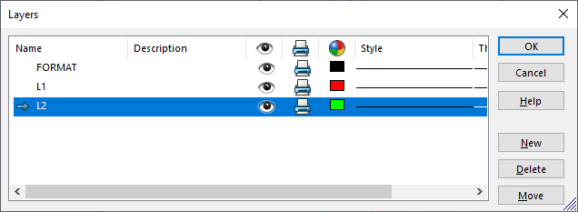

此VBA宏收集并删除指定图层上的所有项目（注释、草图线段、块、草图点和填充）。图层本身不会被删除。

在**LAYER_NAME**常量中设置图层的名称。

~~~ vb
Const LAYER_NAME As String = "我的图层"

Dim swApp As SldWorks.SldWorks

Sub main()

    Set swApp = Application.SldWorks
    
    Dim swModel As SldWorks.ModelDoc2
    
    Set swModel = swApp.ActiveDoc
    
    Dim swLayerMgr As SldWorks.LayerMgr
    
    Set swLayerMgr = swModel.GetLayerManager
    
    Dim swLayer As SldWorks.layer
    Set swLayer = swLayerMgr.GetLayer(LAYER_NAME)
    
    Dim swLayerItems() As Object
    
    AddItems swLayer, swLayerItemsOption_Annotations, swLayerItems
    AddItems swLayer, swLayerItemsOption_SketchBlockInstance, swLayerItems
    AddItems swLayer, swLayerItemsOption_SketchHatch, swLayerItems
    AddItems swLayer, swLayerItemsOption_SketchPoint, swLayerItems
    AddItems swLayer, swLayerItemsOption_SketchSegments, swLayerItems
    
    If swModel.Extension.MultiSelect(swLayerItems, False, Nothing) = UBound(swLayerItems) + 1 Then
        If False = swModel.Extension.DeleteSelection2(swDeleteSelectionOptions_e.swDelete_Absorbed) Then
            Err.Raise vbError, "", "删除实体失败"
        End If
    Else
        Err.Raise vbError, "", "选择图层上的项目失败"
    End If
    
End Sub

Sub AddItems(layer As SldWorks.layer, itemsType As swLayerItemsOption_e, ByRef layerItems() As Object)
    
    Dim vItems As Variant
    vItems = layer.GetItems(itemsType)
    
    If Not IsEmpty(vItems) Then

        If (Not layerItems) = -1 Then
            ReDim layerItems(UBound(vItems))
        Else
            ReDim Preserve layerItems(UBound(layerItems) + UBound(vItems) + 1)
        End If
        
        Dim i As Integer
        
        For i = 0 To UBound(vItems)
            Set layerItems(UBound(layerItems) - i) = vItems(i)
        Next
        
    End If
    
End Sub
~~~