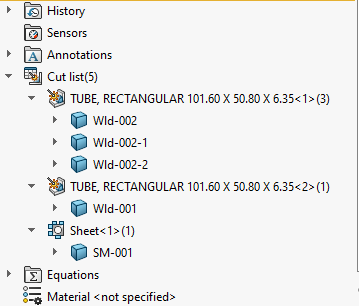

这个VBA宏允许根据预定义的命名模板重命名属于切割清单文件夹（例如钣金或焊接）的所有体。可以使用自由文本与自定义属性占位符相结合，以在名称中使用自定义属性。

自定义属性必须用```<>```符号括起来。

例如，要使用**SM_**前缀和厚度值重命名所有钣金体，应将**NAME_TEMPLATE**变量定义为：

~~~ vb
Const NAME_TEMPLATE As String = "SM_<Thickness>"
~~~

## 注意事项

* 运行后，宏可能需要模型重建以刷新特征的名称
* 如果一个切割清单文件夹中有多个体，则使用索引来区分名称，例如-1，-2，-3
* 在重命名之前，宏将执行切割清单更新

~~~ vb
Const NAME_TEMPLATE As String = "<PartNo>"

Dim swApp As SldWorks.SldWorks

Sub main()

    Set swApp = Application.SldWorks
    
    Dim swPart As SldWorks.PartDoc
    
    Set swPart = swApp.ActiveDoc
    
    ProcessCutLists swPart
    
End Sub

Sub ProcessCutLists(model As SldWorks.ModelDoc2)

    Dim swFeat As SldWorks.Feature
    
    Set swFeat = model.FirstFeature
    
    Do While Not swFeat Is Nothing
        
        Dim swBodyFolder As SldWorks.BodyFolder
        
        If swFeat.GetTypeName2() = "SolidBodyFolder" Then
            Set swBodyFolder = swFeat.GetSpecificFeature2
            swBodyFolder.UpdateCutList
        ElseIf swFeat.GetTypeName2() = "CutListFolder" Then
            Set swBodyFolder = swFeat.GetSpecificFeature2
                        
            Dim name As String
            name = ComposeName(NAME_TEMPLATE, swFeat)
            
            RenameBodies swBodyFolder.GetBodies(), name
            
        End If
        
        Set swFeat = swFeat.GetNextFeature
        
    Loop
    
End Sub

Sub RenameBodies(bodies As Variant, bodyName As String)
    
    If Not IsEmpty(bodies) Then
    
        Dim i As Integer
        
        For i = 0 To UBound(bodies)
            Dim swBody As SldWorks.Body2
            Set swBody = bodies(i)
            
            swBody.name = bodyName & IIf(i > 0, "-" & CStr(i), "")
        Next
    
    End If
    
End Sub

Function ComposeName(template As String, cutListFeat As SldWorks.Feature) As String

    Dim regEx As Object
    Set regEx = CreateObject("VBScript.RegExp")
    
    regEx.Global = True
    regEx.IgnoreCase = True
    regEx.Pattern = "<[^>]*>"
    
    Dim regExMatches As Object
    Set regExMatches = regEx.Execute(template)
    
    Dim i As Integer
    
    Dim outName As String
    outName = template
    
    For i = regExMatches.Count - 1 To 0 Step -1
        
        Dim regExMatch As Object
        Set regExMatch = regExMatches.Item(i)
                    
        Dim prpName As String
        prpName = Mid(regExMatch.Value, 2, Len(regExMatch.Value) - 2)
        
        outName = Left(outName, regExMatch.FirstIndex) & GetPropertyValue(cutListFeat.CustomPropertyManager, prpName) & Right(outName, Len(outName) - (regExMatch.FirstIndex + regExMatch.Length))

    Next
    
    ComposeName = outName
    
End Function

Function GetPropertyValue(custPrpMgr As SldWorks.CustomPropertyManager, prpName As String) As String
    Dim resVal As String
    custPrpMgr.Get2 prpName, "", resVal
    GetPropertyValue = resVal
End Function
~~~