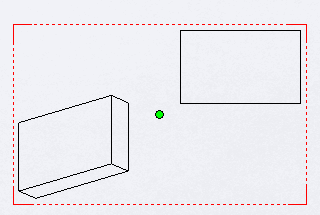

 Creating sketch points and sketch segments directly in the drawing view sketch area using SOLIDWORKS API
image: point-in-drawing-view-sketch.png
labels: [drawing,transform,sketch]
---
{ width=350 }

All drawing views in the drawing document have their own sketches which can be retrieved via [IView::GetSketch](https://help.solidworks.com/2019/english/api/sldworksapi/solidworks.interop.sldworks~solidworks.interop.sldworks.iview~getsketch.html) SOLIDWORKS API method.

This is a sketch where sketch entities and points can be drawn using the [ISketchManager](https://help.solidworks.com/2019/english/api/draftsightapi/Interop.dsAutomation~Interop.dsAutomation.ISketchManager.html) interface.

Unlike [creating sketch segment in the sheet space](/docs/codestack/solidworks-api/document/drawing/sheet-context-sketch/), segments added to a view sketch will move together with the view and will be scaled and rotated in case of 3D rotation of the view.

Similar to the sketches in the assembly or part it is required to transform the coordinates from the model space into the sheet space in order to properly position the segments.

The following example demonstrates how to find the middle point of the drawing view (in sheet coordinate system) and draw this point directly in the view using SOLIDWORKS API using the transformation.

~~~ vb
Dim swApp As SldWorks.SldWorks

Sub main()

    Set swApp = Application.SldWorks
    
    Dim swDraw As SldWorks.DrawingDoc
    
    Set swDraw = swApp.ActiveDoc
    
    If Not swDraw Is Nothing Then
        
        Dim swView As SldWorks.view
        Set swView = swDraw.SelectionManager.GetSelectedObject6(1, -1)
        
        If Not swView Is Nothing Then
            DrawPoint swDraw, swView
        Else
            MsgBox "Please select drawing view"
        End If
    Else
        MsgBox "Please open the drawing document"
    End If
    
End Sub

Sub DrawPoint(draw As SldWorks.DrawingDoc, view As SldWorks.view)
    
    Dim vBoundings As Variant
    vBoundings = view.GetOutline()
    
    Dim dCenterPt(2) As Double
    dCenterPt(0) = (vBoundings(0) + vBoundings(2)) / 2
    dCenterPt(1) = (vBoundings(1) + vBoundings(3)) / 2
    dCenterPt(2) = 0
    
    Dim swViewSketch As SldWorks.Sketch
    Set swViewSketch = view.GetSketch
    
    Dim swViewSketchXForm As SldWorks.MathTransform
    Set swViewSketchXForm = swViewSketch.ModelToSketchTransform
    
    Dim swMathUtils As SldWorks.MathUtility
    Set swMathUtils = swApp.GetMathUtility
    
    Dim swMathPt As SldWorks.MathPoint
    Set swMathPt = swMathUtils.CreatePoint(dCenterPt)
    
    Set swMathPt = swMathPt.MultiplyTransform(swViewSketchXForm)
    
    draw.ActivateView view.Name
    
    Dim vPt As Variant
    vPt = swMathPt.ArrayData
    
    draw.SketchManager.CreatePoint vPt(0), vPt(1), vPt(2)
    
End Sub
~~~

