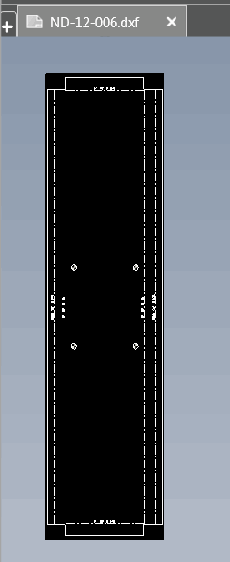

 VBA macro to export flat pattern views in the drawing active sheet to DXF or DWG or other format preserving the bend notes, annotations etc. using SOLIDWORKS API
image: flat-pattern-view.png
labels: [dxf,dwg,export,flat pattern]
group: Drawing
---
{ width=350 }

This VBA macro exports all flat pattern views from the active sheet in the drawing to the specified format (e.g. DXF or DWG) using SOLIDWORKS API. Macro exports the file to the same folder as original drawing and names files after the drawing view name.

This macro can be used in conjunction with [Rename flat pattern views with cut-list names](/docs/codestack/solidworks-api/document/drawing/rename-sheet-metal-views/) macro  if it is required to name exported files after the cut list name.

Specify the output file extension at the beginning of the macro:

~~~ vb
Const OUT_EXT As String = ".dxf"
~~~

## Algorithm

* Traverse all drawing view of the current sheet of the active drawing
* Find all drawing views of flat pattern
* Create new temp drawing and copies the view
* Remove all dimensions
* Remove all tables
* Set view and sheet scale to 1:1
* Fit sheet size to view
* Export to the specified file

~~~ vb
Const OUT_EXT As String = ".dxf"

Dim swApp As SldWorks.SldWorks

Sub main()

    Set swApp = Application.SldWorks
    
    Dim swDraw As SldWorks.DrawingDoc
    
try:
    
    On Error GoTo catch
    
    Set swDraw = swApp.ActiveDoc
    
    If Not swDraw Is Nothing Then
        ExportFlatPatternViews swDraw, swDraw.GetCurrentSheet
    Else
        Err.Raise vbError, "", "Please open drawing document"
    End If
    
    GoTo finally
    
catch:
    MsgBox Err.Description & " (" & Err.Number & ")", vbCritical
finally:
    
End Sub

Sub ExportFlatPatternViews(draw As SldWorks.DrawingDoc, sheet As SldWorks.sheet)
    
    Dim vViews As Variant
    
    vViews = sheet.GetViews()
    
    If Not IsEmpty(vViews) Then
        
        Dim i As Integer
        
        For i = 0 To UBound(vViews)
            Dim swView As SldWorks.view
            Set swView = vViews(i)
            
            If swView.IsFlatPatternView() Then
                ExportFlatPatternView draw, swView
            End If
        Next
        
    End If
    
End Sub

Sub ExportFlatPatternView(model As SldWorks.ModelDoc2, view As SldWorks.view)
    
    Dim fileName As String
    fileName = view.Name & OUT_EXT
    
    Dim saveDir As String
    saveDir = model.GetPathName()
    
    If saveDir = "" Then
        Err.Raise vbError, "", "Only saved drawings are supported"
    End If
    
    saveDir = Left(saveDir, InStrRev(saveDir, "\"))
        
    Dim swViews(0) As SldWorks.view
    Set swViews(0) = view
    
    If model.Extension.MultiSelect2(swViews, False, Nothing) = 1 Then
        
        model.EditCopy
        
        Dim swViewModel As SldWorks.ModelDoc2
        Set swViewModel = PasteViewInNewDocument()
        
        Dim errs As Long
        Dim warns As Long
        
        Dim expRes As Boolean
        expRes = swViewModel.Extension.SaveAs(saveDir & fileName, swSaveAsVersion_e.swSaveAsCurrentVersion, swSaveAsOptions_e.swSaveAsOptions_Silent, Nothing, errs, warns)
        
        swApp.CloseDoc swViewModel.GetTitle
        
        If False = expRes Then
            Err.Raise vbError, "", "Failed to export " & view.Name & ". Error code: " & errs
        End If
        
    Else
        Err.Raise vbError, "", "Failed to select " & view.Name
    End If
    
End Sub

Function PasteViewInNewDocument(Optional dummy As String = "") As SldWorks.ModelDoc2
    
    Dim drawTemplate As String
    drawTemplate = swApp.GetUserPreferenceStringValue(swUserPreferenceStringValue_e.swDefaultTemplateDrawing)
    
    If drawTemplate <> "" Then
        
        Dim swDraw As SldWorks.ModelDoc2
        
        Set swDraw = swApp.NewDocument(drawTemplate, swDwgPaperSizes_e.swDwgPapersUserDefined, 0.1, 0.1)
        
        If swDraw Is Nothing Then
            Err.Raise vbError, "", "Failed to create new drawing document"
        End If
try:
        On Error GoTo catch
        swDraw.Paste
        
        Dim swView As SldWorks.view
        Dim swSheet As SldWorks.sheet
        Set swSheet = swDraw.GetCurrentSheet()
        Set swView = swSheet.GetViews()(0)
        
        Dim ratio(1) As Double
        ratio(0) = 1: ratio(1) = 1
        swView.ScaleRatio = ratio
        
        swSheet.SetScale 1, 1, False, False
        
        Dim vTables As Variant
        vTables = swView.GetTableAnnotations()
        
        swDraw.ForceRebuild3 True
        
        RemoveDimensions swDraw, swView
        RemoveTables swDraw, swView
        
        FitSheetToView swSheet, swView
            
        Set PasteViewInNewDocument = swDraw
            
        GoTo finally
catch:
    swApp.CloseDoc swDraw.GetTitle
    Err.Raise Err.Number, Err.Source, Err.Description
finally:
    
    Else
        Err.Raise vbError, "", "Default drawing template is not specified"
    End If
    
End Function

Sub RemoveDimensions(model As SldWorks.ModelDoc2, view As SldWorks.view)
    
    Dim vDispDims As Variant
    vDispDims = view.GetDisplayDimensions
    
    If Not IsEmpty(vDispDims) Then
    
        Dim swAnns() As SldWorks.Annotation
        ReDim swAnns(UBound(vDispDims))
        Dim i As Integer
        
        For i = 0 To UBound(vDispDims)
            Dim swDispDim As SldWorks.DisplayDimension
            Set swDispDim = vDispDims(i)
            Set swAnns(i) = swDispDim.GetAnnotation
        Next
        
        If model.Extension.MultiSelect2(vDispDims, False, Nothing) = UBound(vDispDims) + 1 Then
            model.Extension.DeleteSelection2 swDeleteSelectionOptions_e.swDelete_Absorbed
        Else
            Err.Raise vbError, "", "Failed to select dimensions for deletion"
        End If
    
    End If
    
End Sub

Sub RemoveTables(model As SldWorks.ModelDoc2, view As SldWorks.view)

    Dim vSheets As Variant
    
    vSheets = model.GetViews()

    Dim vViews As Variant
    vViews = vSheets(0)
    
    Dim swSheetView As SldWorks.view
    Set swSheetView = vViews(0)
    
    Dim vTableAnns As Variant
    vTableAnns = swSheetView.GetTableAnnotations
    
    If Not IsEmpty(vTableAnns) Then
    
        If model.Extension.MultiSelect2(vTableAnns, False, Nothing) = UBound(vTableAnns) + 1 Then
            model.Extension.DeleteSelection2 swDeleteSelectionOptions_e.swDelete_Absorbed
        Else
            Err.Raise vbError, "", "Failed to select dimensions for deletion"
        End If
    
    End If
    
End Sub

Sub FitSheetToView(sheet As SldWorks.sheet, view As SldWorks.view)

    Dim vViewOutline As Variant
    vViewOutline = view.GetOutline

    sheet.SetSize swDwgPaperSizes_e.swDwgPapersUserDefined, CDbl(vViewOutline(2) - vViewOutline(0)), CDbl(vViewOutline(3) - vViewOutline(1))
    
    Dim vPos As Variant
    vPos = view.Position
    
    vViewOutline = view.GetOutline
    
    vPos(0) = vPos(0) - vViewOutline(0)
    vPos(1) = vPos(1) - vViewOutline(1)
    
    view.Position = vPos
    
End Sub
~~~

