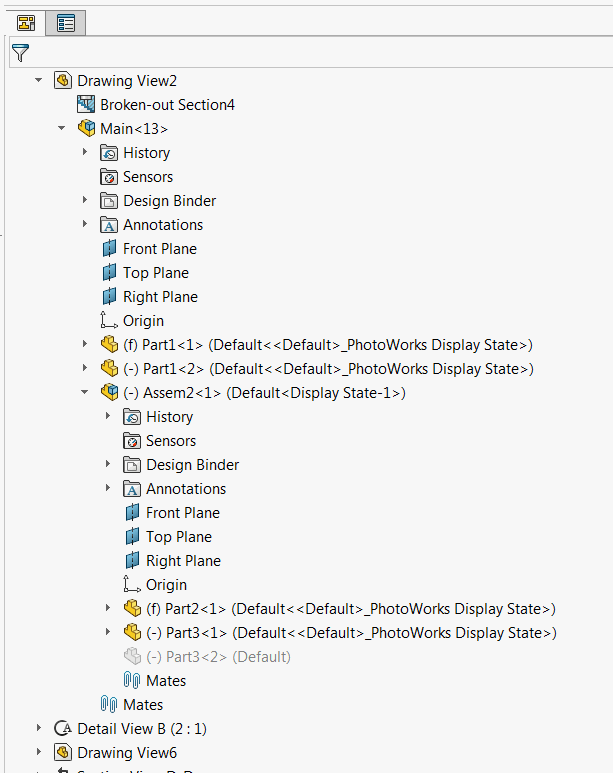

 VBA macro to get all visible components in the drawing view (including sub-assemblies) using SOLIDWORKS API
image: drawing-view-feature-tree.png
labels: [visible components,drawing view]
---
{ width=350 }

This VBA macro extracts all visible components from the selected drawing view using SOLIDWORKS API. Macro will extract all types of components (part components and assembly components).

[IView::GetVisibleComponents](https://help.solidworks.com/2013/english/api/sldworksapi/solidworks.interop.sldworks~solidworks.interop.sldworks.iview~getvisiblecomponents.html) SOLIDWORKS API methods only extracts part components (i.e. sldprt files) while all sub-assembly components are not returned. Furthermore the pointers to [IComponent2](https://help.solidworks.com/2017/english/api/sldworksapi/SOLIDWORKS.Interop.sldworks~SOLIDWORKS.Interop.sldworks.IComponent2.html) interfaces returned by this function are drawing context components. The [IComponent2::GetParent](https://help.solidworks.com/2016/english/api/sldworksapi/solidworks.interop.sldworks~solidworks.interop.sldworks.icomponent2~getparent.html) SOLIDWORKS API method returns Nothing for all components which means it is not possible to find the parent sub-assembly.

The below code addresses this limitations and returns all components in the context of their assembly document.

~~~ vb
Dim swApp As SldWorks.SldWorks

Sub main()

    Set swApp = Application.SldWorks
    
    Dim swModel As SldWorks.ModelDoc2
    
    Set swModel = swApp.ActiveDoc
    
    If Not swModel Is Nothing Then
        
        Dim swView As SldWorks.view
        Set swView = swModel.SelectionManager.GetSelectedObjectsDrawingView2(1, -1)
        
        If Not swView Is Nothing Then
            
            Dim vComps As Variant
            vComps = GetAllVisibleComponents(swView)
            
            If Not IsEmpty(vComps) Then
                
                Dim i As Integer
                Dim swComp As SldWorks.Component2
                
                For i = 0 To UBound(vComps)
                    Set swComp = vComps(i)
                    Debug.Print swComp.Name2
                Next
            End If
            
        Else
            MsgBox "Please select drawing view"
        End If
    Else
        MsgBox "Please open model"
    End If
    
End Sub

Function GetAllVisibleComponents(view As SldWorks.view) As Variant
        
    Dim swRootModel As SldWorks.ModelDoc2
    Set swRootModel = view.RootDrawingComponent.Component.GetModelDoc2
    
    Dim vComps As Variant
    vComps = view.GetVisibleComponents()
            
    Dim swAllComps() As SldWorks.Component2
    Dim isInit As Boolean
    
    Dim i As Integer
    
    For i = 0 To UBound(vComps)
        
        Dim swComp As SldWorks.Component2
        Set swComp = vComps(i)
        
        Dim swCorrComp As SldWorks.Component2
        Set swCorrComp = GetCorrespondingComponent(swRootModel, swComp)
            
        While Not swCorrComp Is Nothing
                                    
            Dim add As Boolean
            add = False

            If Not isInit Then
                ReDim swAllComps(0)
                isInit = True
                add = True
            Else
                If Not Contains(swAllComps, swCorrComp) Then
                    ReDim Preserve swAllComps(UBound(swAllComps) + 1)
                    add = True
                End If
            End If

            If add Then
                Set swAllComps(UBound(swAllComps)) = swCorrComp
            End If
            
            Set swCorrComp = swCorrComp.GetParent

        Wend
        
    Next
    
    GetAllVisibleComponents = swAllComps
    
End Function

Function GetCorrespondingComponent(assy As SldWorks.AssemblyDoc, swDrawComp As SldWorks.Component2) As SldWorks.Component2
        
    Dim name As String
    name = swDrawComp.Name2
    
    Dim vNameParts As Variant
    vNameParts = Split(name, "/")
    
    Dim swComp As SldWorks.Component2
    
    Dim swCompFeat As SldWorks.Feature
    
    Dim i As Integer
    i = 0
    
    While swCompFeat Is Nothing
        Set swCompFeat = assy.FeatureByName(vNameParts(i))
        i = i + 1
    Wend
    
    Set swComp = swCompFeat.GetSpecificFeature2
    
    For i = i To UBound(vNameParts)
                
        Set swCompFeat = swComp.FeatureByName(vNameParts(i))
        
        If swCompFeat Is Nothing Then
            Set GetComponentByName = Nothing
            Exit Function
        End If
        
        Set swComp = swCompFeat.GetSpecificFeature2
        
    Next
    
    Set GetCorrespondingComponent = swComp
    
End Function

Function Contains(vArr As Variant, item As Object) As Boolean
    
    Dim i As Integer
    
    For i = 0 To UBound(vArr)
        If vArr(i) Is item Then
            Contains = True
            Exit Function
        End If
    Next
    
    Contains = False
    
End Function
~~~

