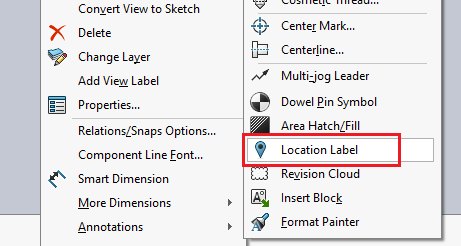

这个 VBA 宏提供了一个解决方案，用于在绘图视图中插入位置标签，因为 SOLIDWORKS API 中没有提供直接的方法。

请将视图的名称指定为 **VIEW_NAME** 常量。

> 仅支持与位置标签兼容的视图，例如辅助视图、详图视图等。

~~~ vb
#If VBA7 Then
     Private Declare PtrSafe Function SendMessage Lib "User32" Alias "SendMessageA" (ByVal hWnd As Long, ByVal wMsg As Long, ByVal wParam As Long, lParam As Any) As Long
#Else
     Private Declare Function SendMessage Lib "User32" Alias "SendMessageA" (ByVal hWnd As Long, ByVal wMsg As Long, ByVal wParam As Long, lParam As Any) As Long
#End If

Dim swApp As SldWorks.SldWorks
Const VIEW_NAME As String = "Drawing View2"

Sub main()

    Set swApp = Application.SldWorks
    
    Dim swDraw As SldWorks.DrawingDoc
    
    Set swDraw = swApp.ActiveDoc
    
    If Not swDraw Is Nothing Then
        InsertLocationLabel swDraw, swDraw.FeatureByName(VIEW_NAME).GetSpecificFeature
    Else
        MsgBox "请打开绘图"
    End If

End Sub

Sub InsertLocationLabel(draw As SldWorks.DrawingDoc, view As SldWorks.view)
    
    Dim swModel As SldWorks.ModelDoc2
    Set swModel = draw
    
    If False <> swModel.Extension.SelectByID2(view.Name, "DRAWINGVIEW", 0, 0, 0, False, -1, Nothing, 0) Then
        
        Const WM_COMMAND As Long = &H111
        Const ADD_LOCATION_LABEL As Long = 52041
        
        Dim swFrame As SldWorks.Frame
            
        Set swFrame = swApp.Frame
            
        SendMessage swFrame.GetHWnd(), WM_COMMAND, ADD_LOCATION_LABEL, 0
    Else
        Err.Raise vbError, "", "选择视图失败"
    End If
    
End Sub
~~~