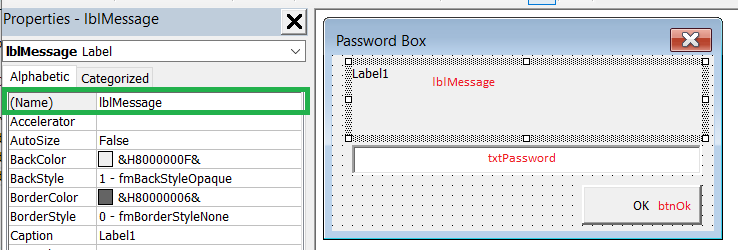
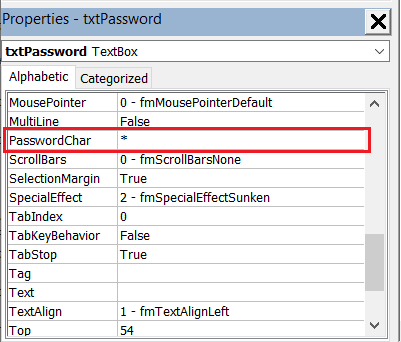

 VBA macro which locks (or password protects) the sheet format editing using SOLIDWORKS API
image: locked-sheet-format.png
labels: [lock,sheet format,protect]
group: Drawing
---
{ width=250 }

This VBA macro allows to disable (or password protect) the editing of the sheet format in SOLIDWORKS drawing using SOLIDWORKS API.

This macro can be useful where it is required to disallow users to modify the standard sheet format.

Macro provides 2 options which could be configured by changing the constants below:

~~~ vb
Public Const LOCK_WITH_PASSWORD As Boolean = False
Public Const PASSWORD As String = ""
~~~

## Locking the editing

Set the value of *LOCK_WITH_PASSWORD* to *False*. 

The following message is displayed every time the *Edit Sheet Format* command is called and command is cancelled:

## Password protecting the editing

Set the value of *LOCK_WITH_PASSWORD* to *True*. Set the value of *PASSWORD* to the target password.

It is recommended to password protect the VBA macro, so the password cannot be seen from the macro itself.

The following prompt is displayed every time the *Edit Sheet Format* command is called

If password matches, the sheet format can be edited, otherwise the command is cancelled and error message is displayed.

## Creating the macro

* Create new macro and paste [the code](#macro-module) of Macro Module
* Add new [class module](/docs/codestack/visual-basic/classes/) and name it *SheetFormatEditorHandler*. Paste the [code below](#sheetformateditorhandler-class) into class module.
* Add new [user form](/docs/codestack/visual-basic/user-forms/) and name it *PasswordBox*. Paste the [code below](#passwordbox-user-form) into the user form code
* Add the controls to the form as shown below and specify the name of each control as marked on the image

* Set the value of *PasswordChar* property of Text Box control to \* to hide the password from user interface while typing

The files tree should look similar to below image.

Follow the [Run Macro On SOLIDWORKS Start](/docs/codestack/solidworks-api/getting-started/macros/run-macro-on-solidworks-start/) for the instruction of setting up the automatic run of the macro on SOLIDWORKS startup.

## Blocking other commands

This macro can be modified to block another commands. It could be also changed to handle multiple commands at the same time. In order to enable this it is required to modify the following line

~~~ vb
If Command = swCommands_Edit_Template Then
~~~

To the

~~~ vb
If Command = CmdId1 Or Command = CmdId2 ... Or Command = CmdId3 Then
~~~

For example the following line would block editing sketch, opening the SOLIDWORKS options dialog and printing the document. Refer the [Capture Commands](/docs/codestack/solidworks-api/application/frame/capture-commands/) macro for an explanation of how to extract the IDs for the specific command in SOLIDWORKS.

~~~ vb
If Command = 859 Or Command = 342 Or Command = 589 Then
~~~

### Macro Module

~~~ vb
Public Const LOCK_WITH_PASSWORD As Boolean = True
Public Const PASSWORD As String = "admin"

Dim swSheetFormatEditorHandler As SheetFormatEditorHandler

Sub main()

    Set swSheetFormatEditorHandler = New SheetFormatEditorHandler
    
End Sub

~~~

### SheetFormatEditorHandler Class

~~~ vb
Dim WithEvents swApp As SldWorks.SldWorks

Private Sub Class_Initialize()
    Set swApp = Application.SldWorks
End Sub

Private Function swApp_CommandOpenPreNotify(ByVal Command As Long, ByVal UserCommand As Long) As Long
    
    Const swCommands_Edit_Template As Long = 1501
    
    If Command = swCommands_Edit_Template Then
        Dim cancel As Boolean
        cancel = True
        
        If LOCK_WITH_PASSWORD Then
            
            Dim pwd As String
            PasswordBox.Message = "Sheet format editing is locked. Please enter password to unlock"
            PasswordBox.ShowDialog
            pwd = PasswordBox.Password
            
            If pwd <> "" Then
                If pwd = Password Then
                    cancel = False
                Else
                    swApp.SendMsgToUser2 "Password is incorrect", swMessageBoxIcon_e.swMbStop, swMessageBoxBtn_e.swMbOk
                End If
            End If
        Else
            swApp.SendMsgToUser2 "Sheet format editing is locked", swMessageBoxIcon_e.swMbInformation, swMessageBoxBtn_e.swMbOk
        End If
        
        swApp_CommandOpenPreNotify = IIf(cancel, 1, 0)
    End If
    
End Function
~~~

### PasswordBox User Form

~~~ vb
Public Password As String

Public Property Let Message(msg As String)
     lblMessage.Caption = msg
End Property

Public Sub ShowDialog()
    Password = ""
    txtPassword.Text = ""
    Show vbModal
End Sub

Private Sub btnOk_Click()
    
    Password = txtPassword.Text
    Me.Hide
    
End Sub
~~~

