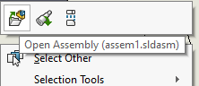

 VBA macro opens the document referenced by the selected drawing view in the referenced configuration and display state
image: ref-doc-display-state.svg
labels: [drawing,reference,display state]
group: Drawing
---
This VBA macro performs similar operation to **Open assembly command** on the selected SOLIDWORKS drawing view, but also activates the referenced display state associated with the drawing view.

~~~ vb
Dim swApp As SldWorks.SldWorks
Dim swModel As SldWorks.ModelDoc2

Sub main()

    Set swApp = Application.SldWorks
    
    Set swModel = swApp.ActiveDoc
    
    If Not swModel Is Nothing Then
    
        Dim swSelMgr As SldWorks.SelectionMgr
        
        Set swSelMgr = swModel.SelectionManager
        
        Dim swView As SldWorks.View
        
        Set swView = swSelMgr.GetSelectedObject6(1, -1)
        
        If Not swView Is Nothing Then
        
            Dim swRefDoc As SldWorks.ModelDoc2
            Set swRefDoc = swView.ReferencedDocument
            
            If swRefDoc Is Nothing Then
                Err.Raise vbError, "", "Drawing view model is not loaded"
            End If
            
            swRefDoc.ShowConfiguration2 swView.ReferencedConfiguration
            
            Dim swConf As SldWorks.Configuration
            Set swConf = swRefDoc.GetConfigurationByName(swView.ReferencedConfiguration)
            
            swConf.ApplyDisplayState swView.DisplayState
            
            swRefDoc.Visible = True
            
        Else
            Err.Raise vbError, "", "Select drawing view"
        End If
        
    Else
        Err.Raise vbError, "", "No active documents"
    End If
    
End Sub
~~~

