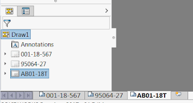
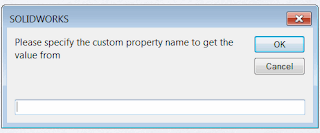
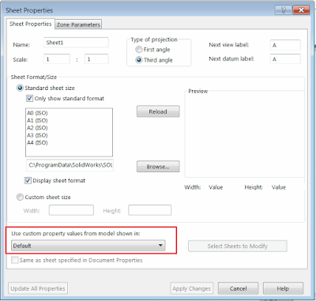

 Macro will rename all drawings sheets using the value of the specified custom property using SOLIDWORKS API
image: drw-sheets.png
labels: [custom property, drawing, example, macro, properties, rename, sheet, solidworks api, vba]
group: Drawing
redirect-from:
  - /2018/03/document_8.html
---
This macro will rename all drawings sheets using the value of the specified custom property using SOLIDWORKS API.

{ width=320 }

* Open the drawing and run the macro
* Specify the property to read the value from

{ width=320 }

* All sheets are renamed based on the value of this property. Macro will get the value from the model view specified in the Sheet Properties.
The 'Same as sheet specified in Document Properties'  option is not supported.
If this option is selected then the property from the first view will be used.
Macro will try to read the configuration specific property and if the property is not specified then model level property is read.

{ width=400 }

~~~ vb
Dim swApp As SldWorks.SldWorks
Dim swDraw As SldWorks.DrawingDoc

Sub main()

    Set swApp = Application.SldWorks
    
    Set swDraw = swApp.ActiveDoc
    
    If swDraw Is Nothing Then
        MsgBox "Please open the drawing"
        End
    End If
    
    Dim prpName As String
    prpName = InputBox("Please specify the custom property name to get the value from")
    
    Dim vSheetNames As Variant
    vSheetNames = swDraw.GetSheetNames
    
    Dim i As Integer
    
    For i = 0 To UBound(vSheetNames)
        
        Dim swSheet As SldWorks.Sheet
        Set swSheet = swDraw.Sheet(vSheetNames(i))
        
        Dim custPrpViewName As String
        custPrpViewName = swSheet.CustomPropertyView
        
        Dim vViews As Variant
        vViews = swSheet.GetViews()
        
        Dim swCustPrpView As SldWorks.View
        Set swCustPrpView = Nothing
        
        Dim j As Integer
        
        For j = 0 To UBound(vViews)
            
            Dim swView As SldWorks.View
            Set swView = vViews(j)
            
            If LCase(swView.Name) = LCase(custPrpViewName) Then
                Set swCustPrpView = swView
                Exit For
            End If
            
        Next
        
        If swCustPrpView Is Nothing Then
            Set swCustPrpView = vViews(0)
        End If
        
        If Not swCustPrpView Is Nothing Then
            
            Dim swRefConfName As String
            Dim swRefDoc As SldWorks.ModelDoc2
            
            swRefConfName = swCustPrpView.ReferencedConfiguration
            Set swRefDoc = swCustPrpView.ReferencedDocument
            
            If Not swRefDoc Is Nothing Then
                
                Dim prpValue As String
                
                prpValue = GetCustomPropertyValue(swRefDoc, swRefConfName, prpName)
                
                If prpValue <> "" Then
                    swSheet.SetName (prpValue)
                End If
                
            Else
                MsgBox "Failed to get the model from drawing view. Make sure that the drawing is not lightweight"
            End If
            
        Else
            MsgBox "Failed to get the view to get property from"
        End If
        
    Next
    
End Sub

Function GetCustomPropertyValue(model as SldWorks.ModelDoc2, confName as String, prpName As String) As String
    
    Dim prpValue As String
                
    model.Extension.CustomPropertyManager(confName).Get3 prpName, False, "", prpValue
    
    If prpValue = "" Then
        model.Extension.CustomPropertyManager("").Get3 prpName, False, "", prpValue
    End If
    
    GetCustomPropertyValue = prpValue
    
End Function
~~~

