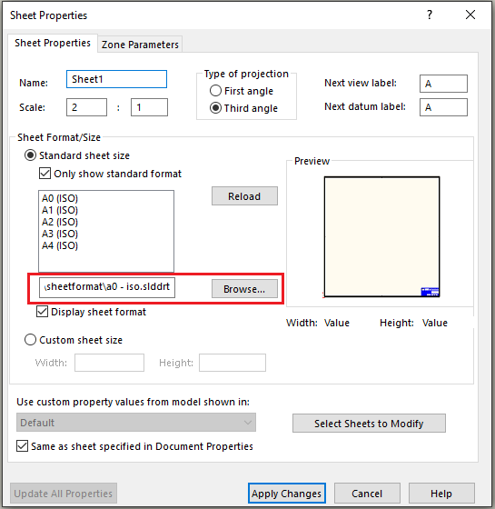

 VBA macro to replace sheet formats in the drawing sheets based on the specified map
image: replace-sheet-format.svg
group: Drawing
---
{ width=300 }

This VBA macro replaces sheet formats (*.slddrt files) in all sheets of an active drawing document according to specified mapping rules.

## Configuration

Configure the map by changing the **REPLACE_MAP** array. This array contains instructions on replacing the sheets based on the size or sheet format file of the input sheet.

This map contains an array of matching filters and resulting sheet format file in the following format:

~~~
|{Source paper size}|{Source sheet format file path}|{Target sheet format file path}
~~~

Source paper size is the constant as defined in [swDwgPaperSizes_e](https://help.solidworks.com/2016/english/api/swconst/solidworks.interop.swconst~solidworks.interop.swconst.swdwgpapersizes_e.html) enumeration. See the table below. Use one of these values or use \* to match any paper size

| Size        | Constant |
|-------------|----------|
| A           | 0        |
| A Vertical  | 1        |
| B           | 2        |
| C           | 3        |
| D           | 4        |
| E           | 5        |
| A4          | 6        |
| A4 Vertical | 7        |
| A3          | 8        |
| A2          | 9        |
| A1          | 10       |
| A0          | 11       |

Source sheet format file size is a full file path to the sheet format file or \* to match all sheet formats.

For example the below map will

* Replace all sheets with A0 size (11) regardless of the sheet format file used (\*) with the *D:\Formats\format1.slddrt* sheet format.
* Replace all sheets regardless of the size (\*) with sheet format linked to *D:\OldFormats\oldformat1.slddrt* with the *D:\Formats\format2.slddrt* file

~~~ vb
REPLACE_MAP = Array("11|*|D:\Formats\format1.slddrt", "*|D:\OldFormats\oldformat1.slddrt|D:\Formats\format2.slddrt")
~~~

You can specify as many rules as required.

Rules are executed in the specified order.

If none of the rules match the input - macro throws an error.

~~~ vb
Const REMOVE_MODIFIED_NOTES As Boolean = True
Const FILTER_ANY As String = "*"

Dim swApp As SldWorks.SldWorks

Dim REPLACE_MAP As Variant

Sub main()

    REPLACE_MAP = Array("*|*|D:\new-format.slddrt")

    Set swApp = Application.SldWorks
    
    Dim swDraw As SldWorks.DrawingDoc
    
    Set swDraw = swApp.ActiveDoc
    
    Dim vSheetNames As Variant
    vSheetNames = swDraw.GetSheetNames
    
    Dim i As Integer
    
    Dim activeSheet As String
    activeSheet = swDraw.GetCurrentSheet().GetName
    
    For i = 0 To UBound(vSheetNames)
        
        Dim sheetName As String
        sheetName = CStr(vSheetNames(i))
        
        Dim swSheet As SldWorks.sheet
        Set swSheet = swDraw.sheet(sheetName)
        
        Dim targetSheetFormatFileName As String
        targetSheetFormatFileName = GetReplaceSheetFormat(swSheet)
        
        swDraw.ActivateSheet sheetName
        
        ReplaceSheetFormat swDraw, swSheet, targetSheetFormatFileName

    Next
    
    swDraw.ActivateSheet activeSheet
    
End Sub

Function GetReplaceSheetFormat(sheet As SldWorks.sheet) As String
    
    Dim curTemplateName As String
    curTemplateName = sheet.GetTemplateName()
    
    Dim curSize As Integer
    curSize = sheet.GetSize(-1, -1)
    
    Dim i As Integer
    
    For i = 0 To UBound(REPLACE_MAP)
        
        Dim map As String
        map = REPLACE_MAP(i)
        
        Dim mapParams As Variant
        mapParams = Split(map, "|")
        
        Dim mapPaperSize As Integer
        Dim srcTemplateName As String
        
        If Trim(mapParams(0)) <> FILTER_ANY Then
            mapPaperSize = CInt(Trim(mapParams(0)))
        Else
            mapPaperSize = -1
        End If
        
        If Trim(mapParams(1)) <> FILTER_ANY Then
            srcTemplateName = CStr(Trim(mapParams(1)))
        Else
            srcTemplateName = ""
        End If
        
        If (mapPaperSize = -1 Or mapPaperSize = curSize) And (srcTemplateName = "" Or LCase(srcTemplateName) = LCase(curTemplateName)) Then
            
            Dim targetTemplateName As String

            targetTemplateName = CStr(Trim(mapParams(2)))
        
            If targetTemplateName = "" Then
                Err.Raise vbError, "", "Target template is not specified"
            End If
        
            GetReplaceSheetFormat = targetTemplateName
            Exit Function
            
        End If
        
    Next
    
    Err.Raise vbError, "", "Failed find the sheet format mathing current sheet"
    
End Function

Sub ReplaceSheetFormat(draw As SldWorks.DrawingDoc, sheet As SldWorks.sheet, targetSheetFormatFile As String)
    
    Debug.Print "Replacing '" & sheet.GetName() & "' with '" & targetSheetFormatFile & "'"
    
    Dim vProps As Variant
    vProps = sheet.GetProperties()
    
    Dim paperSize As Integer
    Dim templateType As Integer
    Dim scale1 As Double
    Dim scale2 As Double
    Dim firstAngle As Boolean
    Dim width As Double
    Dim height As Double
    Dim custPrpView As String
    
    paperSize = CInt(vProps(0))
    templateType = CInt(vProps(1))
    scale1 = CDbl(vProps(2))
    scale2 = CDbl(vProps(3))
    firstAngle = CBool(vProps(4))
    width = CDbl(vProps(5))
    height = CDbl(vProps(6))
    custPrpView = sheet.CustomPropertyView
    
    If False <> draw.SetupSheet5(sheet.GetName(), paperSize, templateType, scale1, scale2, firstAngle, targetSheetFormatFile, width, height, custPrpView, REMOVE_MODIFIED_NOTES) Then
        If sheet.ReloadTemplate(Not REMOVE_MODIFIED_NOTES) <> swReloadTemplateResult_e.swReloadTemplate_Success Then
            Err.Raise vbError, "", "Failed to reload sheet format"
        End If
    Else
        Err.Raise vbError, "", "Failed to set the sheet format"
    End If
    
End Sub
~~~

