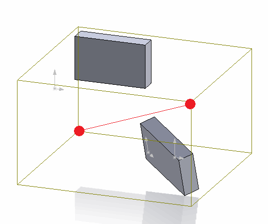

 Draw underlying model bounding box sketch segment in the context of the drawing sheet using SOLIDWORKS API
image: drawing-view-line.png
labels: [sketch,dimension,edge,bounding box]
---
This code example demonstrates how to draw the model bounding box diagonal in the drawing view using SOLIDWORKS API.

{ width=250 }

The bounding box coordinate system is extracted from the underlying model of the drawing view. The coordinates are relative to the global coordinate system of the part or the assembly drawing view created from.

In order to properly transform the coordinate into the drawing sheet space it is required to consider the following:

* Drawing view transformation. This can be extracted using the [IView::ModelToViewTransform](https://help.solidworks.com/2018/english/api/sldworksapi/solidworks.interop.sldworks~solidworks.interop.sldworks.iview~modeltoviewtransform.html) SOLIDWORKS API method.
* Drawing sheet transformation.
* Drawing sheet scale

{ width=350 }

The combination of the above transformation will return the full transformation of the coordinate from the model space into the current sheet space.

> When inserting the sketch segments into the drawing sheet it is imported to activate the sheet space by calling the [IDrawingDoc::ActivateView](https://help.solidworks.com/2018/english/api/sldworksapi/solidworks.interop.sldworks~solidworks.interop.sldworks.idrawingdoc~activateview.html) SOLIDWORKS API method and passing an empty string as the parameter. Otherwise the entity will be inserted directly into the model space of the view document.

## Running macro

* Open drawing
* Insert view of part or assembly
* Modify view and drawing sheet scale. You can also rotate the view
* Run the macro. As the result the diagonal is drawn in the sheet space representing the bounding box of the underlying model
* Move the view. Note that the created line segment doesn't move with the view which means it was created in the drawing sheet space

{ width=300 }

~~~ vb
Dim swApp As SldWorks.SldWorks

Sub main()

    Set swApp = Application.SldWorks
    
    Dim swDraw As SldWorks.DrawingDoc
    
    Set swDraw = swApp.ActiveDoc
    
    If Not swDraw Is Nothing Then
        
        Dim swView As SldWorks.view
        Set swView = swDraw.SelectionManager.GetSelectedObject6(1, -1)
        
        If Not swView Is Nothing Then
            DrawBBoxDiagonal swDraw, swView
        Else
            MsgBox "Please select drawing view"
        End If
    Else
        MsgBox "Please open the drawing document"
    End If
    
End Sub

Sub DrawBBoxDiagonal(draw As SldWorks.DrawingDoc, view As SldWorks.view)
    
    Dim vBox As Variant
    Dim swViewTransform As SldWorks.MathTransform
    
    Dim swMathPt As SldWorks.MathPoint
    Dim vStartPt As Variant
    Dim vEndPt As Variant
    
    vBox = GetViewRefModelBBox(view)
    Set swViewTransform = GetViewToSheetTransform(draw, view)
    
    Dim swMathUtils As SldWorks.MathUtility
    Set swMathUtils = swApp.GetMathUtility
    
    Dim dPt(2) As Double
    dPt(0) = vBox(0): dPt(1) = vBox(1): dPt(2) = vBox(2)
    
    Set swMathPt = swMathUtils.CreatePoint(dPt)
    Set swMathPt = swMathPt.MultiplyTransform(swViewTransform)
    vStartPt = swMathPt.ArrayData
    
    dPt(0) = vBox(3): dPt(1) = vBox(4): dPt(2) = vBox(5)
    
    Set swMathPt = swMathUtils.CreatePoint(dPt)
    Set swMathPt = swMathPt.MultiplyTransform(swViewTransform)
    vEndPt = swMathPt.ArrayData
    
    draw.ActivateView ""
        
    draw.ClearSelection2 True
        
    draw.SketchManager.CreateLine vStartPt(0), vStartPt(1), vStartPt(2), vEndPt(0), vEndPt(1), vEndPt(2)
    
End Sub

Function GetViewRefModelBBox(view As SldWorks.view) As Variant
    
    Dim swRefDoc As SldWorks.ModelDoc2
    Set swRefDoc = view.ReferencedDocument
    
    If Not swRefDoc Is Nothing Then
        If swRefDoc.GetType() = swDocumentTypes_e.swDocPART Then
            Dim swPart As SldWorks.PartDoc
            Set swPart = swRefDoc
            GetViewRefModelBBox = swPart.GetPartBox(True)
        ElseIf swRefDoc.GetType() = swDocumentTypes_e.swDocASSEMBLY Then
            Dim swAssy As SldWorks.AssemblyDoc
            Set swAssy = swRefDoc
            Const BOX_OPTS_DEFAULT As Integer = 0
            GetViewRefModelBBox = swAssy.GetBox(BOX_OPTS_DEFAULT)
        Else
            Err.Raise vbError, "", "Unsupported view document"
        End If
    Else
        Err.Raise vbError, "", "No document attached to view"
    End If
    
End Function

Function GetViewToSheetTransform(draw As SldWorks.DrawingDoc, view As SldWorks.view) As SldWorks.MathTransform

    Dim swMathUtils As SldWorks.MathUtility
    Dim swSheet As SldWorks.sheet
    
    Set swMathUtils = swApp.GetMathUtility
    
    Set swSheet = view.sheet
    
    Dim vSheetPrps As Variant
    vSheetPrps = swSheet.GetProperties
    
    Dim sheetScaleNom As Double
    Dim sheetScaleDenom As Double
    
    sheetScaleNom = vSheetPrps(2)
    sheetScaleDenom = vSheetPrps(3)

    Dim dSheetData(15) As Double
    dSheetData(0) = 1: dSheetData(1) = 0: dSheetData(2) = 0: dSheetData(3) = 0
    dSheetData(4) = 1: dSheetData(5) = 0: dSheetData(6) = 0: dSheetData(7) = 0
    dSheetData(8) = 1: dSheetData(9) = 0: dSheetData(10) = 0: dSheetData(11) = 0
    dSheetData(12) = sheetScaleNom / sheetScaleDenom: dSheetData(13) = 0: dSheetData(14) = 0: dSheetData(15) = 0
    
    Dim swSheetTransform As SldWorks.MathTransform
    Set swSheetTransform = swMathUtils.CreateTransform(dSheetData)
            
    Set GetViewToSheetTransform = view.ModelToViewTransform.Multiply(swSheetTransform.Inverse())

End Function
~~~

