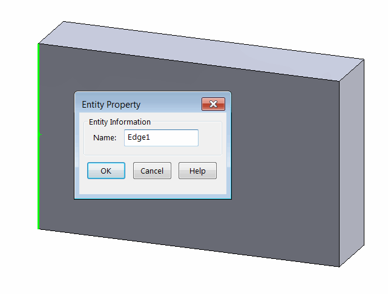
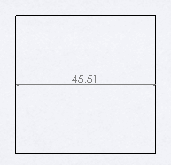

 Add dimension between two named entities of the part drawing retrieved from the underlying model using SOLIDWORKS API
image: drawing-view-dimension.png
labels: [view,dimension,named]
---
Similar to [Assembly Context](/docs/codestack/solidworks-api/document/assembly/context/) there is drawing context. Pointer to the entity may exist in underlying model context and in the drawing view context.

When entities from the underlying model context (i.e. from part or assembly) need to be selected in the drawing view (for example for the dimensioning purposes), [IView::SelectEntity](https://help.solidworks.com/2018/english/api/sldworksapi/solidworks.interop.sldworks~solidworks.interop.sldworks.iview~selectentity.html) SOLIDWORKS API method could be called. SOLIDWORKS will automatically find the corresponding entity pointer in the drawing view and select it.

This example demonstrates how to add the linear dimension between two named edges (Edge1 and Edge2) from the underlying part model using SOLIDWORKS API. The entities can be named via the following property dialog:

{ width=350 }

As the result the dimension is added between the edges.

{ width=250 }

Location of the dimension is found as a middle point of the line drawn between two middle points of the dimensioned edges. Unlike [drawing in sheet context](/docs/codestack/solidworks-api/document/drawing/sheet-context-sketch/), drawing sheet scale is not required to be multiplied to the view transformation matrix when positioning the dimensions.

~~~ vb
Dim swApp As SldWorks.SldWorks

Sub main()

    Set swApp = Application.SldWorks
    
    Dim swDraw As SldWorks.DrawingDoc
    
    Set swDraw = swApp.ActiveDoc
    
    If Not swDraw Is Nothing Then
        
        Dim swView As SldWorks.view
        Set swView = swDraw.SelectionManager.GetSelectedObject6(1, -1)
        
        If Not swView Is Nothing Then
            DimensionNamedEdges "Edge1", "Edge2", swDraw, swView
        Else
            MsgBox "Please select drawing view"
        End If
    Else
        MsgBox "Please open the drawing document"
    End If
    
End Sub

Function DimensionNamedEdges(firstEdgeName As String, secondEdgeName As String, draw As SldWorks.DrawingDoc, view As SldWorks.view)
    
    Dim swRefPart As SldWorks.PartDoc
    Set swRefPart = view.ReferencedDocument
    
    Dim swFirstEdge As SldWorks.edge
    Set swFirstEdge = swRefPart.GetEntityByName(firstEdgeName, swSelectType_e.swSelEDGES)
    
    Dim swSecondEdge As SldWorks.edge
    Set swSecondEdge = swRefPart.GetEntityByName(secondEdgeName, swSelectType_e.swSelEDGES)
    
    If swFirstEdge Is Nothing Or swSecondEdge Is Nothing Then
        Err.Raise vbError, "", "Failed to find edge by name"
    End If
    
    If False = view.SelectEntity(swFirstEdge, False) Or False = view.SelectEntity(swSecondEdge, True) Then
        Err.Raise vbError, "", "Failed to select edges in the drawing view"
    End If
    
    Dim swModel As SldWorks.ModelDoc2
    Set swModel = draw
    
    Dim vDimLoc As Variant
    vDimLoc = GetDimensionLocation(swFirstEdge, swSecondEdge, view)
    
    swModel.AddDimension2 vDimLoc(0), vDimLoc(1), vDimLoc(2)
    
End Function

Function GetDimensionLocation(firstEdge As SldWorks.edge, secondEdge As SldWorks.edge, view As SldWorks.view) As Variant
    
    Dim vFirstPt As Variant
    vFirstPt = GetEdgeMidPoint(firstEdge, view)
    
    Dim vSecondPt As Variant
    vSecondPt = GetEdgeMidPoint(secondEdge, view)
    
    Dim dLoc(2) As Double
    dLoc(0) = (vFirstPt(0) + vSecondPt(0)) / 2
    dLoc(1) = (vFirstPt(1) + vSecondPt(1)) / 2
    dLoc(2) = (vFirstPt(2) + vSecondPt(2)) / 2
    
    GetDimensionLocation = dLoc
    
End Function

Function GetEdgeMidPoint(edge As SldWorks.edge, view As SldWorks.view) As Variant
    
    Dim vStartPt As Variant
    vStartPt = edge.GetStartVertex().GetPoint
    
    Dim vEndPt As Variant
    vEndPt = edge.GetEndVertex().GetPoint
    
    Dim vMidPt(2) As Double
    vMidPt(0) = (vStartPt(0) + vEndPt(0)) / 2
    vMidPt(1) = (vStartPt(1) + vEndPt(1)) / 2
    vMidPt(2) = (vStartPt(2) + vEndPt(2)) / 2
    
    Dim swViewXForm As SldWorks.MathTransform
    Set swViewXForm = view.ModelToViewTransform
    
    Dim swMathUtils As SldWorks.MathUtility
    Set swMathUtils = swApp.GetMathUtility
    
    Dim swMathPt As SldWorks.MathPoint
    Set swMathPt = swMathUtils.CreatePoint(vMidPt)
    
    Set swMathPt = swMathPt.MultiplyTransform(swViewXForm)
    
    GetEdgeMidPoint = swMathPt.ArrayData
    
End Function
~~~

