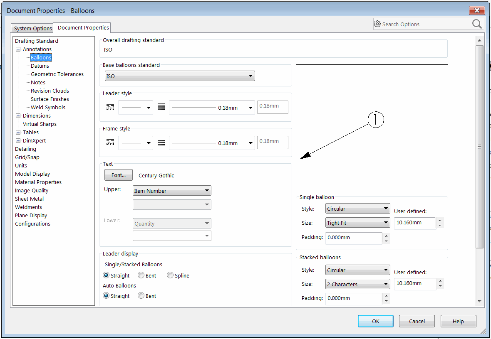
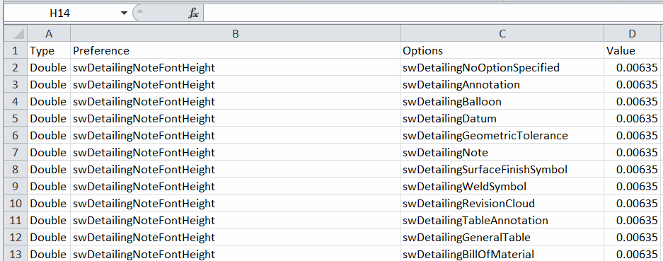

 Macro allows to export all document properties into excel format using SOLIDWORKS API and reflection
image: document-properties.png
labels: [export, excel, csv, options]
group: Options
---
{ width=350 }

This macro exports all document properties (available under the Tools->Options->Document) menu

Macro is utilizing [Reflection](https://docs.microsoft.com/en-us/dotnet/csharp/programming-guide/concepts/reflection) to dynamically read all available user preferences enumerations and calling the corresponding SOLIDWORKS API to extract each property value.

Macro outputs the properties into the CSV file which can be opened in Excel. The following information is included:

* Preference Group - numeric, toggle or text
* ID of preference - the exact option being exported
* Preference option - additional information about preference
* Value - current value of the preference

Refer [System Options and Document Properties](https://help.solidworks.com/2016/english/api/sldworksapiprogguide/overview/system_options_and_document_properties.htm) article for a list of options to match the specific preference ID and value.

{ width=350 }

This macro can be useful if it is required to compare the preferences between different files. Any diff tool can be used to simplify the comparison and identify the differences, such as [WinMerge](https://winmerge.org/)

{ width=550 }

File output location be customized by modifying the *OUT_FILE_PATH* constant at the beginning of the macro.

~~~ cs
const string OUT_FILE_PATH = @""; //Output file will be created at the same location as SOLIDWORKS model and will be named as <ModelName>_prefs.csv
const string OUT_FILE_PATH = @"Options.csv"; //Output file will be created at the same location as SOLIDWORKS model and will be named as Options.csv
const string OUT_FILE_PATH = @"D:\Output\prefs.csv"; //File will be output to D:\Output\prefs.csv
~~~

Refer [Create And Run VSTA Macro](/docs/codestack/solidworks-api/getting-started/macros/create-vsta/) for information about creating and adding code to VSTA macro.

## C# VSTA Macro

~~~ cs
using SolidWorks.Interop.sldworks;
using SolidWorks.Interop.swconst;
using System.Runtime.InteropServices;
using System;
using System.Collections.Generic;
using System.IO;

namespace ExtractAlLDocProperties.csproj
{
    public partial class SolidWorksMacro
    {
        const string OUT_FILE_PATH = @"";

        public delegate object PreferenceHandlerDelegate(IModelDocExtension ext, int pref, swUserPreferenceOption_e opt, out string type);

        public void Main()
        {
            try
            {
                IModelDoc2 model = swApp.IActiveDoc2;

                if (model != null)
                {
                    IModelDocExtension modelExt = model.Extension;

                    Dictionary<Type, PreferenceHandlerDelegate> handlers = InitHandlers();

                    string outFilePath = OUT_FILE_PATH;

                    if (string.IsNullOrEmpty(outFilePath))
                    {
                        outFilePath = Path.GetFileNameWithoutExtension(model.GetTitle()) + "_prefs.csv";
                    }

                    if (!Path.IsPathRooted(outFilePath))
                    {
                        string curModelPath = model.GetPathName();

                        if (string.IsNullOrEmpty(curModelPath))
                        {
                            throw new NullReferenceException("Current model is not saved. Either save the model or specify the full path to the output file");
                        }

                        outFilePath = Path.Combine(Path.GetDirectoryName(curModelPath), outFilePath);
                    }

                    ExtractUserPreferences(modelExt, outFilePath, handlers);
                }
                else
                {
                    throw new NullReferenceException("Please open the model");
                }
            }
            catch (Exception ex)
            {
                swApp.SendMsgToUser2(ex.Message, (int)swMessageBoxIcon_e.swMbStop, (int)swMessageBoxBtn_e.swMbOk);
            }
        }

        private void ExtractUserPreferences(IModelDocExtension modelExt, string outFilePath, Dictionary<Type, PreferenceHandlerDelegate> handlers)
        {
            using (StreamWriter fileWriter = new StreamWriter(outFilePath))
            {
                fileWriter.WriteLine("Type,Preference,Options,Value");

                foreach (KeyValuePair<Type, PreferenceHandlerDelegate> prefData in handlers)
                {
                    foreach (Enum pref in Enum.GetValues(prefData.Key))
                    {
                        if (pref.ToString().StartsWith("swDetailing"))
                        {
                            foreach (swUserPreferenceOption_e opt in Enum.GetValues(typeof(swUserPreferenceOption_e)))
                            {
                                OutputValue(fileWriter, prefData.Value, modelExt, pref, opt);
                            }
                        }
                        else
                        {
                            OutputValue(fileWriter, prefData.Value, modelExt, pref, swUserPreferenceOption_e.swDetailingNoOptionSpecified);
                        }
                    }
                }
            }
        }

        private Dictionary<Type, PreferenceHandlerDelegate> InitHandlers()
        {
            Dictionary<Type, PreferenceHandlerDelegate> preferences
                = new Dictionary<Type, PreferenceHandlerDelegate>();

            preferences.Add(typeof(swUserPreferenceDoubleValue_e),
                GetDoublePreferenceValue);

            preferences.Add(typeof(swUserPreferenceIntegerValue_e),
                GetIntegerPreferenceValue);

            preferences.Add(typeof(swUserPreferenceStringValue_e),
                GetStringPreferenceValue);

            preferences.Add(typeof(swUserPreferenceToggle_e),
                GetTogglePreferenceValue);
            return preferences;
        }

        private void OutputValue(System.IO.StreamWriter fileWriter, PreferenceHandlerDelegate handler, 
            IModelDocExtension ext, Enum pref, swUserPreferenceOption_e opt) 
        {
            int prefVal = Convert.ToInt32(pref);

            string type;
            object value = handler.Invoke(ext, prefVal, opt, out type);

            string line = string.Format("{0},{1},{2},\"{3}\"", type, pref, opt, value);

            fileWriter.WriteLine(line);
        }

        private object GetDoublePreferenceValue(IModelDocExtension ext, int pref, swUserPreferenceOption_e opt, out string type) 
        {
            type = "Double";
            return ext.GetUserPreferenceDouble(pref, (int)opt);
        }

        private object GetIntegerPreferenceValue(IModelDocExtension ext, int pref, swUserPreferenceOption_e opt, out string type)
        {
            type = "Integer";
            return ext.GetUserPreferenceInteger(pref, (int)opt);
        }

        private object GetStringPreferenceValue(IModelDocExtension ext, int pref, swUserPreferenceOption_e opt, out string type)
        {
            type = "String";
            return ext.GetUserPreferenceString(pref, (int)opt);
        }

        private object GetTogglePreferenceValue(IModelDocExtension ext, int pref, swUserPreferenceOption_e opt, out string type)
        {
            type = "Toggle";
            return ext.GetUserPreferenceToggle(pref, (int)opt);
        }

        public SldWorks swApp;
    }
}
~~~

