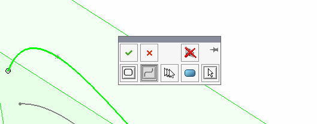

 Example demonstrates how to create surface loft feature from the contours as the profiles using SOLIDWORKS API
image: lofted-surface-sketch-contours.png
labels: [surface, loft, contour]
---
{ width=500 }

This example demonstrates how to create surface loft feature from the contours as the profiles using SOLIDWORKS API.

Sketch segments are not accepted entities for the profiles in the surface loft feature. This means if only several segments from the sketch need to be used for profiles (instead of the entire sketch) it is not possible to create a feature by selecting the sketch segments. It is required to use sketch contours instead.

Sketch segments are not supported from the User Interface as well. When segment is selected the following selection manager is displayed allowing to select the open or closed loop.

{ width=250 }

* Open part and select sketch segments for profile. Any types of sketch segments are supported (spline, line, arc etc.). There might be multiple sketch segments in the sketch and only several can be selected for the profile. Segments can be in different sketches as well.
* Macro will find the corresponding sketch contour for each sketch segment
* Macro will create surface loft feature with the corresponding sketch contours

> This macro is not an optimal performance code for finding sketch contours of segments within the same sketch as it will do a full traversal of all sketch segments within the sketch to find the corresponding contour for individual sketch segments. Modify the macro to find multiple sketch contours at a time within one traversal loop avoiding repetition.

~~~ vb
Dim swApp As SldWorks.SldWorks

Sub main()

    Dim swModel As SldWorks.ModelDoc2
    Dim swSelMgr As SldWorks.SelectionMgr
    
    Set swApp = Application.SldWorks
    Set swModel = swApp.ActiveDoc

    Set swSelMgr = swModel.SelectionManager
    
    Dim swContours() As SldWorks.SketchContour
    ReDim swContours(swSelMgr.GetSelectedObjectCount2(-1) - 1)
    
    Dim i As Integer
    
    For i = 1 To swSelMgr.GetSelectedObjectCount2(-1)
        Dim swSkSeg As SldWorks.SketchSegment
        Set swSkSeg = swSelMgr.GetSelectedObject6(i, -1)
        Set swContours(i - 1) = GetSketchContour(swSkSeg)
    Next
    
    swModel.ClearSelection2 True
    
    Dim swSelData As SldWorks.SelectData
        
    Set swSelData = swSelMgr.CreateSelectData
    
    swSelData.Mark = 1
        
    For i = 0 To UBound(swContours)
        Dim swSkContour As SldWorks.SketchContour
        Set swSkContour = swContours(i)
        swSkContour.Select2 True, swSelData
    Next
    
    swModel.InsertLoftRefSurface2 False, True, False, 1, 0, 0

End Sub

Function GetSketchContour(sketchSeg As SldWorks.SketchSegment) As SldWorks.SketchContour
    
    Dim swSketch As SldWorks.Sketch
    Set swSketch = sketchSeg.GetSketch
    
    Dim vSketchContours As Variant
    
    vSketchContours = swSketch.GetSketchContours
    
    If Not IsEmpty(vSketchContours) Then
        
        Dim i As Integer
        
        For i = 0 To UBound(vSketchContours)
            
            Dim swSkContour As SldWorks.SketchContour
            Set swSkContour = vSketchContours(i)
            
            Dim vSegs As Variant
            vSegs = swSkContour.GetSketchSegments()
            
            If Not IsEmpty(vSegs) Then
                
                Dim j As Integer
                
                Dim swCurSkSeg As SldWorks.SketchSegment
                Set swCurSkSeg = vSegs(j)
                
                If swApp.IsSame(sketchSeg, swCurSkSeg) = swObjectEquality.swObjectSame Then
                    Set GetSketchContour = swSkContour
                    Exit Function
                End If
                
            End If
            
        Next
        
    End If
    
End Function
~~~

