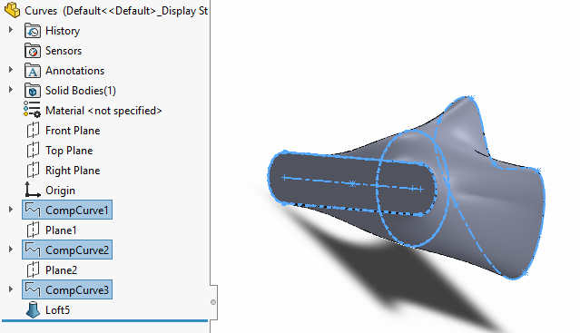

---
标题：通过SOLIDWORKS API创建挤压特征
描述：使用SOLIDWORKS API从选择的草图或曲线特征创建实体挤压特征的VBA宏
图片：loft-feature-through-curves.png
---

{ width=400 }

这个VBA宏演示了如何利用[IFeatureManager::InsertProtrusionBlend2](https://help.solidworks.com/2018/english/api/sldworksapi/SOLIDWORKS.Interop.sldworks~SOLIDWORKS.Interop.sldworks.IFeatureManager~InsertProtrusionBlend2.html) API从在特征管理器树中选择的草图或曲线特征创建挤压特征。

``` vb
Dim swApp As SldWorks.SldWorks

Sub main()

    Dim swModel As SldWorks.ModelDoc2
    Dim swSelMgr As SldWorks.SelectionMgr
    
    Set swApp = Application.SldWorks
    Set swModel = swApp.ActiveDoc

    Set swSelMgr = swModel.SelectionManager
    
    Dim swFeats() As SldWorks.Feature
    ReDim swFeats(swSelMgr.GetSelectedObjectCount2(-1) - 1)
    
    Dim i As Integer
    
    For i = 1 To swSelMgr.GetSelectedObjectCount2(-1)
        Dim swFeat As SldWorks.Feature
        Set swFeat = swSelMgr.GetSelectedObject6(i, -1)
        Set swFeats(i - 1) = swFeat
    Next
    
    Dim swSelData As SldWorks.SelectData
    Set swSelData = swSelMgr.CreateSelectData
    
    swSelData.Mark = 1
    
    If swModel.Extension.MultiSelect2(swFeats, False, swSelData) <> UBound(swFeats) + 1 Then
        Err.Raise vbError, "", "Failed to selected profiles"
    End If
        
    Const CONSTRAINT_DEFAULT As Integer = 6
    Const THIN_TYPE_ONE_DIR As Integer = 0
    
    swModel.FeatureManager.InsertProtrusionBlend2 False, True, False, 1, CONSTRAINT_DEFAULT, CONSTRAINT_DEFAULT, 1, 1, True, True, False, 0, 0, THIN_TYPE_ONE_DIR, True, True, True, swGuideCurveInfluence_e.swGuideCurveInfluenceNextGuide

End Sub
```

