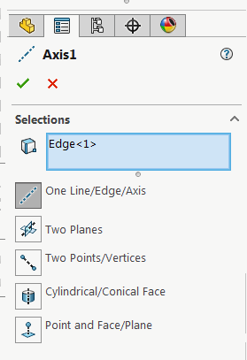

 VBA macro example to change the selection of the axis feature using SOLIDWORKS API
image: axis-definition.png
labels: [axis,definition]
---
{ width=250 }

This VBA example demonstrates how to modify the definition and change the selection for the axis feature using SOLIDWORKS API.

* Select the target axis feature to modify as first selection
* Select the objects to be set as the reference for the target axis. For example 2 intersecting planes, edge, etc.

As the result the selected objects (second to the last) will be assigned to the axis (first selection).

~~~ vb
Dim swApp As SldWorks.SldWorks

Sub main()

    Set swApp = Application.SldWorks
    
    Dim swModel As SldWorks.ModelDoc2
    Dim swSelMgr As SldWorks.SelectionMgr

    Set swModel = swApp.ActiveDoc
    
    Set swSelMgr = swModel.SelectionManager
    
    Dim swFeat As SldWorks.Feature
    Set swFeat = swSelMgr.GetSelectedObject6(1, -1)
    
    If Not swFeat Is Nothing Then
    
        Dim swAxisFeatDef As SldWorks.RefAxisFeatureData
        Set swAxisFeatDef = swFeat.GetDefinition
        
        Dim i As Integer
        
        Dim swRefs() As Object
        ReDim swRefs(swSelMgr.GetSelectedObjectCount2(-1) - 2)
        
        For i = 2 To swSelMgr.GetSelectedObjectCount2(-1)
            Set swRefs(i - 2) = swSelMgr.GetSelectedObject6(i, -1)
        Next
        
        swAxisFeatDef.AccessSelections swModel, Nothing
        
        swAxisFeatDef.SetSelections swRefs
        
        swFeat.ModifyDefinition swAxisFeatDef, swModel, Nothing
        
    End If
    
End Sub
~~~

