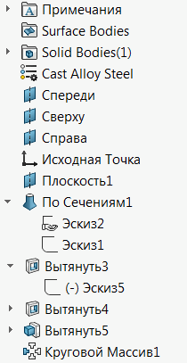

这个VBA宏允许使用SOLIDWORKS API根据指定的规则和特征类型名称重命名零件文档中的特征管理树。

这个宏可以用作翻译宏，将特征树从一种语言重命名为另一种语言。

例如，这个特征树是用俄语编写的：

{ width=150 }

它可以被重命名为英语版本：

{ width=150 }

## 配置

宏使用两个文件中指定的数据，这两个文件必须与宏存储在同一个文件夹中：

~~~ vb
Const NO_INCREMENT_FILE As String = "noincrement.csv"
Const CUSTOM_MAP_FILE As String = "custommap.csv"
~~~

这些文件可以在Excel或任何文本编辑器（如记事本）中进行编辑。

### 不递增的CSV文件

这个文件包含特征类型名称，它们的名称不应该递增（即它们在树中只出现一次），例如*Origin*特征或*Documents Folder*。

这是一个单列的CSV文件。[下载](noincrement.csv)

### 自定义映射CSV文件

这个文件包含特征类型的特殊名称。默认情况下，特征将以其类型命名，但是可以在这个文件中覆盖此行为。例如，*Sketch*特征的类型名称是*OriginProfileFeature*，所以默认情况下所有的草图将被重命名为*OriginProfileFeature1*、*OriginProfileFeature2*、*OriginProfileFeature3*等，除非在*custommap.csv*文件中添加以下行：

~~~
OriginProfileFeature,Sketch
~~~

在这种情况下，草图将被重命名为*Sketch1*、*Sketch2*、*Sketch3*。

这是一个2列的CSV文件。

[下载](custommap.csv)

## 特征类型

特征类型是特征种类的与语言无关的标识符。使用[获取特征类型名称](/docs/codestack/solidworks-api/document/features-manager/get-feature-type-name/) VBA宏提取类型名称。使用*Type Name 2*，除非它等于*ICE*（在这种情况下使用*Type Name 1*）。

### 特殊特征类型

有几种特殊类型的特征可用于重命名

* _FrontPlane
* _RightPlane
* _TopPlane

~~~ vb
Const NO_INCREMENT_FILE As String = "noincrement.csv"
Const CUSTOM_MAP_FILE As String = "custommap.csv"

Dim swApp As SldWorks.SldWorks

Sub main()

    Set swApp = Application.SldWorks
    
    Dim swModel As SldWorks.ModelDoc2
    
    Set swModel = swApp.ActiveDoc
    
    If Not swModel Is Nothing Then
    
        Dim dicFeatsCount As Object
        Dim collFeatsNonIncr As Collection
        Dim dicBaseNames As Object
        
        Set dicFeatsCount = CreateObject("Scripting.Dictionary")
        Set collFeatsNonIncr = New Collection
        Set dicBaseNames = CreateObject("Scripting.Dictionary")
        
        Dim vTable As Variant
        Dim i As Integer
        
        vTable = ReadCsvFile(swApp.GetCurrentMacroPathFolder() & "\" & NO_INCREMENT_FILE, False)
        
        If Not IsEmpty(vTable) Then
            For i = 0 To UBound(vTable)
                collFeatsNonIncr.Add vTable(i)(0)
            Next
        End If
        
        vTable = ReadCsvFile(swApp.GetCurrentMacroPathFolder() & "\" & CUSTOM_MAP_FILE, False)
        
        If Not IsEmpty(vTable) Then
            For i = 0 To UBound(vTable)
                dicBaseNames.Add vTable(i)(0), vTable(i)(1)
            Next
        End If
        
        Dim vFeats As Variant
        vFeats = GetAllFeatures(swModel)
                
        Dim curRefPlanePos As Integer
        curRefPlanePos = 0
                
        For i = 0 To UBound(vFeats)
                
            Dim swFeat As SldWorks.Feature
            Set swFeat = vFeats(i)
                
            Dim newName As String
            
            Dim typeName As String
            typeName = GetTypeName(swFeat, curRefPlanePos)
            
            If dicFeatsCount.exists(typeName) Then
                dicFeatsCount.item(typeName) = dicFeatsCount.item(typeName) + 1
            Else
                dicFeatsCount.Add typeName, 1
            End If
            
            If dicBaseNames.exists(typeName) Then
                newName = dicBaseNames.item(typeName)
            Else
                newName = typeName
            End If
            
            Dim isIncremented As Boolean
            isIncremented = True
            Dim j As Integer
            For j = 1 To collFeatsNonIncr.Count
                If collFeatsNonIncr(j) = typeName Then
                    isIncremented = False
                    Exit For
                End If
            Next
            
            If isIncremented Then
                newName = newName & dicFeatsCount.item(typeName)
            End If
            
            If typeName = "MaterialFolder" Then
                
                isRefGeom = True
                
                Dim sMatName As String
                
                Dim swPart As SldWorks.PartDoc
                Set swPart = swModel
                
                sMatName = swPart.GetMaterialPropertyName2("", "")
                
                If sMatName <> "" Then
                    newName = sMatName
                End If
                
            End If
            
            swFeat.Name = newName
            
            Set swFeat = swFeat.GetNextFeature
            
        Next
        
    Else
        Err.Raise vbError, "", "打开模型"
    End If
    
End Sub

Function GetAllFeatures(model As SldWorks.ModelDoc2) As Variant

    Dim swFeat As SldWorks.Feature
    
    Dim swFeats() As SldWorks.Feature
    
    Set swFeat = model.FirstFeature
    
    While Not swFeat Is Nothing
        
        If swFeat.GetTypeName2() <> "Reference" Then
        
            ProcessFeature swFeat, swFeats
            
            If swFeat.GetTypeName2 <> "HistoryFolder" Then
                
                TraverseSubFeatures swFeat, swFeats
            
            End If
        
        End If
        
        Set swFeat = swFeat.GetNextFeature
        
    Wend
    
    GetAllFeatures = swFeats
    
End Function

Sub TraverseSubFeatures(parentFeat As SldWorks.Feature, feats() As SldWorks.Feature)
    
    Dim swChildFeat As SldWorks.Feature
    Set swChildFeat = parentFeat.GetFirstSubFeature
    
    While Not swChildFeat Is Nothing
        ProcessFeature swChildFeat, feats
        Set swChildFeat = swChildFeat.GetNextSubFeature()
    Wend
    
End Sub

Sub ProcessFeature(feat As SldWorks.Feature, feats() As SldWorks.Feature)
    
    If Not Contains(feats, feat) Then
        If (Not feats) = -1 Then
            ReDim feats(0)
        Else
            ReDim Preserve feats(UBound(feats) + 1)
        End If
        
        Set feats(UBound(feats)) = feat
    End If
    
End Sub

Function Contains(arr As Variant, item As Object) As Boolean
    
    Dim i As Integer
    
    For i = 0 To UBound(arr)
        If arr(i) Is item Then
            Contains = True
            Exit Function
        End If
    Next
    
    Contains = False
    
End Function

Function GetTypeName(feat As SldWorks.Feature, ByRef curRefPlanePos As Integer) As String

    Dim typeName As String
    
    typeName = feat.GetTypeName2()
    
    If typeName = "RefPlane" Then
    
        Select Case curRefPlanePos
            Case 0
                typeName = "_FrontPlane"
            Case 1
                typeName = "_TopPlane"
            Case 2
                typeName = "_RightPlane"
        End Select
        
        curRefPlanePos = curRefPlanePos + 1
        
    ElseIf typeName = "ICE" Then
    
        typeName = feat.GetTypeName()
        
    End If
    
    GetTypeName = typeName
    
End Function

Function ReadCsvFile(filePath As String, firstRowHeader As Boolean) As Variant
    
    'rows x columns
    Dim vTable() As Variant
        
    Dim fileName As String
    Dim tableRow As String
    
    Set fso = CreateObject("Scripting.FileSystemObject")
    
    If fso.FileExists(filePath) Then
    
        Set file = fso.OpenTextFile(filePath)
        
        Dim isFirstRow As Boolean
        Dim isTableInit As Boolean
        
        isFirstRow = True
        isTableInit = False
        
        Do Until file.AtEndOfStream
            
            tableRow = file.ReadLine
            
            If Not isFirstRow Or Not firstRowHeader Then
                
                Dim vCells As Variant
                vCells = Split(tableRow, ",")
                
                Dim lastRowIndex As Integer
                
                If Not isTableInit Then
                    lastRowIndex = 0
                    isTableInit = True
                    ReDim Preserve vTable(lastRowIndex)
                Else
                    lastRowIndex = UBound(vTable, 1) + 1
                    ReDim Preserve vTable(lastRowIndex)
                End If
                
                vTable(lastRowIndex) = vCells
                
            End If
            
            If isFirstRow Then
                isFirstRow = False
            End If
            
        Loop
        
        file.Close
        
        If isTableInit Then
            ReadCsvFile = vTable
        Else
            ReadCsvFile = Empty
        End If
        
    Else
        ReadCsvFile = Empty
    End If
    
End Function
~~~