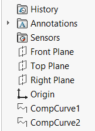

{ width=250 }

This VBA macro helps to reveal all features in the active SOLIDWORKS model which are hidden in the feature manager tree.

There are may be various reasons for the features to be hidden in the SOLIDWORKS files. In some cases those feature are invalid or dangling. This could cause unpredicted behavior of SOLIDWORKS, including performance problems or instability such as crashes or hanging.

* Create a new macro and paste the [module code](#macro-module) into the macro
* Add new [user form](/docs/codestack/visual-basic/user-forms/) into the macro and name it *FeaturesForm* and paste the [code](#featuresform-user-form). The macro structure should look similar to the image below

* Add controls to the form and name according the to image below. Optionally specify more attributes to controls such as caption.

    * List Box named *lstFeatures*
    * Button named *btnShow*
    * Button named *btnDelete*

As the result of running the macro all hidden features will be populated in the list. Select (or multi select) features in the list and click *Show* or *Delete* button to either show or remove features from the model.

> !IMPORTANT: use delete option on your own risk. In some cases the hidden feature is a valid feature created by SOLIDWORKS or 3rd party applications. For example [attributes](/docs/codestack/solidworks-api/data-storage/attributes/) can be created as a hidden features and can contain important information. Removing this can have unexpected results.

To hide the feature use the [following macro](/docs/codestack/solidworks-api/document/features-manager/hide-features/) macro.

## Macro Module

~~~ vb
Dim swApp As SldWorks.SldWorks

Sub main()

    Set swApp = Application.SldWorks
    
    Dim swModel As SldWorks.ModelDoc2
    
    Set swModel = swApp.ActiveDoc
    
    Dim swFeatsColl As Collection
    Set swFeatsColl = GetAllHiddenFeatures(swModel)
    
    If swFeatsColl.Count > 0 Then
        
        FeaturesForm.ShowFeatures swModel, swFeatsColl
        
    Else
        MsgBox "There are no hidden features in the model"
    End If
    
End Sub

Public Sub DeleteAllFeatures(model As SldWorks.ModelDoc2, feats As Variant)
    
    If Not IsEmpty(feats) Then
        ShowAllFeatures model, feats
        
        If model.Extension.MultiSelect2(feats, False, Nothing) <> UBound(feats) + 1 Then
            Err.Raise vbError, "", "Failed to select features to delete"
        End If
        
        model.Extension.DeleteSelection2 swDeleteSelectionOptions_e.swDelete_Absorbed
    End If
    
End Sub

Public Sub ShowAllFeatures(model As SldWorks.ModelDoc2, feats As Variant)
    
    If Not IsEmpty(feats) Then
        Dim i As Integer
        
        For i = 0 To UBound(feats)
            Dim swFeat As SldWorks.Feature
            Set swFeat = feats(i)
            swFeat.SetUIState swUIStates_e.swIsHiddenInFeatureMgr, False
        Next
        
        model.ForceRebuild3 False
    End If
    
End Sub

Function GetAllHiddenFeatures(model As SldWorks.ModelDoc2) As Collection
    
    Dim swProcFeatsColl As Collection
    Set swProcFeatsColl = New Collection
    
    Dim swFeat As SldWorks.Feature
    Set swFeat = model.FirstFeature
    
    Dim isAfterOrigin As Boolean
    isAfterOrigin = False
    
    While Not swFeat Is Nothing
        
        If swFeat.GetTypeName2() <> "HistoryFolder" Then
            
            If isAfterOrigin Then
                AddFeatureIfRequired swProcFeatsColl, swFeat
            
                CollectAllSubFeatures swFeat, swProcFeatsColl
            End If
            
            If swFeat.GetTypeName2() = "OriginProfileFeature" Then
                isAfterOrigin = True
            End If
            
        End If
        
        Set swFeat = swFeat.GetNextFeature
        
    Wend
    
    Set GetAllHiddenFeatures = swProcFeatsColl
    
End Function

Sub CollectAllSubFeatures(parentFeat As SldWorks.Feature, procFeatsColl As Collection)
    
    Dim swSubFeat As SldWorks.Feature
    Set swSubFeat = parentFeat.GetFirstSubFeature
        
    While Not swSubFeat Is Nothing
        
        AddFeatureIfRequired procFeatsColl, swSubFeat
        
        CollectAllSubFeatures swSubFeat, procFeatsColl
        Set swSubFeat = swSubFeat.GetNextSubFeature
        
    Wend
    
End Sub

Sub AddFeatureIfRequired(featColl As Collection, feat As Feature)
    
    If False <> feat.GetUIState(swUIStates_e.swIsHiddenInFeatureMgr) Then
        If Not Contains(featColl, feat) Then
            featColl.Add feat
        End If
    End If
    
End Sub

Function Contains(coll As Collection, item As Object) As Boolean
    
    Dim i As Integer
    
    For i = 1 To coll.Count
        If coll.item(i) Is item Then
            Contains = True
            Exit Function
        End If
    Next
    
    Contains = False
    
End Function
~~~

## FeaturesForm User Form

~~~ vb
Dim swModel As SldWorks.ModelDoc2
Dim swHiddenFeats As Collection

Private Sub UserForm_Initialize()
    Me.Caption = "Hidden Features"
    lstFeatures.MultiSelect = fmMultiSelectExtended
    lstFeatures.ColumnCount = 2
End Sub

Public Sub ShowFeatures(model As SldWorks.ModelDoc2, featsColl As Collection)
    
    Set swModel = model
    Set swHiddenFeats = featsColl
    
    Dim i As Integer
    
    For i = 1 To featsColl.Count
        Dim swFeat As SldWorks.Feature
        Set swFeat = featsColl.item(i)
        lstFeatures.AddItem swFeat.Name
        lstFeatures.List(i - 1, 1) = swFeat.GetTypeName2
    Next
    
    Show vbModeless
End Sub

Private Sub btnDelete_Click()
    DeleteAllFeatures swModel, CollectionToArray(ExtractSelected)
End Sub

Private Sub btnShow_Click()
    ShowAllFeatures swModel, CollectionToArray(ExtractSelected)
End Sub

Function ExtractSelected() As Collection
    
    Dim swSelFeats As Collection
    Set swSelFeats = New Collection
    
    Dim i As Integer
    
    For i = swHiddenFeats.Count To 1 Step -1
        If True = lstFeatures.Selected(i - 1) Then
            swSelFeats.Add swHiddenFeats(i)
            swHiddenFeats.Remove i
            lstFeatures.RemoveItem i - 1
        End If
    Next
    
    Set ExtractSelected = swSelFeats
    
End Function

Function CollectionToArray(coll As Collection) As Variant
    
    If coll.Count() > 0 Then
        
        Dim arr() As Object
        
        ReDim arr(coll.Count() - 1)
        Dim i As Integer
        
        For i = 1 To coll.Count
            Set arr(i - 1) = coll(i)
        Next
        
        CollectionToArray = arr
        
    Else
        CollectionToArray = Empty
    End If
    
End Function
~~~

