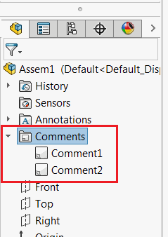

 VBA macro to show text from comments in the active document using SOLIDWORKS API
image: comments.png
labels: [comment]
group: Model
---

This VBA macro extracts the text from all comments of the active document and displays it in a single message box.

~~~ vb
Dim swApp As SldWorks.SldWorks

Sub main()
    
    Set swApp = Application.SldWorks
    
    Dim swModel As SldWorks.ModelDoc2
    
    Set swModel = swApp.ActiveDoc
    
    If Not swModel Is Nothing Then
    
        Dim swFeat As SldWorks.Feature
        
        Set swFeat = swModel.FirstFeature
        
        Dim msg As String
        
        While Not swFeat Is Nothing
        
            If swFeat.GetTypeName() = "CommentsFolder" Then
                
                Dim swCommentsFolder As SldWorks.CommentFolder
                
                Set swCommentFolder = swFeat.GetSpecificFeature2
                
                Dim vComments As Variant
                vComments = swCommentFolder.GetComments
 
                Dim i As Integer
                
                If Not IsEmpty(vComments) Then
                    For i = 0 To UBound(vComments)
                        Dim swComment As SldWorks.Comment
                        Set swComment = vComments(i)
                        msg = IIf(msg = "", "", msg & vbLf) & swComment.Text
                    Next i
                End If
            End If
           
           Set swFeat = swFeat.GetNextFeature
           
        Wend
        
        If msg <> "" Then
            swApp.SendMsgToUser2 msg, swMessageBoxIcon_e.swMbInformation, swMessageBoxBtn_e.swMbOk
        End If
        
    Else
        MsgBox "Please open model"
    End If
    
End Sub

~~~

