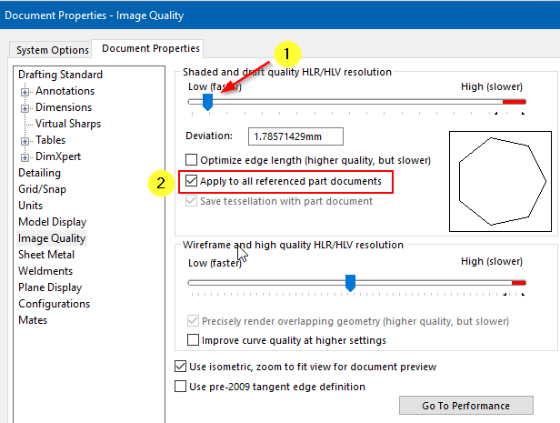

作者：[Eddy Alleman](https://www.linkedin.com/in/eddyalleman/)

{ width=650 }

在处理大型装配体时，您可以设置文档选项，以便在保存文件时尽可能轻量化：

## 阴影和草图质量HLR/HLV分辨率
控制用于阴影渲染输出的曲面镶嵌。较高的分辨率设置会导致模型重建速度较慢，但曲线更准确。
低（较快）- 高（较慢）

这意味着，如果您在装配体中工作，可以手动将所有引用的文件设置为低图像质量。

但是，如果您有很多文件并且需要在大型装配体中工作，可以使用宏在打开根装配体之前帮助您使文件变得更轻。

此宏设置了上述图像中显示的两个选项（1）和（2）。选项（2）对零件不可用。

如果您将此宏与Batch+一起使用，其真正的威力就会显现出来。您可以在不处理装配体时让它运行。

{ width=800 }

~~~ vb
Option Explicit

' 活动文档必须是装配体或零件文件。

' 将文档选项设置为使用粗糙质量
' 如果活动文档是装配体，则将设置“应用于所有引用的零件文档”的复选标记为打开状态

Dim swxApp As SldWorks.SldWorks
Dim swModel As SldWorks.ModelDoc2

Sub main()

try_:

    On Error GoTo catch_

    Set swxApp = Application.SldWorks
    
    Set swModel = swxApp.ActiveDoc

    ' 检查活动文档是否为零件或装配体文件
    Select Case True
    
           Case swModel Is Nothing, (swModel.GetType <> swDocASSEMBLY And swModel.GetType <> swDocPART)
              Call swxApp.SendMsgToUser2("请打开一个装配体或零件文件", swMbInformation, swMbOk)
                           
           Case Else
               Call SetCoarseQuality
               
    End Select

    GoTo finally_:
    
catch_:

        Debug.Print "错误：" & Err.Number & "：" & Err.Source & "：" & Err.Description
    
finally_:
    
End Sub

Private Function SetCoarseQuality() As Boolean
                  
    ' 设置为使用粗糙质量
    Dim boolstatus As Boolean
    boolstatus = swModel.Extension.SetUserPreferenceInteger(swUserPreferenceIntegerValue_e.swImageQualityShaded, _
                                                              swUserPreferenceOption_e.swDetailingNoOptionSpecified, _
                                                              swImageQualityShaded_e.swShadedImageQualityCoarse)
        
    ' 将选项“应用于所有引用的零件文档”设置为打开状态
    If swModel.GetType = swDocASSEMBLY Then
      
       Dim res As Boolean
       res = swModel.Extension.SetUserPreferenceToggle(swImageQualityApplyToAllReferencedPartDoc, _
                                                         swDetailingNoOptionSpecified, True)
        
    End If
           
End Function
~~~