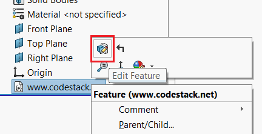
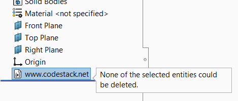
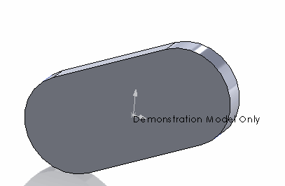

 Adds the watermark feature (license) with custom message and name which cannot be deleted or edited
image: model-watermark.png
labels: [secutiry, macro feature, lock]
group: Security
---


This article will explain how to embed a watermark feature in any model using SOLIDWORKS API to protect intellectual property or indicate that the model is to be used under the special conditions. This can be useful if license needs to be embedded into the model which cannot be edited by 3rd parties.

The inserted feature cannot be deleted, suppressed, removed or changed by user interface or API.

The feature can be inserted into any SOLIDWORKS model (part, document, drawing or template).

Feature is fully embedded into the model.

The solution consists of 2 parts:

* Authoring macro. This is used to insert the watermark. This macro is not embedded to the model
* Watermark macro. This macro represents a watermark feature and will be directly embedded into the model

## Setting up authoring macro

* Create new macro in SOLIDWORKS (Tools->Macro->New... command from the SOLIDWORKS menu)
* Specify the name to save this file
* Copy the following code into the macro

~~~ vb
Const WATERMARK_MACRO_NAME As String = "Watermark.swp"
Const SECURITY_NOTE As String = "www.codestack.net"

Const BASE_NAME As String = "Watermark"

Sub main()

    Dim swApp As SldWorks.SldWorks
    Set swApp = Application.SldWorks
    
    Dim swModel As SldWorks.ModelDoc2
    
    Set swModel = swApp.ActiveDoc
    
    If Not swModel Is Nothing Then
        
        Dim watermarkMacroPath As String
        watermarkMacroPath = swApp.GetCurrentMacroPathFolder() & "\" & WATERMARK_MACRO_NAME
        Dim vMethods(8) As String
        Dim moduleName As String
        
        GetMacroEntryPoint swApp, watermarkMacroPath, moduleName
        
        vMethods(0) = watermarkMacroPath: vMethods(1) = moduleName: vMethods(2) = "swmRebuild"
        vMethods(3) = watermarkMacroPath: vMethods(4) = moduleName: vMethods(5) = "swmEditDefinition"
        vMethods(6) = watermarkMacroPath: vMethods(7) = moduleName: vMethods(8) = "swmSecurity"
        
        Dim iconsDir As String
        iconsDir = swApp.GetCurrentMacroPathFolder() & "\Icons\"
        
        Dim icons(8) As String
        icons(0) = iconsDir & "watermark_20x20.bmp"
        icons(1) = iconsDir & "watermark-suppressed_20x20.bmp"
        icons(2) = iconsDir & "watermark_20x20.bmp"
        
        icons(3) = iconsDir & "watermark_32x32.bmp"
        icons(4) = iconsDir & "watermark-suppressed_32x32.bmp"
        icons(5) = iconsDir & "watermark_32x32.bmp"
        
        icons(6) = iconsDir & "watermark_40x40.bmp"
        icons(7) = iconsDir & "watermark-suppressed_40x40.bmp"
        icons(8) = iconsDir & "watermark_40x40.bmp"

        Dim swFeat As SldWorks.Feature
        
        Set swFeat = swModel.FeatureManager.InsertMacroFeature3(BASE_NAME, "", vMethods, _
            Empty, Empty, Empty, Empty, Empty, Empty, _
            icons, swMacroFeatureOptions_e.swMacroFeatureEmbedMacroFile + swMacroFeatureOptions_e.swMacroFeatureAlwaysAtEnd)
        
        If Not swFeat Is Nothing Then
            Dim swSecNote As SldWorks.note
            If SECURITY_NOTE <> "" Then
                Set swSecNote = swModel.FeatureManager.InsertSecurityNote(SECURITY_NOTE, swFeat)
            End If
        Else
            MsgBox "Failed to create watermark feature"
        End If
        
    Else
        MsgBox "Please open model"
    End If
    
End Sub

Sub GetMacroEntryPoint(app As SldWorks.SldWorks, macroPath As String, ByRef moduleName As String)
        
    Dim vMethods As Variant
    vMethods = app.GetMacroMethods(macroPath, swMacroMethods_e.swAllMethods)
    
    Dim i As Integer
    
    If Not IsEmpty(vMethods) Then
    
        For i = 0 To UBound(vMethods)
            Dim vData As Variant
            vData = Split(vMethods(i), ".")
            
            If i = 0 Or LCase(vData(1)) = "swmRebuild" Then
                moduleName = vData(0)
            End If
        Next
        
    End If
    
End Sub
~~~

In order to add custom icons, download the [Icons](Icons.zip) file and unzip into the **Icons** sub-folder next to the macro feature file

## Setting up watermark macro

* Create another new macro
* Specify the name of this macro as *Watermark.swp* and save it to the same folder as previous authoring macro

> If different name is used it is required to modify this name in the following constant of the authoring macro

~~~ vb
Const WATERMARK_MACRO_NAME = "Watermark.swp"
~~~

* Change the security note in the constant to be displayed as read-only non-modifiable note.

~~~ vb
Const SECURITY_NOTE = "www.codestack.net"
~~~

* Copy the following code into the macro

~~~ vb
Const MESSAGE As String = "Sample model by CodeStack"
Const FEATURE_NAME As String = "www.codestack.net"

Function swmRebuild(varApp As Variant, varDoc As Variant, varFeat As Variant) As Variant
    swmRebuild = True
End Function

Function swmEditDefinition(varApp As Variant, varDoc As Variant, varFeat As Variant) As Variant
    
    On Error Resume Next
    
    varApp.SendMsgToUser2 MESSAGE, swMessageBoxIcon_e.swMbInformation, swMessageBoxBtn_e.swMbOk
    swmEditDefinition = True
    
End Function

Function swmSecurity(varApp As Variant, varDoc As Variant, varFeat As Variant) As Variant
    
    On Error Resume Next
    
    Const swMacroFeatureSecurityCannotBeDeleted As Long = 1
    Const swMacroFeatureSecurityCannotBeSuppressed As Long = 4
    Const swMacroFeatureSecurityCannotBeReplaced As Long = 8
    Const swMacroFeatureSecurityEnableNote As Long = 16
    
    swmSecurity = swMacroFeatureSecurityCannotBeDeleted + swMacroFeatureSecurityCannotBeReplaced + swMacroFeatureSecurityCannotBeSuppressed + swMacroFeatureSecurityEnableNote

    If varFeat.Name <> FEATURE_NAME Then
        varFeat.Name = FEATURE_NAME
    End If
    
End Function

~~~

### Modifying the parameters

There are few parameters which can be modified for the macro which are defined as constants at the top of the macro

~~~ vb
Const MESSAGE As String = "Watermark Feature by CodeStack"
Const FEATURE_NAME As String = "www.codestack.net"
~~~

* *MESSAGE* is the custom message displayed when the watermark feature is edited by the user
* *FEATURE_NAME* name of the watermark feature in the Feature manager tree

### Setting the macro password

Assign the password to the watermark macro so it cannot be changed by users.

* Select *Properties* command from the context menu of Watermark macro

{ width=200 }

* Select the *Protection* tab
* Check the *Lock project for viewing* option
* Specify the password in the password boxes

{ width=250 }

* Save the macro and close

## Inserting the watermark

* To insert the watermark just open the model and run the [Authoring Macro](#setting-up-authoring-macro)
* Save the model

## Watermark behaviour

* Watermark feature will always be moved to the bottom of the feature tree
* When definition of the watermark feature is edited 

{ width=250 }

the custom message is displayed

{ width=250 }

* The following message is displayed on attempt to delete the feature

{ width=250 }

* Non editable security note is added in the model at the origin

{ width=250 }

* Feature name cannot be changed. It is possible to rename it, but the name will be reverted while state update (e.g. select, rebuild, open model, etc.)