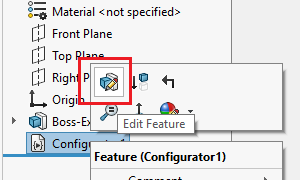

 VBA macro feature which allows to configure the dimensions of the model via custom user Form
image: part-configurator.svg
labels: [configure, macro feature, dimensions]
group: Model
---
This VBA macro leverages functionality of macro feature to create custom model configurator for the specified dimensions.



Macro will build dynamic User Interface for the specified dimension and insert the **Configurator** feature directly in the Feature Manager tree.

Design can be modified at any time by clicking **Edit Feature** command

Feature can also be edited in the context of the assembly.

To insert the feature, pre-select dimensions you want to be configured and run the macro.

For each selected dimension specify the user friendly title (this will be displayed on the form):

Once inserted. Edit the definition of the feature to update the model.

Configurator feature can be inserted into the part or assembly (including inserting to the component edited in the context of the assembly).

Dimensions will be modified in the active configuration or in the referenced configuration of the component (if edited in context)

When adding configurator feature to the assembly it is possible to modify the dimensions of any sub-component.

## Configuration

User can modify the constants below to change some of the parameters.

* **BASE_NAME** constants defines the default name used for the configurator feature
* **EMBED_MACRO_FEATURE** allows to embed the code directly to the model, so it is no longer linked to the original macro. This model can be shared with anyone and edited without the need to supply the original macro

~~~ vb
Public Const BASE_NAME As String = "MyConfigurator" 'default name for the feature

Const EMBED_MACRO_FEATURE As Boolean = True' embeds macro feature into the model
~~~

## Benefits Comparison

Table below demonstrates the benefits of this approach compared to other poplar design automation methods and tools.

> Note, the table below only shows benefits of this macro compared to other methods. Other methods have more benefits and features which this macro does not cover and those are not included into the table below

| Feature  | This Macro | Equations  | Design Table  | DriveWorks |
|---|---|---|---|---|
| Easy to setup  | &check;  | &check;  | &check;  | &cross;  |
| Simple input method  | &check;  | &cross;  | &cross;  | &check;  |
| Performance  | &check;  | &check;  | &cross;  | &cross;  |
| On-demand editing  | &check;  | &check;  | &check;  | &cross;  |
| Sub-components support  | &check;  | &cross;  | &cross;  | &check;  |
| In-context editing  | &check;  | &cross;  | &cross;  | N/A  |
| Extensibility  | &check;  | &cross;  | &cross;  | &check;  |

### Easy to setup

This criteria defines how quickly the configurator can be created. DriveWorks requires specific skills and rules engine to create a configurator, while this macro only requires dimensions preselection

### Simple input method

This criteria defines how easy it is to apply and change the dimensions as per configurator input parameters. Both this macro and DriveWorks will use custom forms which simplifies the input while Equations and Design Table do not have a specific input form and it is required to search for the specific inputs through the list of other equations and definitions.

### Performance

This criteria defines the execution performance (how long it takes before parameters are applied). This macro applies parameters instantly directly to dimension. Design Table needs to load Excel instance and open the file to recalculate and apply value. DriveWorks will always generate new model based on the specification inputs.

### On-demand editing

This criteria defines if parameters can be changed to the existing design. DriveWorks generates new model and does not modify existing one.

### Sub-components support

This criteria defines if parameters of the sub component can be modified. Although Equations can be defined for the components those are not configuration specific, i.e. it will not be possible to have two instances of the component with different configurations and different equation values.

### In-context editing

This criteria defines if configuration of the component can be changed using in-context editing from the top level assembly. All of the methods except this macro requires the target component to be opened in its own window in order to be edited, while this macro allows in-context editing.

### Extensibility

This criteria defines the possibility to extend the functionality beyond the out-of-the box functionality. Both Equations and DesignTable are built-in features. DriveWorks provides APIs and can be extended. This macro is open source and can be extended using SOLIDWORKS API.

## Macro Setup

* Create new macro and copy the code below:

~~~ vb
Public Const MARGIN As Integer = 10
Public Const MAX_FORM_HEIGHT = 200
Public Const TEXT_BOX_WIDTH As Integer = 50
Public Const BASE_NAME As String = "Configurator"

Const EMBED_MACRO_FEATURE As Boolean = False

Public ActiveModel As SldWorks.ModelDoc2
Public Model As SldWorks.ModelDoc2
Public FeatureName As String
Public DimensionNames As Variant
Public DimensionTitles As Variant
Public ConfigName As String

Sub main()

    Dim swApp As SldWorks.SldWorks
    Set swApp = Application.SldWorks
    
    Dim swModel As SldWorks.ModelDoc2
    
    Set swModel = swApp.ActiveDoc
    
    If Not swModel Is Nothing Then
        
        If Not TypeOf swModel Is PartDoc And Not TypeOf swModel Is AssemblyDoc Then
            Err.Raise vbError, "", "Only part and assembly documents are supported"
        End If
        
        Dim vParamNames As Variant
        Dim vParamTypes As Variant
        Dim vParamValues As Variant
        
        If Not CollectParameters(swModel, vParamNames, vParamTypes, vParamValues) Then
            Err.Raise vbError, "", "Please select dimensions to configure"
        End If
        
        Dim curMacroPath As String
        curMacroPath = swApp.GetCurrentMacroPathName
        
        Dim vMethods(8) As String
        Dim moduleName As String
        
        GetMacroEntryPoint swApp, curMacroPath, moduleName, ""
        
        vMethods(0) = curMacroPath: vMethods(1) = moduleName: vMethods(2) = "swmRebuild"
        vMethods(3) = curMacroPath: vMethods(4) = moduleName: vMethods(5) = "swmEditDefinition"
        vMethods(6) = curMacroPath: vMethods(7) = moduleName: vMethods(8) = "swmSecurity"
        
        Dim opts As swMacroFeatureOptions_e
        
        If EMBED_MACRO_FEATURE Then
            opts = swMacroFeatureOptions_e.swMacroFeatureEmbedMacroFile
        Else
            opts = swMacroFeatureOptions_e.swMacroFeatureByDefault
        End If
        
        Dim swFeat As SldWorks.Feature
        Set swFeat = swModel.FeatureManager.InsertMacroFeature3(BASE_NAME, "", vMethods, _
            vParamNames, vParamTypes, vParamValues, Empty, Empty, Empty, _
            Empty, opts)
        
        If swFeat Is Nothing Then
            Err.Raise vbError, "", "Failed to create box feature"
        End If
        
    Else
        MsgBox "Please open model"
    End If
    
End Sub

Function CollectParameters(Model As SldWorks.ModelDoc2, ByRef vParamNames As Variant, ByRef vParamTypes As Variant, ByRef vParamValues As Variant) As Boolean

    Dim paramNames() As String
    Dim paramTypes() As Long
    Dim paramValues() As String

    Dim swSelMgr As SldWorks.SelectionMgr
    Set swSelMgr = Model.SelectionManager

    Dim i As Integer
    
    For i = 1 To swSelMgr.GetSelectedObjectCount2(-1)
        If swSelMgr.GetSelectedObjectType3(i, -1) = swSelectType_e.swSelDIMENSIONS Then
            
            Dim swDispDim As SldWorks.DisplayDimension
            Set swDispDim = swSelMgr.GetSelectedObject6(i, -1)
            
            Dim swComp As SldWorks.Component2
            Set swComp = swSelMgr.GetSelectedObjectsComponent3(i, -1)
                        
            If (Not paramNames) = -1 Then
                ReDim paramNames(0)
                ReDim paramTypes(0)
                ReDim paramValues(0)
            Else
                ReDim Preserve paramNames(UBound(paramNames) + 1)
                ReDim Preserve paramTypes(UBound(paramTypes) + 1)
                ReDim Preserve paramValues(UBound(paramValues) + 1)
            End If
            
            Dim paramName As String
            paramName = ""
            
            If Not swComp Is Nothing Then
                
                paramName = swComp.Name2
                
                Dim swAssy As SldWorks.AssemblyDoc
                Set swAssy = Model
                
                Dim swEditTargetComp As SldWorks.Component2
                Set swEditTargetComp = swAssy.GetEditTargetComponent
                
                If Not swEditTargetComp Is Nothing Then
                    If Not swEditTargetComp.GetModelDoc2() Is swAssy Then
                        If Left(paramName, Len(swEditTargetComp.Name2)) <> swEditTargetComp.Name2 Then
                            Err.Raise vbError, "", "Dimension must belong to the current edit target"
                        End If
                        If LCase(paramName) = LCase(swEditTargetComp.Name2) Then
                            paramName = ""
                        Else
                            paramName = Right(paramName, Len(paramName) - Len(swEditTargetComp.Name2) - 1)
                        End If
                    End If
                End If
                
            End If
            
            paramName = paramName & IIf(paramName <> "", "/", "") & swDispDim.GetNameForSelection
            
            paramNames(UBound(paramNames)) = paramName
            paramValues(UBound(paramValues)) = InputBox("Specify the name for " & paramName, "Configurator", paramName)
            paramTypes(UBound(paramTypes)) = swMacroFeatureParamType_e.swMacroFeatureParamTypeString
            
        End If
    Next
    
    vParamNames = paramNames
    vParamTypes = paramTypes
    vParamValues = paramValues
    
    CollectParameters = (Not paramNames) <> -1
    
End Function

Sub GetMacroEntryPoint(app As SldWorks.SldWorks, macroPath As String, ByRef moduleName As String, ByRef procName As String)
        
    Dim vMethods As Variant
    vMethods = app.GetMacroMethods(macroPath, swMacroMethods_e.swMethodsWithoutArguments)
    
    Dim i As Integer
    
    If Not IsEmpty(vMethods) Then
    
        For i = 0 To UBound(vMethods)
            Dim vData As Variant
            vData = Split(vMethods(i), ".")
            
            If i = 0 Or LCase(vData(1)) = "main" Then
                moduleName = vData(0)
                procName = vData(1)
            End If
        Next
        
    End If
    
End Sub

Function swmRebuild(varApp As Variant, varDoc As Variant, varFeat As Variant) As Variant
    swmRebuild = True
End Function

Function swmEditDefinition(varApp As Variant, varDoc As Variant, varFeat As Variant) As Variant
    
    Dim swFeat As SldWorks.Feature
    Set swFeat = varFeat
    
    Dim swMacroFeat As SldWorks.MacroFeatureData
    Set swMacroFeat = swFeat.GetDefinition
    
    ConfigName = swMacroFeat.CurrentConfiguration.name
    
    Dim vParamNames As Variant
    Dim vParamValues As Variant
    
    swMacroFeat.GetParameters vParamNames, Empty, vParamValues
    
    DimensionNames = vParamNames
    DimensionTitles = vParamValues
    FeatureName = swFeat.name
    
    Set ActiveModel = varDoc
    Set Model = varDoc
    
    If Model.GetType() = swDocumentTypes_e.swDocASSEMBLY Then
        Dim swAssy As SldWorks.AssemblyDoc
        Set swAssy = Model
        Set Model = swAssy.GetEditTarget
    End If
    
    ConfiguratorForm.Show vbModal
    
    swmEditDefinition = True
    
End Function

Function swmSecurity(varApp As Variant, varDoc As Variant, varFeat As Variant) As Variant
    swmSecurity = SwConst.swMacroFeatureSecurityOptions_e.swMacroFeatureSecurityByDefault
End Function
~~~

Add new [User Form](/docs/codestack/visual-basic/user-forms/) and place the code below into the form's code behind

~~~ vb
Dim lblParamName() As Label
Dim txtParamValue() As TextBox

Dim WithEvents btnApply As CommandButton

Private Sub UserForm_Initialize()

    Me.Caption = "Edit " & FeatureName
    
    If UBound(DimensionNames) <> UBound(DimensionTitles) Then
        Err.Raise vbError, "", "Parameter names and dimensions must be of the same size"
    End If

    Dim i As Integer
    
    Dim maxWidth As Integer
    
    ReDim lblParamName(UBound(DimensionTitles))
    ReDim txtParamValue(UBound(DimensionTitles))
    
    Dim nextPosY As Integer
    nextPosY = MARGIN
    
    For i = 0 To UBound(DimensionTitles)
    
        Set lblParamName(i) = Me.Controls.Add("Forms.Label.1")
        lblParamName(i).Caption = CStr(DimensionTitles(i)) & ":"
        lblParamName(i).name = "lblLabel" & (i + 1)
        lblParamName(i).AutoSize = True
        
        lblParamName(i).Left = MARGIN
        lblParamName(i).Top = nextPosY
        
        If lblParamName(i).Width > maxWidth Then
            maxWidth = lblParamName(i).Width
        End If
        
        Set txtParamValue(i) = Me.Controls.Add("Forms.TextBox.1")
        txtParamValue(i).Width = TEXT_BOX_WIDTH
        txtParamValue(i).name = "txtVal" & (i + 1)
        txtParamValue(i).Top = nextPosY
                
        nextPosY = nextPosY + MARGIN + lblParamName(i).height
        
    Next
    
    For i = 0 To UBound(txtParamValue)
        txtParamValue(i).Left = maxWidth + MARGIN * 2
    Next
    
    Set btnApply = Me.Controls.Add("Forms.CommandButton.1")
    btnApply.Caption = "Apply"
    btnApply.name = "btnApply"
    btnApply.Top = nextPosY + MARGIN
    btnApply.Left = (maxWidth + MARGIN + TEXT_BOX_WIDTH) / 2 - btnApply.Width / 2 + MARGIN
    
    Dim height As Integer
    height = btnApply.Top + btnApply.height + MARGIN
    
    Me.StartUpPosition = 1 'center owner
    Me.ScrollBars = IIf(height > MAX_FORM_HEIGHT, fmScrollBarsVertical, fmScrollBarsNone)
    Me.ScrollHeight = height
    Me.Width = (maxWidth + MARGIN + TEXT_BOX_WIDTH) + MARGIN * 2 + 20
    Me.height = IIf(height > MAX_FORM_HEIGHT, MAX_FORM_HEIGHT + 25, height + 25) 'including header height
    
    LoadDimensionValues
    
End Sub

Private Sub LoadDimensionValues()
    
    Dim i As Integer
        
    For i = 0 To UBound(DimensionNames)
        
        Dim swDim As SldWorks.Dimension
        
        Dim dimName As String
        dimName = CStr(DimensionNames(i))
        
        Set swDim = GetDimension(dimName)
        
        If Not swDim Is Nothing Then
            Dim dimVal As Double
            Dim confNames(0) As String
            confNames(0) = ConfigName
            dimVal = swDim.GetValue3(swInConfigurationOpts_e.swSpecifyConfiguration, confNames)(0)
            txtParamValue(i).Text = dimVal
        Else
            Err.Raise vbError, "", dimName & " does not exist"
        End If
    Next
    
End Sub

Private Sub btnApply_Click()
    
    Dim i As Integer
        
    For i = 0 To UBound(DimensionNames)
        
        Dim swDim As SldWorks.Dimension
        
        Dim dimName As String
        dimName = CStr(DimensionNames(i))
        
        Set swDim = GetDimension(dimName)
        
        If Not swDim Is Nothing Then
            Dim dimVal As Double
            
            If IsNumeric(txtParamValue(i).Text) Then
                dimVal = CDbl(txtParamValue(i).Text)
            Else
                Err.Raise vbError, "", "Specified value for " & DimensionTitles(i) & " is not numeric"
            End If
            Dim confNames(0) As String
            confNames(0) = ConfigName
            swDim.SetValue3 dimVal, swInConfigurationOpts_e.swSpecifyConfiguration, confNames
        Else
            Err.Raise vbError, "", dimName & " does not exist"
        End If
    Next
    
    ActiveModel.ForceRebuild3 False
    
End Sub

Function GetDimension(name As String) As SldWorks.Dimension
    
    Dim dimParts As Variant
    dimParts = Split(name, "/")
    
    Dim i As Integer
    
    Dim swTargetModel As SldWorks.ModelDoc2
    Set swTargetModel = Model
    
    Dim swCurComp As SldWorks.Component2
    
    For i = 0 To UBound(dimParts) - 1
        Dim swAssy As SldWorks.AssemblyDoc
        Set swAssy = swTargetModel
        Set swCurComp = swAssy.GetComponentByName(dimParts(i))
        Set swTargetModel = swCurComp.GetModelDoc2()
    Next
    
    Set GetDimension = swTargetModel.Parameter(dimParts(UBound(dimParts)))
    
End Function
~~~

Specify the name for the form to be **ConfiguratorForm**. As the result the solution tree in VBA will look like below:

