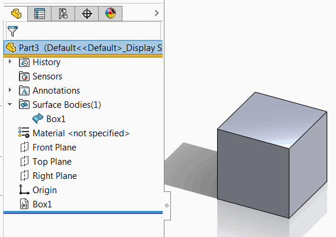
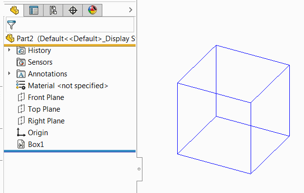

 Example of creating VBA macro feature which generates different types of box geometry (solid, sheet, wire) using SOLIDWORKS API
image: solid-body.png
labels: [macro feature,geometry,box,solid,sheet,wire]
---
This VBA example demonstrates how to create macro feature which generates custom geometry.

Open part document and run the macro. New feature is inserted in the Feature Manager tree and box geometry is generated either as solid, sheet or wire body.

## Configuration

### Embedding

Set the value of *EMBED_MACRO_FEATURE* constant to specify if macro feature should be embedded to file or not. If this option set to *True* then part document can be opened on any other computer and the geometry will be present without the need to copy the macro.

### Box Size

Size of the box can be configured by changing the *WIDTH*, *LENGTH* and *HEIGHT* constants:

~~~ vb
Const WIDTH As Double = 0.01
Const LENGTH As Double = 0.01
Const HEIGHT As Double = 0.01
~~~

### Body Type

Generated body type can be set by assigning the value to *BODY_TYPE* constant

#### swBodyType_e.swSolidBody

Creates a box as a solid body geometry.

{ width=350 }

#### swBodyType_e.swSheetBody

Creates a single surface body by sewing the faces of the box.

{ width=350 }

#### swBodyType_e.swWireBody

Creates wire bodies from all edges of the box geometry. Wire bodies are edges and not presented in the bodies folders. Example of wire bodies used in standard feature tree are curves (composite, through XYZ, projected etc.)

{ width=350 }

~~~ vb
Const BODY_TYPE As Integer = swBodyType_e.swSolidBody
Const EMBED_MACRO_FEATURE As Boolean = False
Const BASE_NAME As String = "Box"

Const WIDTH As Double = 0.01
Const LENGTH As Double = 0.01
Const HEIGHT As Double = 0.01

Sub main()

    Dim swApp As SldWorks.SldWorks
    Set swApp = Application.SldWorks
    
    Dim swModel As SldWorks.ModelDoc2
    
    Set swModel = swApp.ActiveDoc
    
    If Not swModel Is Nothing Then
        
        Dim curMacroPath As String
        curMacroPath = swApp.GetCurrentMacroPathName
        
        Dim vMethods(8) As String
        Dim moduleName As String
        
        GetMacroEntryPoint swApp, curMacroPath, moduleName, ""
        
        vMethods(0) = curMacroPath: vMethods(1) = moduleName: vMethods(2) = "swmRebuild"
        vMethods(3) = curMacroPath: vMethods(4) = moduleName: vMethods(5) = "swmEditDefinition"
        vMethods(6) = curMacroPath: vMethods(7) = moduleName: vMethods(8) = "swmSecurity"
        
        Dim opts As swMacroFeatureOptions_e
        
        If EMBED_MACRO_FEATURE Then
            opts = swMacroFeatureOptions_e.swMacroFeatureEmbedMacroFile
        Else
            opts = swMacroFeatureOptions_e.swMacroFeatureByDefault
        End If
        
        Dim swFeat As SldWorks.Feature
        Set swFeat = swModel.FeatureManager.InsertMacroFeature3(BASE_NAME, "", vMethods, _
            Empty, Empty, Empty, Empty, Empty, Empty, _
            Empty, opts)
        
        If swFeat Is Nothing Then
            MsgBox "Failed to create box feature"
        End If
        
    Else
        MsgBox "Please open model"
    End If
    
End Sub

Sub GetMacroEntryPoint(app As SldWorks.SldWorks, macroPath As String, ByRef moduleName As String, ByRef procName As String)
        
    Dim vMethods As Variant
    vMethods = app.GetMacroMethods(macroPath, swMacroMethods_e.swMethodsWithoutArguments)
    
    Dim i As Integer
    
    If Not IsEmpty(vMethods) Then
    
        For i = 0 To UBound(vMethods)
            Dim vData As Variant
            vData = Split(vMethods(i), ".")
            
            If i = 0 Or LCase(vData(1)) = "main" Then
                moduleName = vData(0)
                procName = vData(1)
            End If
        Next
        
    End If
    
End Sub

Function swmRebuild(varApp As Variant, varDoc As Variant, varFeat As Variant) As Variant
    
    Dim swApp As SldWorks.SldWorks
    Dim swModeler As SldWorks.Modeler
    
    Set swApp = varApp
    Set swModeler = swApp.GetModeler
    
    Dim swTemplateBody As SldWorks.Body2

    Dim dCenter(2) As Double
    dCenter(0) = 0: dCenter(1) = 0: dCenter(2) = 0
    
    Dim dAxis(2) As Double
    dAxis(0) = 0: dAxis(1) = 0: dAxis(2) = 1
                    
    Dim dBoxData(8) As Double
    dBoxData(0) = dCenter(0): dBoxData(1) = dCenter(1): dBoxData(2) = dCenter(2)
    dBoxData(3) = dAxis(0): dBoxData(4) = dAxis(1): dBoxData(5) = dAxis(2)
    dBoxData(6) = WIDTH: dBoxData(7) = LENGTH: dBoxData(8) = HEIGHT
        
    Set swTemplateBody = swModeler.CreateBodyFromBox3(dBoxData)
    
    Dim swBoxBody() As SldWorks.Body2
    
    Dim i As Integer
    
    Dim isInit As Boolean
    isInit = False
    
    Select Case BODY_TYPE
        Case swBodyType_e.swSolidBody
            isInit = True
            ReDim swBoxBody(0) As SldWorks.Body2
            Set swBoxBody(0) = swTemplateBody
        Case swBodyType_e.swSheetBody
            isInit = True
            ReDim swBoxBody(0) As SldWorks.Body2
            Set swBoxBody(0) = swModeler.CreateSheetFromFaces(swTemplateBody.GetFaces())
        Case swBodyType_e.swWireBody
            isInit = True
            
            Dim vEdges As Variant
            
            vEdges = swTemplateBody.GetEdges()
            
            ReDim swBoxBody(UBound(vEdges)) As SldWorks.Body2
            
            For i = 0 To swTemplateBody.GetEdgeCount() - 1
                Dim swEdge(0) As SldWorks.Edge
                Set swEdge(0) = vEdges(i)
                Set swBoxBody(i) = swModeler.CreateWireBody(swEdge, swCreateWireBodyOptions_e.swCreateWireBodyByDefault)
            Next
    End Select
    
    If isInit Then
        
        Dim swFeat As SldWorks.Feature
        Set swFeat = varFeat
        
        Dim swMacroFeatData As SldWorks.MacroFeatureData
        Set swMacroFeatData = swFeat.GetDefinition
        
        For i = 0 To UBound(swBoxBody)
            AssignUserIds swBoxBody(i), swMacroFeatData
        Next
        
        swMacroFeatData.EnableMultiBodyConsume = UBound(swBoxBody) > 0
        swmRebuild = swBoxBody
        
    Else
        swmRebuild = "Invalid body type. Only solid, sheet and wire body is supported"
    End If
    
End Function

Sub AssignUserIds(body As SldWorks.Body2, featData As SldWorks.MacroFeatureData)
    
    Dim vFaces As Variant
    Dim vEdges As Variant
    Dim i As Integer
    
    featData.GetEntitiesNeedUserId body, vFaces, vEdges
    
    If Not IsEmpty(vFaces) Then
        For i = 0 To UBound(vFaces)
            Dim swFace As SldWorks.Face2
            Set swFace = vFaces(i)
            featData.SetFaceUserId swFace, 0, i
        Next
    End If
    
    If Not IsEmpty(vEdges) Then
        For i = 0 To UBound(vEdges)
            Dim swEdge As SldWorks.Edge
            Set swEdge = vEdges(i)
            featData.SetEdgeUserId swEdge, 0, i
        Next
    End If
    
End Sub

Function swmEditDefinition(varApp As Variant, varDoc As Variant, varFeat As Variant) As Variant
    swmEditDefinition = True
End Function

Function swmSecurity(varApp As Variant, varDoc As Variant, varFeat As Variant) As Variant
    swmSecurity = SwConst.swMacroFeatureSecurityOptions_e.swMacroFeatureSecurityByDefault
End Function
~~~

