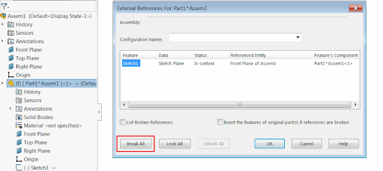

 Example will break, lock or unlock all external references for the file or components in the active assembly using SOLIDWORKS API
image: break-all-external-references.png
labels: [assembly, external references, solidworks api, utility]
group: Assembly
redirect-from:
  - /2018/03/solidworks-api-assembly-break-all-external-references-for-components.html
  - /solidworks-api/document/assembly/break-components-external-references
  - /solidworks-api/document/assembly/components/break-external-references/
---
This example will break, lock or unlock all external references for the active model or all or selected components in the active assembly using SOLIDWORKS API.

{ width=640 }

## Configuration

Macro can be configured by modifying the value of the constants

~~~ vb
Const MODIFY_ACTION As Integer = ModifyAction_e.UnlockAll 'Action to call on the references in the model. Supported values: BreakAll, LockAll, UnlockAll
Const REFS_SCOPE As Integer = Scope_e.AllComponents 'Scope to run the above action. Supported values: ThisFile, TopLevelComponents, AllComponents, SelectedComponents
~~~

## CAD+

This macro is compatible with [Toolbar+](https://cadplus.xarial.com/toolbar/) and [Batch+](https://cadplus.xarial.com/batch/) tools so the buttons can be added to toolbar and assigned with shortcut for easier access or run in the batch mode.

In order to enable [macro arguments](https://cadplus.xarial.com/toolbar/configuration/arguments/) set the **ARGS** constant to true

~~~ vb
#Const ARGS = True
~~~

In this case it is not required to make copies of the macro to set individual [options for action and scope](#configuration).

Instead specify 2 arguments:

1. Use the **-b**, **-l**, **-u**, to set the action to **Break All**, **Lock All**, **Unlock All** respectively
1. Use the **-f**, **-t**, **-a** to set the scope to **This File**, **Top Level Components**, **All Components** respectively

For example the parameters below will lock all external references of the file itself

~~~
> -l -f
~~~

While the following command will break all external references for all components of the assembly (including sub-components)

~~~
> -b -a
~~~

~~~ vb
#Const ARGS = False 'True to use arguments from Toolbar+ or Batch+ instead of the constant

Enum ModifyAction_e
    BreakAll
    LockAll
    UnlockAll
End Enum

Enum Scope_e
    ThisFile
    TopLevelComponents
    AllComponents
    SelectedComponents
End Enum

Const MODIFY_ACTION As Integer = ModifyAction_e.UnlockAll
Const REFS_SCOPE As Integer = Scope_e.AllComponents

Dim swApp As SldWorks.SldWorks

Sub main()

    Set swApp = Application.SldWorks
    
try_:
    
    On Error GoTo catch_
    
    Dim action As ModifyAction_e
    Dim scope As Scope_e
    
    #If ARGS Then
                
        Dim macroRunner As Object
        Set macroRunner = CreateObject("CadPlus.MacroRunner.Sw")
        
        Dim param As Object
        Set param = macroRunner.PopParameter(swApp)
        
        Dim vArgs As Variant
        vArgs = param.Get("Args")
        
        Dim actionArg As String
        actionArg = CStr(vArgs(0))
        
        Select Case LCase(actionArg)
            Case "-b"
                action = ModifyAction_e.BreakAll
            Case "-l"
                action = ModifyAction_e.LockAll
            Case "-u"
                action = ModifyAction_e.UnlockAll
            Case Else
                Err.Raise vbError, "", "Invalid action argument. Valid arguments -b -l -u"
        End Select
        
        Dim scopeArg As String
        scopeArg = CStr(vArgs(1))
        
        Select Case LCase(scopeArg)
            Case "-f"
                scope = ThisFile
            Case "-t"
                scope = TopLevelComponents
            Case "-a"
                scope = AllComponents
            Case Else
                Err.Raise vbError, "", "Invalid scope argument. Valid arguments -f -t -a"
        End Select
        
    #Else
        action = MODIFY_ACTION
        scope = REFS_SCOPE
    #End If
    
    Dim swModel As SldWorks.ModelDoc2
    
    Set swModel = swApp.ActiveDoc
    
    If scope = ThisFile Then
        ProcessReferences swModel, action
    Else
        If swModel.GetType() = swDocumentTypes_e.swDocASSEMBLY Then
                
            Dim swAssy As SldWorks.AssemblyDoc
                
            Set swAssy = swModel
            
            swAssy.ResolveAllLightWeightComponents True
            
            Dim vComps As Variant
            Dim swComp As SldWorks.Component2
            Dim swCompModel As SldWorks.ModelDoc2
            
            If scope = SelectedComponents Then
                vComps = GetSelectedComponents(swModel.SelectionManager)
            Else
                Dim topLevel As Boolean
                
                Select Case scope
                    Case TopLevelComponents
                        topLevel = True
                    Case AllComponents
                        topLevel = False
                    Case Else
                        Err.Raise "Invalid scope"
                End Select
                
                vComps = swAssy.GetComponents(topLevel)
                
            End If
            
            Dim i As Integer
                
            If Not IsEmpty(vComps) Then
                
                For i = 0 To UBound(vComps)
                    
                    Set swComp = vComps(i)
                    Set swCompModel = swComp.GetModelDoc2
                    
                    If Not swCompModel Is Nothing Then
                        ProcessReferences swCompModel, action
                    End If
                Next
            
            End If
            
        Else
            Err.Raise "Please open assembly"
        End If
     
     End If
         
    GoTo finally_
         
catch_:
    #If ARGS Then
        Err.Raise Err.Number, Err.Source, Err.Description, Err.HelpContext, Err.HelpContext
    #Else
        MsgBox Err.Description, vbCritical
    #End If
finally_:

End Sub

Function GetSelectedComponents(selMgr As SldWorks.SelectionMgr) As Variant

    Dim isInit As Boolean
    isInit = False
    
    Dim swComps() As SldWorks.Component2

    Dim i As Integer
    
    For i = 1 To selMgr.GetSelectedObjectCount2(-1)
                
        Dim swComp As SldWorks.Component2
    
        Set swComp = selMgr.GetSelectedObjectsComponent4(i, -1)
        
        If Not swComp Is Nothing Then
            
            If Not isInit Then
                ReDim swComps(0)
                Set swComps(0) = swComp
                isInit = True
            Else
                If Not Contains(swComps, swComp) Then
                    ReDim Preserve swComps(UBound(swComps) + 1)
                    Set swComps(UBound(swComps)) = swComp
                End If
            End If
                        
        End If
    
    Next

    If isInit Then
        GetSelectedComponents = swComps
    Else
        GetSelectedComponents = Empty
    End If

End Function

Function Contains(vArr As Variant, item As Object) As Boolean
    
    Dim i As Integer
    
    For i = 0 To UBound(vArr)
        If vArr(i) Is item Then
            Contains = True
            Exit Function
        End If
    Next
    
    Contains = False
    
End Function

Sub ProcessReferences(model As SldWorks.ModelDoc2, action As ModifyAction_e)
    
    Select Case action
        Case ModifyAction_e.BreakAll
            model.Extension.BreakAllExternalFileReferences2 False
        Case ModifyAction_e.LockAll
            model.LockAllExternalReferences
        Case ModifyAction_e.UnlockAll
            model.UnlockAllExternalReferences
        Case Else
            Err.Raise "Not supported action"
    End Select
    
End Sub
~~~

