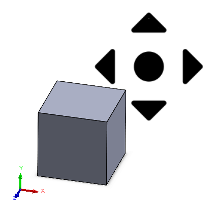

---
标题：使用SOLIDWORKS API以屏幕像素为单位平移模型视图
说明：示例演示了如何通过提供屏幕像素的偏移量来移动视图（平移）。宏将偏移量转换为模型视图的3D空间，并更新视图位置。

{ width=350 }

此示例演示了如何通过指定屏幕（像素）的X和Y坐标的偏移量来移动视图（平移）。宏将偏移量转换为模型视图的3D空间，并更新视图位置。

~~~ vb
Dim swApp As SldWorks.SldWorks
Dim swModel As SldWorks.ModelDoc2
Dim swView As SldWorks.ModelView

Sub main()

    Set swApp = Application.SldWorks
    
    Set swModel = swApp.ActiveDoc
    
    Set swView = swModel.ActiveView
    
    Dim swMathUtils As SldWorks.MathUtility
    Set swMathUtils = swApp.GetMathUtility
    
    Dim dVec(2) As Double
    dVec(0) = 100
    dVec(1) = 0
    dVec(2) = 0
    
    Dim swVector As SldWorks.MathVector
    Set swVector = swMathUtils.CreateVector(dVec)
    
    Dim swViewToScreenTransform As SldWorks.MathTransform
    Set swViewToScreenTransform = swView.Transform
    
    Dim swScreenToViewTransform As SldWorks.MathTransform
    Set swScreenToViewTransform = swViewToScreenTransform.Inverse
    
    Dim swDestVec As SldWorks.MathVector
    Set swDestVec = swVector.MultiplyTransform(swScreenToViewTransform)
    
    Set swDestVec = swDestVec.MultiplyTransform(swView.Orientation3)
    
    Set swDestVec = swDestVec.Scale(swView.Scale2)
    
    Dim swTranslateVec As SldWorks.MathVector
    Set swTranslateVec = swView.Translation3
    
    Set swTranslateVec = swTranslateVec.Add(swDestVec)
    
    swView.Translation3 = swTranslateVec
    
    swView.GraphicsRedraw Nothing
    
End Sub
~~~