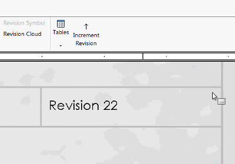

{ width=300 }

This macro increments the numeric value of the notes using SOLIDWORKS API. This can be useful if it required to increment the revision for note or notes without the need of manually selecting and changing the note. This macro can be also used in the batch processing software.

* Numeric value is matched by specified [regular expression](https://en.wikipedia.org/wiki/Regular_expression). It is possible to modify the regular expression to match specific numeric values. Note can contain free text (in this case only numeric part will be updated as per specified regular expression)
* It is required to add the text tag to the note in order to increment its value. Follow [Add Tag To Selected Note](/docs/codestack/solidworks-api/document/notes/tag-selected-note) example of instructions for adding the tag to the note.
* By default the numeric value is incremented by 1, but this can be changed by modifying the value of *increment* parameter of the *IncrementNoteValue* function.

~~~ vb
Dim swApp As SldWorks.SldWorks
Dim swModel As SldWorks.ModelDoc2

Sub main()

    Set swApp = Application.SldWorks
    
    Set swModel = swApp.ActiveDoc
    
    IncrementNoteValue "_CodeStackNote_", "\d+", 1
    
End Sub

Sub IncrementNoteValue(noteTag As String, pattern As String, increment As Double)
    
    Dim swNote As SldWorks.Note
    Set swNote = FindNodeByTag(swModel, noteTag)
    
    If Not swNote Is Nothing Then
        Dim newText As String
        newText = IncrementNumericMatches(swNote.GetText(), pattern, increment)
        swNote.SetText newText
    End If
    
End Sub

Function IncrementNumericMatches(text As String, pattern As String, increment As Double) As String
    
    Dim resultText As String
    resultText = text
    
    Dim regEx As Object
    Set regEx = CreateObject("VBScript.RegExp")
    
    regEx.Global = True
    regEx.IgnoreCase = True
    regEx.pattern = pattern
    
    Dim regExMatches As Object
    Set regExMatches = regEx.Execute(text)
    
    If regExMatches.Count > 0 Then
        
        Dim i As Integer
        
        Dim offset As Integer
        
        For i = 0 To regExMatches.Count - 1
            
            Dim regExMatch As Object
            Set regExMatch = regExMatches(i)
            
            Dim newValue As Double
            newValue = CDbl(regExMatch.Value) + increment
            
            resultText = Left(resultText, regExMatch.FirstIndex + offset) & newValue & Right(resultText, Len(resultText) - regExMatch.FirstIndex - regExMatch.Length - offset)
            
            offset = offset + Len(CStr(newValue)) - regExMatch.Length
        
        Next
        
    End If
    
    IncrementNumericMatches = resultText

End Function

Function FindNodeByTag(model As SldWorks.ModelDoc2, tag As String) As SldWorks.Note
    
    If tag <> "" Then
        
        Dim vAnnots As Variant
        vAnnots = model.Extension.GetAnnotations
        
        Dim swNote As SldWorks.Note
        Dim i As Integer
        
        If Not IsEmpty(vAnnots) Then
            
            For i = 0 To UBound(vAnnots)
                
                Dim swAnn As SldWorks.Annotation
                Set swAnn = vAnnots(i)
                
                If swAnn.GetType() = swAnnotationType_e.swNote Then
                    Set swNote = swAnn.GetSpecificAnnotation
                    If swNote.TagName = tag Then
                        Set FindNodeByTag = swNote
                        Exit Function
                    End If
                End If
                
            Next
        End If
        
        If model.GetType() = swDocumentTypes_e.swDocDRAWING Then
        
            Dim swDraw As SldWorks.DrawingDoc
            Set swDraw = model
        
            Dim vSheets As Variant
            vSheets = swDraw.GetViews()
            
            For i = 0 To UBound(vSheets)
                
                Dim vViews As Variant
                vViews = vSheets(i)
                
                Dim j As Integer
                
                For j = 0 To UBound(vViews)
                
                    Dim swView As SldWorks.View
                    Set swView = vViews(j)
                
                    Dim vNotes As Variant
                    
                    vNotes = swView.GetNotes()
                    
                    Dim k As Integer
                    
                    For k = 0 To UBound(vNotes)
                        
                        Set swNote = vNotes(k)
                        
                        If swNote.TagName = tag Then
                            Set FindNodeByTag = swNote
                            Exit Function
                        End If
                    
                    Next
                
                Next
                
            Next
            
        End If
        
    End If
    
End Function
~~~

